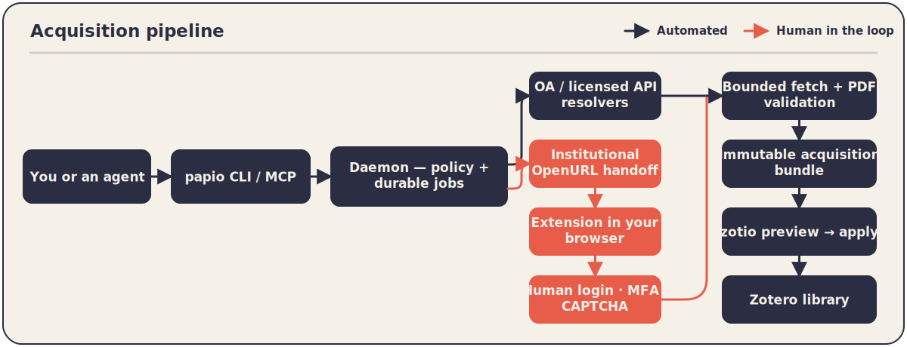

<p align="center">
  <picture>
    <source media="(prefers-color-scheme: dark)" srcset="docs/assets/logo-wordmark-dark.svg">
    <source media="(prefers-color-scheme: light)" srcset="docs/assets/logo-wordmark.svg">
    
  </picture>
</p>

<p align="center">
  <strong>
    The paper-acquisition broker for your
    <a href="https://www.zotero.org/">Zotero</a> library
  </strong>
</p>

<p align="center">
  <a href="https://github.com/OrgMentem/papio/actions/workflows/ci.yml"></a>
  <a href="https://github.com/OrgMentem/papio/actions/workflows/docs.yml"></a>
  <a href="https://go.dev/"></a>
  <a href="LICENSE"></a>
</p>

<p align="center">
  <a href="https://orgmentem.github.io/papio/"><strong>Home</strong></a>
  &middot;
  <a href="https://orgmentem.github.io/papio/guide/getting-started/"><strong>Get started</strong></a>
  &middot;
  <a href="https://orgmentem.github.io/papio/reference/commands/"><strong>Commands</strong></a>
  &middot;
  <a href="https://orgmentem.github.io/papio/reference/mcp-tools/"><strong>MCP tools</strong></a>
  &middot;
  <a href="https://orgmentem.github.io/papio/"><strong>Documentation</strong></a>
</p>

<p align="center">
  Finding a paper is easy; <em>legitimately acquiring</em> it is the tedious
  part. <code>papio</code> searches scholarly works on OpenAlex, turns your
  picks into durable, bounded acquisition jobs, resolves each one through
  open-access and licensed sources first — falling back to a visible
  institutional pass in your own browser only when needed — validates every
  PDF before you trust it, and hands ready artifacts to Zotero through
  <a href="https://github.com/OrgMentem/zotio">zotio</a> behind a
  preview-and-confirmation boundary.
</p>

```bash
brew install orgmentem/tap/papio                          # or grab a signed binary from Releases
papio init                                                # guided setup: config, data dir, DB, native host, doctor
papio doctor                                              # checks the whole chain, including the browser extension and zotio
papio search "appropriate reliance on AI" --limit 20 --year-from 2023
papio acquire 10.1371/journal.pone.0262026 --auto-import --wait
papio status --follow                                     # working / awaiting-human / needs-review / ready / failed
papio actions list                                        # open browser handoffs and identity reviews
```

---

## Why *papio*

Discovery is a solved problem — getting the PDF is not. The gap between "found
it on OpenAlex" and "validated PDF in my library" is a swamp of publisher
landing pages, SSO redirects, quarantine-worthy downloads, and hand-filed
imports. Existing tools either stop at metadata or cross lines you don't want
crossed.

`papio` owns exactly that glue, with hard boundaries:

- **Legitimate by construction.** Open-access and explicitly licensed APIs run
  before institutional access. Institutional fetches happen as an OpenURL
  handoff **in your ordinary Chrome or Firefox session** — login, MFA, and
  CAPTCHAs stay human decisions. `papio` never stores institution credentials
  and never does subscription crawling.
- **Durable, bounded jobs.** Every request becomes a persisted job with a
  stable request ID — reruns are idempotent, batches are capped, budgets and
  source allow/deny lists are enforced by the daemon, not by hope.
- **Validated before trusted.** Every candidate PDF is quarantined and gated on
  structure, identity, and a bounded OCR fallback. Ambiguous identity parks in
  `needs_review` for a human verdict instead of silently importing the wrong
  paper.
- **Zotero writes only through zotio.** `papio zotio plan` produces an
  immutable preview; `papio zotio apply` requires that preview's exact
  confirmation SHA-256. `papio` never touches Zotero credentials.

---

## How it works

Each acquisition is a durable job. The broker ranks candidates
deterministically and resolves them in order — it never accepts the first URL
it finds:

<picture>
  <source media="(prefers-color-scheme: dark)" srcset="docs/assets/architecture-dark.svg">
  <source media="(prefers-color-scheme: light)" srcset="docs/assets/architecture.svg">
  
</picture>

| Plane | Backend | Handles credentials? |
|---|---|---|
| **Discovery** | OpenAlex (read-only, bounded) | No |
| **Fetch — open** | arXiv · Europe PMC · Unpaywall · OpenAlex · CORE · Crossref TDM | No (API keys only where configured) |
| **Fetch — institutional** | OpenURL handoff in your ordinary browser session | No — login/MFA/CAPTCHA stay human |
| **Validation** | Local PDF structure + identity + bounded OCR (Poppler, Tesseract) | No |
| **Zotero writes** | `zotio` — preview (`plan`) then confirmed `apply` | No — `papio` never stores Zotero credentials |

`papio` runs in one of three access modes — `conservative`, `assisted`, or
`maximal`. A fresh `papio init` chooses `conservative`; institutional handoff
opens a browser only under `assisted`/`maximal`, and even then automation stays
inside legitimate, user-authorized access
([access modes & safety](https://orgmentem.github.io/papio/concepts/access-modes/)).

---

## The research loop

Discover, acquire in bulk, watch progress, review the exceptions — then let
the artifacts flow into Zotero:

```bash
# 1. Discover — bounded, read-only; marks works already in your Zotio library
papio search "trust in AI advice" --limit 20 --year-from 2022
papio search --cites 10.1002/mar.21498          # citation snowball: who cites this paper?

# 2. Acquire — one work or a capped batch of durable jobs
papio acquire 10.1016/j.chb.2020.106607 --auto-import --wait
papio acquire arXiv:2401.00001 --desired-version published

# 3. Observe — jobs settle as ready, awaiting-human, needs-review, or failed
papio status --follow
papio jobs list

# 4. Act on the exceptions
papio actions list                    # open browser passes and identity reviews
papio doctor                          # whole-chain readiness when something looks off

# 5. Standing discovery — a watchlist that runs the same pipeline on a cadence
papio watch add "appropriate reliance on AI" --cadence weekly
```

A browser handoff is a first-class job state, not a failure: the job parks as
`awaiting_human`, `papio actions list` names it, and one warm SSO pass in your
own browser lets the extension finish the download — validated, filed, and
imported like any other artifact
([browser handoff](https://orgmentem.github.io/papio/concepts/browser-handoff/)).

---

## Validated, provenance-tracked artifacts

No PDF is trusted because a server returned `200 OK`. Every candidate is
quarantined and must pass three gates before it becomes an artifact
([validation & provenance](https://orgmentem.github.io/papio/concepts/validation-and-provenance/)):

- **Structure** — it is a real, parseable PDF, not an HTML error page with a
  `.pdf` name.
- **Identity** — the document's own metadata and text match the requested work;
  ambiguity parks the job in `needs_review` with the quarantine path exposed
  for human inspection (`papio actions list` → accept/reject).
- **Text** — a bounded OCR fallback (Tesseract) guarantees the artifact is
  searchable before import.

What survives is an **immutable, content-addressed acquisition bundle**:
the validated PDF plus a provenance record of where it came from, how it was
fetched, and every gate it passed — exportable with `papio bundle`, inspectable
with `papio artifacts`.

---

## Zotero writes only through zotio

`papio` acquires; [zotio](https://github.com/OrgMentem/zotio) imports. The
boundary is explicit and cryptographic:

```bash
papio zotio plan <job-id>       # immutable mutation preview + confirmation SHA-256
papio zotio apply <plan-id> --confirm-sha256 <sha256>   # applies exactly that preview, idempotently
```

`--auto-import` on `acquire` routes through the same plan/apply machinery.
Without zotio installed, `papio` still works — it stops at validated bundles
you can import however you like.

---

## Built for agents

`papio` is designed to be driven by a coding agent as naturally as by a human
([MCP agent guide](https://orgmentem.github.io/papio/guide/agent-skill/)):

- **`--json`** on any command for structured output.
- **`papio mcp`** serves an MCP stdio server with the same configuration,
  daemon, durable jobs, and Zotio boundary as the CLI.
- **A command facade** derived from the CLI, so agents reach the whole tool
  surface through two tools without a parallel layer that can drift:
  `papio_command_search` to discover commands and `papio_command_run` to
  execute one (JSON output). Set `PAPIO_MCP_SURFACE=mirror` to expose one
  `papio_<command>` tool apiece instead
  ([full reference](https://orgmentem.github.io/papio/reference/mcp-tools/)).
- **Two composite tools** with no single-command equivalent — `papio_acquire_batch`
  (bulk work input) and `papio_batch_wait` (bounded polling).
- **Read resources** — `papio://jobs`, `papio://artifacts`, `papio://bundles`,
  `papio://zotio/plans`, `papio://exports` — expose recent durable state
  without creating jobs or mutating anything.
- **One writer.** `papio_command_run` with `zotio apply` is the only path that
  writes to Zotero, and it demands the exact confirmation SHA-256 from
  `zotio plan`.

Register it in an MCP host:

```bash
# Claude Code
claude mcp add papio -- papio mcp
```

---

## Install

**Homebrew (macOS / Linux):**

```bash
brew install orgmentem/tap/papio
```

**Scoop (Windows):**

```bash
scoop bucket add orgmentem https://github.com/OrgMentem/scoop-bucket
scoop install papio
```

**Prebuilt binaries:** every [GitHub release](https://github.com/OrgMentem/papio/releases)
ships archives for macOS, Linux, and Windows (amd64/arm64) with cosign-signed
checksums and SBOMs. Unpack and put `papio` on your `PATH`; on macOS clear the
Gatekeeper quarantine (`xattr -d com.apple.quarantine papio`).

**From source:**

```bash
git clone https://github.com/OrgMentem/papio && cd papio && go build ./cmd/papio
```

### Prerequisites

- **Poppler and Tesseract** for PDF validation and the OCR text gate:
  `brew install poppler tesseract` (or disable OCR in the
  [config](https://orgmentem.github.io/papio/reference/config-reference/)).
- **Chrome or Firefox with the *papio* extension** for human-authenticated
  institutional access — Chrome loads `extension/` unpacked, Firefox loads the
  generated `extension/firefox/` build via `about:debugging`. `papio init`
  prints the exact steps; skip with `papio init --skip-browser` for OA-only
  headless use.
- **[zotio](https://github.com/OrgMentem/zotio)** on `PATH` (or
  `[zotio] executable` in the config) for Zotero import; optional — without it
  *papio* stops at validated bundles.

Then let the CLI walk you through setup — config, data directory, database,
native-messaging host, and a first health check:

```bash
papio init
papio doctor
```

---

## Health check & troubleshooting

```bash
papio doctor        # sources, PDF tooling, daemon, extension, native host, Zotio boundary
```

- **Extension shows disconnected** — reload it in the browser after upgrades;
  `papio doctor` reports daemon/extension version skew explicitly.
- **Job stuck in `awaiting_human`** — `papio actions list` names the browser
  pass or identity review it is waiting for.
- **Zotio errors** — the boundary reports stable error classes; see the
  [troubleshooting guide](https://orgmentem.github.io/papio/guide/troubleshooting/).

---

## Configuration

Config file: `~/.config/papio/config.toml` (override with `--config`). Access
modes, resolver profiles, source allow/deny lists, budgets, OCR, and the zotio
executable are all configured there — every key, default, constraint, and
effect is in the
[configuration reference](https://orgmentem.github.io/papio/reference/config-reference/).

---

## Command reference

Run `papio --help` for the full command list, or `papio <command> --help` for
any subcommand.

<details>
<summary>Top-level commands</summary>

`acquire` · `actions` · `artifacts` · `batch` · `bundle` · `config` · `daemon`
· `doctor` · `init` · `jobs` · `mcp` · `native-host` · `search` · `status` ·
`version` · `watch` · `zotio`

</details>

## Sister project: zotio

*papio* acquires validated, provenance-tracked PDFs.
[zotio](https://github.com/OrgMentem/zotio) is the trust-and-automation layer
for Zotero that imports them preview-first — and audits, heals, and certifies
the library they land in. If *papio* fills the gaps in your library, zotio makes
sure the library stays fit to cite.

*papio* also works without zotio, stopping at validated bundles.

---

Licensed under MIT.

Zotero is a registered trademark of the
[Corporation for Digital Scholarship](https://digitalscholar.org/). *papio* is an
independent project and is not affiliated with or endorsed by Zotero or the
Corporation for Digital Scholarship.
