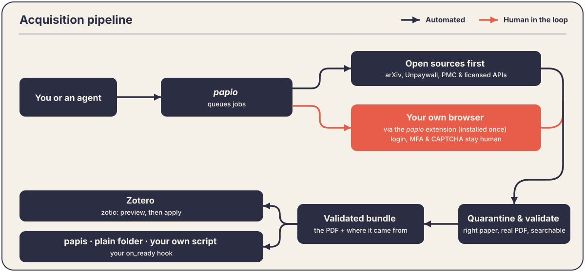

<p align="center">
  <picture>
    <source media="(prefers-color-scheme: dark)" srcset="docs/assets/logo-wordmark-dark.svg">
    <source media="(prefers-color-scheme: light)" srcset="docs/assets/logo-wordmark.svg">
    
  </picture>
</p>

<p align="center">
  <strong>
    Fill the missing PDFs in your reference library — and keep it that way
  </strong>
</p>

<p align="center">
  <a href="https://www.zotero.org/">Zotero</a> via
  <a href="https://github.com/OrgMentem/zotio">zotio</a>
  &middot; <a href="https://github.com/papis/papis">papis</a>
  &middot; a plain folder
  &middot; your own script
</p>

<p align="center">
  <a href="https://github.com/OrgMentem/papio/actions/workflows/ci.yml"></a>
  <a href="https://github.com/OrgMentem/papio/actions/workflows/docs.yml"></a>
  <a href="https://chromewebstore.google.com/detail/papio/npccengdhjmpojpjmjoeeclpdhcjelhf"></a>
  <a href="https://addons.mozilla.org/firefox/addon/papio/"></a>
  <a href="https://go.dev/"></a>
  <a href="LICENSE"></a>
</p>

<p align="center">
  <strong>Docs:</strong>
  <a href="https://orgmentem.github.io/papio/guide/getting-started/"><strong>Get started</strong></a>
  &middot;
  <a href="https://orgmentem.github.io/papio/reference/commands/"><strong>Commands</strong></a>
  &middot;
  <a href="https://orgmentem.github.io/papio/reference/mcp-tools/"><strong>MCP tools</strong></a>
  &middot;
  <a href="https://orgmentem.github.io/papio/concepts/acquisition-pipeline/"><strong>How it works</strong></a>
  &middot;
  <a href="https://orgmentem.github.io/papio/guide/user-guide/"><strong>User guide</strong></a>
</p>

<p align="center">
  Finding citations is easy; <em>getting the PDFs, legitimately</em> is the tedious
  part. <code>papio</code> backfills the works in your library that lack full
  text, checking open-access and licensed sources first and falling back to a
  visible institutional pass in your own browser only when needed. Gives tools to 
  research agents — without handing them your university credentials.
</p>

```bash
brew install orgmentem/tap/papio                          # or grab a signed binary from Releases
papio init                                                # guided setup: config, data folder, database, browser connector, health check
papio doctor                                              # checks the whole chain, including the browser extension and zotio
papio search "appropriate reliance on AI" --limit 20 --year-from 2023
papio acquire 10.1371/journal.pone.0262026 --auto-import --wait
papio acquire --batch refs.bib                            # or RIS, CSL-JSON, NBIB — start from the library you already have
papio status --follow                                     # working / awaiting-human / needs-review / ready / failed
papio actions list                                        # open browser handoffs and identity reviews
```

---

## Why *papio*

Discovery is a solved problem — getting the PDF is not. The gap between "found
it on OpenAlex" and "validated PDF in my library" is a swamp of publisher
landing pages, single sign-on redirects, dubious downloads, and hand-filed
imports. Existing tools either stop at metadata or cross lines you don't want
crossed.

`papio` owns exactly that glue, with hard boundaries:

- **Legitimate by construction.** Open-access and explicitly licensed APIs run
  before institutional access. Institutional fetches happen as an OpenURL
  handoff **in your ordinary Chrome or Firefox session** — login, MFA, and
  CAPTCHAs stay human decisions. `papio` never stores institution credentials
  and never does subscription crawling.
- **Repeatable jobs.** Every request becomes a job with a
  stable ID — running it again is safe and won't duplicate, batches are capped,
  and budgets and allowed/blocked sources are enforced by *papio*, not by hope.
- **Validated before trusted.** Every candidate PDF is quarantined and gated on
  structure, identity, and an OCR fallback. Ambiguous identity parks in
  `needs_review` for a human verdict instead of silently importing the wrong
  paper.
- **Your library, your call.** Zotero gets the deepest path: `papio zotio plan`
  produces an immutable preview, `papio zotio apply` requires that preview's
  exact confirmation SHA-256, and `papio` never touches Zotero credentials.
  Everywhere else — papis, a plain folder, your own script — gets a best-effort
  handoff through the `on_ready` hook. Hook failures are recorded but never fail
  or retry the acquisition job.

---

## How it works

Each acquisition is a job. `papio` ranks the possible sources by a fixed
set of rules and tries them in order — it never accepts the first URL
it finds:

<picture>
  <source media="(prefers-color-scheme: dark)" srcset="docs/assets/architecture-dark.svg">
  <source media="(prefers-color-scheme: light)" srcset="docs/assets/architecture.svg">
  
</picture>

| Stage | Source / tooling | Handles credentials? |
|---|---|---|
| **Discovery** | OpenAlex (read-only) | No |
| **Download — open** | arXiv · Europe PMC · Unpaywall · OpenAlex · CORE · Crossref TDM | No (API keys only where configured) |
| **Download — institutional** | OpenURL handoff in your ordinary browser session | No — login/2FA/CAPTCHA stay human |
| **Validation** | Local PDF structure + identity + OCR (Poppler, Tesseract) | No |
| **Library filing** | `zotio` — preview (`plan`) then confirmed `apply` for Zotero · best-effort `on_ready` handoff for papis, a folder, or your own script; hook failures never fail or retry the job | No — `papio` never stores Zotero credentials |

`papio` runs in one of three access modes — `conservative`, `assisted`, or
`delegated`. A fresh `papio init` chooses `conservative`; institutional handoff
opens a browser only under `assisted`/`delegated`, and even then automation stays
inside legitimate, user-authorized access
([access modes & safety](https://orgmentem.github.io/papio/concepts/access-modes/)).

---

## The research loop

Discover, acquire in bulk, watch progress, review the exceptions — then let
the finished PDFs flow into your library:

```bash
# 1. Discover — read-only; marks works already in your library (with zotio or configured library.sources)
papio search "trust in AI advice" --limit 20 --year-from 2022
papio search --cites 10.1002/mar.21498          # citation snowball: who cites this paper?

# 2. Acquire — one work or a capped batch of jobs
papio acquire 10.1016/j.chb.2020.106607 --auto-import --wait
papio acquire arXiv:2401.00001 --desired-version published

# 3. Observe — jobs settle as ready, awaiting-human, needs-review, or failed
papio status --follow
papio jobs list

# 4. Act on the exceptions
papio actions list                    # open browser passes and identity reviews
papio doctor                          # whole-chain readiness when something looks off

# 5. Standing discovery — a watchlist that runs the same pipeline on a cadence
papio watch add "appropriate reliance on AI" --cadence weekly
```
A browser handoff is a normal job state, not a failure: the job parks as
`awaiting_human`, `papio actions list` names it, and one sign-in pass in your
own browser lets the extension finish the download. The validated result is
then available for Zotero's zotio preview path or a best-effort generic hook
handoff
([browser handoff](https://orgmentem.github.io/papio/concepts/browser-handoff/)).

The extension's inbox keeps itself current on its own — no manual refresh
needed — and its popup adds a compact acquisition-history and impact
summary, with a one-click, 12-week history view.

---

## Validated, provenance-tracked PDFs

No PDF is trusted because a server returned `200 OK`. Every candidate is
quarantined and must pass three gates before it becomes a trusted PDF
([validation & provenance](https://orgmentem.github.io/papio/concepts/validation-and-provenance/)):

- **Structure** — it is a real, parseable PDF, not an HTML error page with a
  `.pdf` name.
- **Identity** — the document's own metadata and text match the requested work;
  ambiguity parks the job in `needs_review` with the quarantine path exposed
  for human inspection (`papio actions list` → accept/reject).
- **Text** — an OCR fallback (Tesseract) makes the PDF
  searchable before import.

What survives is a **permanent acquisition bundle**:
the validated PDF plus a record of where it came from, how it was
fetched, and every check it passed — exportable with `papio bundle`, inspectable
with `papio artifacts`.

---

## Where the PDFs go

`papio`'s output is a validated bundle. Two ways to file it.

**Zotero — the deepest path.** `papio` acquires;
[zotio](https://github.com/OrgMentem/zotio) imports, explicitly and verifiably:

```bash
papio zotio plan <job-id>       # preview of the exact changes + a confirmation code
papio zotio apply <plan-id> --confirm-sha256 <sha256>   # applies exactly that preview; safe to repeat
```

`--auto-import` on `acquire` routes through the same plan/apply machinery.

**Everywhere else — the `on_ready` hook.** papis, Calibre, a plain folder, your
own script: when a job's PDF passes validation, *papio* makes a best-effort
handoff by running one command with the job's metadata in `PAPIO_*` environment
variables. A hook failure is recorded but never fails or retries the acquisition
job.

```toml
[hooks]
on_ready = 'papis add --from doi "$PAPIO_DOI" "$PAPIO_PDF"'
```

zotio is optional: answer `none` at its `papio init` prompt and `papio doctor`
reports it as `not configured (optional)` instead of failing — hooks are then
the whole hand-off
([filing & hooks](https://orgmentem.github.io/papio/guide/hooks/)).

---

## Built for agents

`papio` is designed to be driven by a coding agent as naturally as by a human
([MCP agent guide](https://orgmentem.github.io/papio/guide/agent-skill/)):

- **`--json`** on any command for structured output.
- **`papio mcp`** serves an MCP server with the same configuration,
  background service, jobs, and zotio boundary as the CLI.
- **A command facade** derived from the CLI, so agents reach the whole tool
  surface through two tools without a parallel layer that can drift:
  `papio_command_search` to discover commands and `papio_command_run` to
  execute one (JSON output). Set `PAPIO_MCP_SURFACE=mirror` to expose one
  `papio_<command>` tool apiece instead
  ([full reference](https://orgmentem.github.io/papio/reference/mcp-tools/)).
- **Two composite tools** with no single-command equivalent — `papio_acquire_batch`
  (bulk work input) and `papio_batch_wait` (polls until settled or timeout).
- **Read resources** — `papio://jobs`, `papio://artifacts`, `papio://bundles`,
  `papio://zotio/plans`, `papio://exports` — expose recent saved state
  without creating jobs or mutating anything.
- **One writer into Zotero.** `papio_command_run` with `zotio apply` is the only
  path that writes to Zotero, and it demands the exact confirmation SHA-256 from
  `zotio plan`.

Register it in an MCP host:

```bash
# Claude Code
claude mcp add papio -- papio mcp
```

---

## Install

**Homebrew (macOS):**

```bash
brew install orgmentem/tap/papio
```

**Linux (deb / rpm / apk):** download the package for your distro from the
[GitHub releases](https://github.com/OrgMentem/papio/releases) and install it
with `dpkg -i`, `rpm -i`, or `apk add --allow-untrusted`.

**Windows (Scoop or WinGet):**

```powershell
scoop bucket add orgmentem https://github.com/OrgMentem/scoop-bucket
scoop install papio

# or, WinGet — trails releases, see below
winget install OrgMentem.papio
```

Scoop tracks releases directly. Each release also opens a pull request against
`microsoft/winget-pkgs`, so WinGet serves a new version only once that PR
merges — it trails a fresh tag by however long that review takes.

**Prebuilt binaries:** every [GitHub release](https://github.com/OrgMentem/papio/releases)
ships archives for macOS, Linux, and Windows (amd64/arm64) with cosign-signed
checksums and SBOMs. Unpack and put `papio` on your `PATH`; on macOS clear the
Gatekeeper quarantine (`xattr -d com.apple.quarantine papio`).

**From source:**

```bash
git clone https://github.com/OrgMentem/papio && cd papio && go build ./cmd/papio
```

### Prerequisites

- **Poppler and Tesseract** for PDF validation and the OCR text gate:
  `brew install poppler tesseract` (or disable OCR in the
  [config](https://orgmentem.github.io/papio/reference/config-reference/)).
- **Chrome or Firefox with the *papio* extension** for human-authenticated
  institutional access — install it from the
  [Chrome Web Store](https://chromewebstore.google.com/detail/papio/npccengdhjmpojpjmjoeeclpdhcjelhf)
  or [Firefox Add-ons](https://addons.mozilla.org/firefox/addon/papio/).
  `papio init` prints the exact steps; skip with
  `papio init --skip-browser` for OA-only headless use.
- **[zotio](https://github.com/OrgMentem/zotio)** on `PATH` (or
  `[zotio] executable` in the config) for Zotero import — optional. **Not a
  Zotero user?** Nothing extra to install: answer `none` at its prompt and point
  `[hooks] on_ready` at papis, a folder, or your own script
  ([filing & hooks](https://orgmentem.github.io/papio/guide/hooks/)).

Then let the CLI walk you through setup — config, data directory, database,
native-messaging host, and a first health check:

```bash
papio init
papio doctor
```

---

## Health check & troubleshooting

```bash
papio doctor        # sources, PDF tools, background service, extension, connector, zotio
```

- **Extension shows disconnected** — reload it in the browser after upgrades;
  `papio doctor` reports version mismatches between the background service and extension.
- **Job stuck in `awaiting_human`** — `papio actions list` names the browser
  pass or identity review it is waiting for.
- **zotio errors** — the boundary reports stable error classes; see the
  [troubleshooting guide](https://orgmentem.github.io/papio/guide/troubleshooting/).

---

## Configuration

Config file: `~/.config/papio/config.toml` — on Windows `%APPDATA%\papio\config.toml`
(override with `--config`). Access
modes, resolver profiles, source allow/deny lists, budgets, OCR, and the zotio
executable are all configured there — every key, default, constraint, and
effect is in the
[configuration reference](https://orgmentem.github.io/papio/reference/config-reference/).

---

## Command reference

Run `papio --help` for the full command list, or `papio <command> --help` for
any subcommand.

<details>
<summary>Top-level commands</summary>

`acquire` · `actions` · `artifacts` · `batch` · `bundle` · `config` · `daemon`
· `doctor` · `init` · `jobs` · `mcp` · `native-host` · `search` · `status` ·
`version` · `watch` · `zotio`

</details>

## Sister project: zotio

*papio* acquires validated, provenance-tracked PDFs.
[zotio](https://github.com/OrgMentem/zotio) is the trust-and-automation layer
for Zotero that imports them preview-first — and audits, heals, and certifies
the library they land in. If *papio* fills the gaps in your library, zotio makes
sure the library stays fit to cite.

*papio* also works without zotio: it stops at validated bundles, and a
best-effort `on_ready` hook handoff can offer them wherever else you keep
papers. Hook failures are recorded but never fail or retry the acquisition job.

---

Licensed under MIT.

Zotero is a registered trademark of the
[Corporation for Digital Scholarship](https://digitalscholar.org/). *papio* is an
independent project and is not affiliated with or endorsed by Zotero or the
Corporation for Digital Scholarship.
