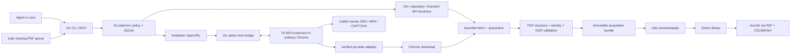

# Paper-Acquisition Stack Plan

**Status:** Phases 0–2 complete including live Example University acceptance (2026-07-14); Phase 3 substantially complete (ProQuest live-accepted; JSTOR committed; EBSCO and Springer fixture-complete; JSTOR/EBSCO/Springer live acceptances pending); browser protocol v1 locked; Phase 4 complete including live gates (2026-07-14)
**Date:** 2026-07-13  
**Name:** `papio` — repo `~/@dev/papio/`, Go module/binary `papio`, config `~/.config/papio/`, native host `papio-native-host` (basename dispatch), native-host manifest `com.orgmentem.papio`, extension product name Papio (ID comes from the separately preserved signing key).

## Executive decision

Build a **new standalone acquisition system** at `~/@dev/<broker>/` with a deliberately split implementation:

- **Go 1.26 core and native host:** durable queue, policy, resolver ordering, bounded HTTP, SQLite, artifact quarantine/validation, provenance, CLI/MCP, and zotio integration.
- **TypeScript Manifest V3 extension:** ordinary user-controlled Chrome tabs, OpenURL/provider DOM adapters, visible human authentication handoff, and Chrome-managed downloads. Bun is used only for extension package management, scripts, build, and tests; the shipped extension runs as browser JavaScript and the installed host is the Go binary.
- **No Python runtime and no continuation of the instsci product architecture.** The fork remains a temporary read-only behavioral reference until selected fixtures and edge cases are ported.
- **No direct broker-to-Zotero writes.** Zotio remains the sole Zotero mutation/dedup/import boundary. A small zotio prerequisite is required for stored-file attachment to an existing item; the current “zero zotio changes” assumption was disproved by source inspection.
- **No direct inscribi dependency.** Inscribi continues consuming selected PDFs plus Zotero BibTeX/CSL-JSON exports. It does not know how papers were acquired.

This is not “Go instead of TypeScript.” It puts each language on the side of the process boundary where it has a durable advantage. Browser code will be JavaScript regardless of the core language; keeping policy, recovery, provenance, and untrusted-file handling in Go avoids adding a Node/Bun runtime and native SQLite dependency to the installed host.

## Stack topology



### Repository ownership

| Repository | Owns | Must not own |
|---|---|---|
| New `<broker>` repo | Resolution, legitimate acquisition, browser handoff, validation, provenance, candidate/artifact ledger | Zotero metadata creation, Zotero dedup rules, paper recommendation, marking/review workflows |
| `~/@dev/zotio` | Zotero reads/writes, item schema, dedup, stored/linked attachments, reviewable mutation plans, exports | Publisher UI automation, institutional sessions, multi-source acquisition waterfall |
| `~/@dev/inscribi` | Instructor marking and postgraduate research-coworker workflows; reference checking from writer-owned PDF/CSL/BibTeX inputs | Acquisition, institutional login, browser automation, Zotero mutation |
| `~/@dev/+forks/instsci` | Temporary behavioral evidence only | Any future product identity, CLI, browser architecture, publisher profiles, or dependency |

## Language decision: Go core + TypeScript browser plane

### Decision criteria

Weights follow actual product risk, not language enthusiasm:

| Criterion | Weight | Go core + TS extension | Rust core + TS extension | All-TypeScript host + extension |
|---|---:|---:|---:|---:|
| Supervised browser/session capability | 25 | 5 | 5 | 5 |
| Durable policy, queue, recovery, provenance | 20 | 5 | 5 | 4 |
| UI-drift containment and testability | 15 | 5 | 5 | 3 |
| Install/release/support burden | 15 | 5 | 4 | 3 |
| HTTP, SQLite, PDF/process fit | 10 | 4 | 4 | 4 |
| Solo-maintainer change throughput | 10 | 5 | 3 | 4 |
| Resource/supply-chain footprint | 5 | 5 | 5 | 3 |
| **Weighted result** | **100** | **98** | **91** | **78** |

The numbers are an explicit decision aid, not measurements. The decisive fact is structural: an ordinary-profile cross-platform Chrome extension is JavaScript in all three options. Go and Rust therefore retain browser ergonomics through the extension while moving durable responsibilities out of the UI-drift plane.

### Why Go wins the core

- The stable workload is local orchestration: `net/http`, cancellation, bounded subprocesses, SQLite, deterministic state transitions, hashing, atomic files, CLI/MCP, and release packaging.
- The existing zotio conventions are already proven: Cobra-style commands, `--agent` JSON, `modernc.org/sqlite`, GoReleaser/Homebrew, and a Go MCP facade. This is operational alignment, not source coupling; the repos communicate through versioned JSON/CLI contracts.
- One signed Go binary can run as CLI, daemon, MCP server, and Chrome native-messaging host. The extension remains a separately signed browser artifact either way.
- Go's garbage-collected memory safety is sufficient because hostile PDF/OCR work is isolated in bounded child processes. Nothing here needs Rust's ownership model to meet the contract.

### Why not all TypeScript

The strongest TypeScript design is credible: Node 24, Bun package management/scripts, `better-sqlite3`, PDF.js, the official MCP TypeScript SDK, and an MV3 extension/native host. It wins if most product changes necessarily co-change the host and browser.

It loses here because:

- Same-language code does not remove the extension/native-host process boundary or selector drift.
- A Node host requires a runtime plus a native SQLite addon, or it adopts the still-release-candidate `node:sqlite`; a Bun-compiled host instead locks the durable core to Bun's younger runtime and platform-specific SQLite builds.
- PDF.js is strong for page/text extraction, but structural/semantic validation still needs isolation and OCR still needs an external renderer/Tesseract.
- The OA/policy/ledger core remains useful even when every provider adapter is broken. It should not share the browser plane's deployment and dependency churn.

### Why not Rust

Rust has the strongest compile-time state-machine and FFI story. A concrete stack exists (`reqwest`, Tokio, Serde, Clap, `rusqlite`, `lopdf`, official `rmcp`). It still requires a JS/TS extension for ordinary cross-platform Chrome, and its CDP/WebDriver crates do not solve the existing-profile or protected-site problem.

It loses because:

- The core is supervised I/O and local state, not high-throughput parsing or unsafe FFI.
- Rust adds compile time, MSRV coordination, async lifecycle complexity, and a fourth primary ecosystem beside zotio, inscribi, and the browser extension without adding a required capability.
- PDFium would add a C++ runtime/ABI; pure-Rust text extraction is not enough to remove Poppler/Tesseract from the difficult cases.

### What Oracle proves, and what it does not

[Oracle 0.16.0](https://github.com/steipete/oracle) is a valid analogue for the browser/session plane:

- MIT, TypeScript/ESM, Node 24+, `chrome-launcher`, `chrome-remote-interface`, MCP SDK, and Zod.
- Launcher, attach-running, remote CDP, persistent/manual profiles, locks/leases, session metadata, reattach, artifact hashing, and provider DOM adapters are all real production patterns.
- The browser subtree contains 51 TypeScript files and 45 browser tests; `src/browser/index.ts` is about 147 KB, `actions/modelSelection.ts` about 60 KB, and `sessionManager.ts` about 33 KB.
- During this review Oracle twice enumerated `GPT-5.6 Sol` but failed to select it. Source documents model-picker drift and fails closed with `option-not-found`. The observed failure does not establish a root cause; it establishes that TypeScript does not make DOM drift disappear.

Oracle is not a whole-broker analogue. Its cookie copying/profile cloning, ChatGPT-specific selectors, CDP model picker, conversation archiving, and generated-file capture must not be transferred to protected publishers. CDP already caused Cloudflare loops in the live publisher trials; ordinary Chrome controlled through Apple Events worked. Production publisher access therefore uses an ordinary-profile extension, not CDP, headless Chrome, stealth patches, copied cookies, or anti-bot evasion.

### Reversal triggers

Do not revisit languages because an adapter is inconvenient.

- **Switch the core to TypeScript only before the final browser protocol v1 lock after Phase 3** if, after 2–3 real provider adapters, more than 70% of core changes necessarily co-change extension code, the cross-language protocol causes more demonstrated defects than it contains, and Node/Bun packaging passes clean-machine release tests on every supported target for two release cycles.
- **Switch the core to Rust only before that same v1 lock** if hostile documents/archives move in-process at parallel scale, a security review requires a memory-safe native daemon, or the broker becomes a remote multi-user service; the maintainer must also accept the Rust/Pdfium/toolchain burden.
- **Promote Apple Events above “optional macOS adapter”** only if named required providers repeatedly fail through the extension but succeed through Apple Events. It must never become the cross-platform architecture.

## Non-negotiable product and safety boundaries

1. One explicit work request per subscription-provider job. OA/API sources may process bounded batches; the broker never crawls a subscription database or journal issue.
2. OA and explicitly licensed APIs run before institutional access.
3. Maximal automation means maximal automation **inside legitimate, user-authorized access**. It never means bypass, credential capture, CAPTCHA solving, anti-bot evasion, paywall circumvention, automated MFA, or automated acceptance of publisher/library terms; terms remain a human action.
4. Human login occurs in a visible ordinary Chrome profile. The extension has no `cookies` or `debugger` permission and no host permissions for Example University/OpenAthens/identity-provider domains. During authentication it compares origins locally and sends no IdP URL, path, title, query, or fragment across native messaging.
5. Per-source enablement and optional host permissions; never `<all_urls>`. Permission grant requires an explicit user gesture in the extension UI, and revocation immediately returns that source to assisted behavior.
6. Core policy is authoritative. Browser messages describe observations/outcomes; they cannot authorize a disallowed transition or source.
7. The extension is restartable and disposable. SQLite in the daemon owns durable job state.
8. Unknown provider/page/protocol states fail closed to `action_required` or `needs_review`; no generic “click likely download button” fallback.
9. PDF bytes and secrets never cross native messaging. Chrome downloads to a broker/job subdirectory under the user's configured Downloads adoption root; the host reports metadata/path only, and the daemon rejects paths outside that root.
10. Every accepted artifact is immutable, content-addressed, structurally validated, identity-checked, hashed, and provenance-linked before zotio sees it.
11. URLs persisted in events are redacted. Signed query values, cookies, API keys, credential fields, and page bodies are not logged.
12. `access_basis` and `reuse_license` are distinct. “Downloadable” never implies open license or redistribution permission.
13. Zotio alone mutates Zotero. Inscribi sees curated inputs, never acquisition state.

## Access profiles

Configuration requires an explicit first-run choice; no silent automation default. This user's profile is set to `maximal`.

| Mode | Behavior |
|---|---|
| `conservative` | OA repositories and enabled licensed APIs only. Institutional/document-delivery actions are emitted but not opened. |
| `assisted` | OpenURL opens in ordinary Chrome; user performs login and download; broker adopts and validates the selected file. |
| `maximal` | OpenURL opens; login/MFA/CAPTCHA stays human; after return to a granted provider host, a verified adapter navigates and initiates the one requested download. Unknown or changed UI falls back to assisted mode. |

Licensed/TDM adapters are separate per-source capabilities with explicit credentials, terms acknowledgement, rate/cost budgets, and allowed uses. They do not inherit permission from `maximal`.

## Process architecture

### Go daemon

A single-user daemon owns the only write connection to SQLite and all state transitions. It listens on a user-only Unix socket (`0600`) on macOS/Linux; a named pipe is the Windows equivalent. CLI and MCP processes connect to it. The CLI may auto-start it through the platform service manager.

Responsibilities:

- normalize work requests and identifiers;
- snapshot policy/config into each job;
- schedule resolvers, rate limits, retries, costs, and cancellation;
- rank candidates deterministically;
- run bounded fetch/validation/OCR workers;
- maintain quarantine and immutable artifact store;
- create human/browser actions;
- emit acquisition bundles and zotio mutation previews;
- write structured redacted events and health data.

### Native-host mode

The installed Go executable has a dedicated `<broker>-native-host` entrypoint. On macOS/Linux the installer creates a fixed-name hard link/symlink to the signed broker binary; Windows uses a same-build copy. The native-host manifest points to that executable path, and the program dispatches by executable basename while treating Chrome's origin argument as untrusted input. The entrypoint:

- is registered through a native-host manifest whose `allowed_origins` contains only the fixed extension ID;
- validates the supplied extension origin, protocol version, message type, job/request IDs, sequence, payload size, and current core state;
- forwards messages to the daemon over the user-only socket;
- returns commands/acknowledgements only; it never owns the queue or persists browser state.
- reserves stdout exclusively for framed native messages and sends diagnostics only to stderr.

Native messaging is metadata-only and bounded below Chrome's documented limits (host-to-extension 1 MiB; extension-to-host 64 MiB). The broker caps its own messages at 256 KiB.

### TypeScript MV3 extension

Permissions: `nativeMessaging`, `activeTab`, `tabs`, `downloads`, `scripting`, and `storage`; provider domains live in `optional_host_permissions`. No `cookies`, `debugger`, broad host access, webRequest interception, or IdP hosts.

Responsibilities:

- open and tag broker-owned visible tabs;
- run provider adapters only on hosts granted through the extension options/popup UI;
- compare tab origins locally across login; on ungranted IdP hosts, emit only `auth_pending`/`auth_returned` timing events and never serialize the URL or title;
- detect provider return and resume the adapter;
- correlate a download directly when an adapter initiates it; in assisted mode, track the next download only after an explicit job-scoped user gesture, and require user selection if zero or multiple downloads match;
- report only the selected `DownloadItem` ID/final filename, adapter version, provider outcome, and normalized failure;
- close only broker-owned tabs on explicit completion/cancel.

The MV3 service worker may be stopped. It persists only minimal tab/job correlation in `chrome.storage`, reconnects to the native host, and asks the daemon for authoritative state.

The options/popup surface shows each supported source, current optional-host permission, grant/revoke controls, and the active job. Selecting `maximal` in the daemon config never grants a Chrome permission by itself.

### Optional Apple Events adapter

macOS-only, ordinary Chrome, explicit Accessibility/JavaScript-from-Apple-Events grants. It implements the same browser outcome protocol and is enabled per source only when extension trials establish a need. It never becomes a hidden CDP/stealth path.

## Durable state model

SQLite uses WAL, foreign keys, a busy timeout, one writer, numbered transactional migrations, startup integrity checks, and explicit backup/checkpoint commands.

Core tables:

- `work_requests`: canonical request, requester, zotio item key/collection if supplied.
- `identifiers`: DOI/PMID/arXiv/OpenAlex/ISBN normalized values and evidence.
- `jobs`: policy snapshot, current state, lease, selected candidate/artifact, terminal reason.
- `candidates`: resolver, redacted URL, version, access basis, reuse license, expected MIME, cost, rank evidence, expiry.
- `attempts`: resolver/fetch/browser attempt, adapter version, timestamps, HTTP/provider outcome, retry classification.
- `artifacts`: SHA-256, immutable path, size, MIME, page count, text/OCR evidence, active-content/encryption flags, identity result.
- `human_actions`: login, terms acceptance, manual download, document delivery, ambiguity review; status and expiry.
- `events`: append-only sequenced transitions with redacted structured detail.
- `exports`: acquisition bundle and zotio plan/apply result.
- `source_budgets`: per-source rate, quota, monetary cost, and next-allowed time.

No credentials, cookies, raw browser DOM, screenshots, or signed URL query values enter SQLite.
Signed or otherwise secret-bearing URLs exist only in the active attempt's memory; after a crash or expiry, the daemon re-runs resolution instead of persisting a bearer URL.

### Job states

```text
queued
  -> resolving
  -> fetching
  -> validating
  -> ready

resolving/fetching
  -> awaiting_human -> resolving/fetching
  -> retry_wait     -> resolving/fetching
  -> needs_review   -> resolving/fetching/cancelled
  -> unavailable | failed | cancelled
```

`ready` is the acquisition terminal state. Bundle export and zotio preview/apply are independent idempotent records in `exports`; they never rewrite the acquisition result.

Every acquisition transition is a database transaction with an idempotency key. Running work has a lease; crash recovery expires leases and resumes from the last durable boundary without duplicating downloads.

## Work, candidate, and artifact contracts

### `WorkRequest v1`

Required: stable request ID plus at least one identifier or a title/author/year tuple. Optional: zotio item key, collection, desired version, access mode override, max cost, and source allow/deny list.

### Candidate semantics

A resolver returns observations, not authority. Candidate ranking is a deterministic tuple:

1. identity confidence; explicit mismatch rejects;
2. legitimate access basis and user policy;
3. requested/default version preference;
4. directness and historical source reliability;
5. reuse-license clarity;
6. monetary cost and quota impact;
7. stable source tie-breaker.

The broker does not accept the first URL. It resolves candidates, fetches by rank, validates, and continues after retryable/invalid results.

### `AcquisitionBundle v1`

Each ready job exports a self-contained directory:

```text
bundle.json
artifacts/<sha256>.pdf
```

`bundle.json` contains:

- schema version and job/work identifiers;
- normalized bibliographic identity and evidence;
- selected candidate source/version/access basis/reuse license;
- sanitized landing/source URLs and source record IDs;
- retrieval and adapter timestamps/versions;
- SHA-256, size, detected MIME, page count, text/OCR metrics;
- validation and identity decision;
- relative artifact path;
- provenance event digest;
- zotio item key when the request came from zotio.

It never contains API keys, cookies, signed query values, identity-provider URLs, or a claim that unknown copyright is open.

## Resolver and acquisition pipeline

### Resolver order

Free/known-ID resolvers may run concurrently within source-specific limits; deterministic candidate ranking controls selection.

1. Existing broker artifact cache by canonical identity and validated SHA.
2. Identifier-native open sources: arXiv, PubMed Central/Europe PMC where applicable.
3. Unpaywall OA locations.
4. OpenAlex work locations and, when explicitly enabled, OpenAlex Content API.
5. CORE and other identifier-native repositories with configured API keys/terms.
6. Crossref full-text/TDM links only when the specific publisher/API credential and use are configured; a link is metadata, not entitlement.
7. Institution OpenURL.
8. Document-delivery/controlled-loan/manual action when no entitled candidate exists.

Institutional routing starts from the institution's OpenURL resolver, never a guessed publisher login. The live Example University resolver already routed Sage and APA works to ProQuest, AOM/JSTOR works to JSTOR, MISQ to EBSCO, and correctly denied a Springer chapter.

### Bounded HTTP

- HTTPS only except fixture tests and explicitly local development.
- Resolve and validate every redirect; reject loopback, link-local, private, multicast, and reserved IPv4/IPv6 destinations.
- Do not forward authorization headers across hosts.
- Source-specific host policy, redirect cap, connect/header/body deadlines, response-size cap, and retry budget.
- Stream to a same-filesystem quarantine temp file; enforce `Content-Length` early and count bytes independently.
- Accept PDF/octet-stream/missing content type only provisionally. HTML, audio, JSON, and login pages fail before adoption.
- API responses and 429/`Retry-After` use typed error classes; no blind retry loops.

### Artifact validation

1. Confined regular file; reject symlink, device, directory, or path outside the job adoption root.
2. SHA-256 and exact size while copying into quarantine.
3. PDF header/EOF plus structural parse/page count using a bounded isolated pdfcpu worker.
4. Optional external `pdfinfo` cross-check when Poppler is present.
5. Bounded `pdftotext` semantic extraction; title/author/year/DOI evidence.
6. If text is absent/too sparse, render the first pages with `pdftoppm` and OCR with Tesseract; record that identity used OCR.
7. Reject a conflicting DOI or clearly different title/author. Ambiguous identity becomes `needs_review`, never a silent accept.
8. Encrypted/password-protected, zero-page, malformed, active-JavaScript, embedded-file, or suspiciously oversized PDFs remain quarantined for review/rejection.
9. Atomically rename a validated artifact to `artifacts/<sha256>.pdf`; never mutate it afterward.

Poppler is invoked as a user-installed subprocess and is not bundled into the permissive Go release. Tesseract is an external capability. `doctor` reports structural, semantic, and OCR capability independently; absence of semantic/OCR tooling prevents automatic acceptance when identity cannot otherwise be proved.

## Browser/provider adapter contract

Each adapter is source-controlled, versioned, fixture-tested, and explicitly enabled. No user-editable selector recipes in the first release.

Adapter input:

- job/work identity;
- OpenURL-resolved provider URL;
- expected provider/allowed hosts;
- expected title/author/DOI hints;
- access-mode and action expiry.

Adapter output is one of:

- `download_started` / `download_complete` with Chrome download metadata;
- `human_auth_required`;
- `terms_acceptance_required`;
- `no_entitlement`;
- `document_delivery_available`;
- `wrong_work`;
- `ui_changed`;
- `rate_limited`;
- `cancelled`.

The first production adapters are limited to providers already verified live: JSTOR, ProQuest, and EBSCO. Springer begins as an entitlement/document-delivery classifier, not a promised downloader. Every new provider requires an HTML fixture, a stale-selector failure fixture, and one human-supervised acceptance run before it can be enabled.

## CLI and MCP surface

Naming is placeholder-only:

```text
<broker> acquire <doi|pmid|arxiv|url|zotio-key>...
<broker> acquire --from-zotio [--collection KEY]
<broker> jobs list|show|retry|cancel
<broker> actions list|open|resolve
<broker> artifacts show|verify|export
<broker> zotio plan <job...>
<broker> zotio apply <plan> --yes
<broker> doctor
<broker> daemon
<broker> mcp
<broker> native-host        # hidden/dev entry; Chrome invokes <broker>-native-host
```

Rules:

- Human output by default; stable JSON/NDJSON with `--agent`.
- Agent mode never prompts or waits on a browser. It returns `job_id`, current state, and typed `action_required` records.
- Acquisition is asynchronous; MCP calls schedule/inspect/cancel rather than holding a tool call open through human login.
- Apply operations are preview-first. CLI apply requires `--yes` after the exact zotio mutation plan is shown; MCP apply requires the plan ID plus its SHA-256 as explicit confirmation.
- Stable exit classes: success, usage, action-required, retryable, unavailable, validation-failed, internal.
- CLI and MCP handlers call the same application service; MCP does not contain acquisition policy.

MCP tools/resources:

- `acquire`
- `jobs_list`, `jobs_get`, `jobs_retry`, `jobs_cancel`
- `actions_list`, `actions_open`
- `artifacts_verify`, `bundle_export`
- `zotio_plan`, `zotio_apply`
- job/artifact provenance resources with redacted fields

## Zotio integration: corrected contract and prerequisite

### What already works

- `zotio items missing-pdf --agent` is the input queue.
- `zotio import doi|pmid|arxiv|isbn|url` owns metadata creation.
- `zotio import scan -> resolve -> apply` owns dedup, editable import plans, and new-item creation.
- Linked-file attachment works for existing items.

### The source-proven gap

Stored attachment to an existing item does **not** work today:

- `internal/cli/import_apply.go` explicitly returns `stored attach cannot target an existing item` for an `attach` entry.
- `internal/cli/items_enrich.go` explicitly says retroactive stored upload awaits the Zotero Web API upload protocol.
- Therefore the prior plan's “validated PDF -> existing zotio manifest -> stored attachment with zero zotio changes” claim is false.

### Required zotio change

Add a public preview-first command and reusable uploader:

```text
zotio attachments add <parent-key> <pdf> --mode stored
```

Then make `import apply --attach-mode stored` delegate to the same implementation for existing items.

Use Zotero's official Web API upload flow:

1. create an `imported_file` child attachment under `parentItem`, using a deterministic `Zotero-Write-Token` derived from the zotio plan/job id;
2. compute MD5 (upload protocol) plus SHA-256 (local provenance);
3. request upload authorization with filename/filesize/mtime and `If-None-Match: *`;
4. handle `{exists:1}` idempotently or upload `prefix + bytes + suffix`/form params;
5. register `uploadKey`;
6. after a lost/ambiguous response or repeated write token, reconcile the parent's children by parent, filename, source URL, and registered MD5; ambiguity becomes review rather than another create;
7. classify 403, 409, 412, 413, and 429 distinctly;
8. on a failed new child, record/retry or roll back only the tool-created empty attachment without touching user-owned content.

Zotio remains the only component holding Zotero credentials and performing writes.

### Broker-to-zotio flow

For an existing zotio item:

1. broker stores `zotio_item_key` in `WorkRequest`;
2. ready artifact produces `AcquisitionBundle v1`;
3. `<broker> zotio plan` invokes zotio's public CLI in preview mode and records the exact returned mutation plan;
4. `<broker> zotio apply ... --yes` invokes the same plan once, with an idempotency key;
5. broker records the resulting attachment key/status but does not mutate Zotero itself.

For a new item, the broker exports the bundle and delegates metadata/dedup to `zotio import doi` or `zotio import scan/resolve/apply`; it does not construct Zotero item JSON.

## Inscribi integration

No code change is required. Inscribi already loads file-backed writer-owned Zotero BibTeX/CSL-JSON exports in `src/inscribi/analyzers/references/bibtex.py`. Its stable input remains:

- selected/stored PDFs from the curated Zotero library;
- BibTeX or CSL-JSON export;
- explicit reading/marking configuration.

Discovery/recommendation may later create `WorkRequest v1` records, but it remains outside the acquisition broker. The broker answers “obtain this identified work legitimately,” not “what should I read?”

## Planned repository layout

```text
~/@dev/<broker>/
  cmd/<broker>/main.go
  internal/app/                 # command-independent use cases
  internal/config/              # XDG config, access profiles, source policy
  internal/store/               # SQLite, migrations, leases, backups
  internal/work/                # identifiers and WorkRequest v1
  internal/job/                 # state machine and scheduler
  internal/resolver/            # interface, ranking, source registry
    arxiv/
    europepmc/
    unpaywall/
    openalex/
    core/
    crossreftdm/
    openurl/
  internal/fetch/               # bounded HTTP, redirects, SSRF policy
  internal/artifact/            # quarantine, hashing, immutable store
  internal/pdf/                 # pdfcpu worker, Poppler/Tesseract adapters
  internal/browser/             # native-host protocol and daemon bridge
  internal/zotio/               # subprocess/JSON adapter only
  internal/mcp/                 # official Go SDK over application service
  protocol/browser-v1.schema.json
  protocol/work-request-v1.schema.json
  protocol/acquisition-bundle-v1.schema.json
  migrations/
  testdata/
  extension/
    package.json
    bun.lock
    tsconfig.json
    manifest.json
    src/background.ts
    src/protocol.ts
    src/adapters/
    fixtures/
```

The schemas are the cross-process source of truth. Go and TypeScript use explicit structs/types plus shared valid/invalid fixture corpora; unknown fields/types fail closed. Generated types are optional only if deterministic codegen proves simpler than maintaining the small protocol manually.

## Dependency and release posture

### Go runtime dependencies

Prefer the standard library. Expected direct dependencies:

- Cobra for established CLI conventions;
- `modernc.org/sqlite` (pure Go, BSD-3) through `database/sql`;
- official Model Context Protocol Go SDK (current stable line);
- pdfcpu (Apache-2.0) for structural validation;
- `golang.org/x/time/rate` for source limiters;
- the same small TOML/config convention used by zotio.

Pin `go.mod`/`go.sum`; run vulnerability and license checks. Do not link Poppler. Do not embed Chromium.

### Extension dependencies

- Bun package manager/scripts and `bun.lock`;
- TypeScript and `@types/chrome` as dev dependencies;
- no production runtime packages unless a demonstrated browser API gap requires one;
- optional Puppeteer/Chrome-for-Testing dev harness only for local fixture tests, never production provider automation.

### Distribution

- GoReleaser builds checksummed macOS arm64/amd64, Linux, and later Windows binaries plus Homebrew tap artifacts; macOS releases are signed/notarized.
- Installer creates the dedicated `<broker>-native-host` executable entrypoint, registers its absolute path and fixed extension ID, and smoke-tests Chrome's exact manifest invocation including the origin argument.
- Ordinary-user Chrome distribution is a signed unlisted Chrome Web Store MV3 extension. Versioned unpacked ZIP is for development only; macOS self-hosted installs otherwise require enterprise policy.
- Core/extension protocol supports one major at a time; compatible minor skew is explicit. Major mismatch fails with upgrade instructions.
- Release includes SBOM, dependency/license notices, clean-machine install test, native-host/extension handshake test, and rollback instructions.

## Implementation phases and acceptance gates

### Phase 0 — name, contracts, and zotio stored upload

1. Choose the final name once; derive the repo, Go module, binary, config directory, native-host name, and extension product name from it. Generate and preserve the Chrome signing key/fixed extension ID separately; an extension ID is not derived from its name.
2. Create the new MIT Go repository and extension workspace; no instsci history or upstream identity.
3. Draft internal `0.x` versions of `WorkRequest`, `AcquisitionBundle`, and browser protocol schemas plus valid/invalid fixtures; do not freeze v1 before real browser adapters exercise the boundary.
4. In zotio, implement `attachments add --mode stored` and route existing-item `import apply --attach-mode stored` through it.
5. Add a fake Zotero upload server covering authorization, `{exists:1}`, full upload/register, 412 conflict, 413 quota, 429 retry, and cleanup/idempotent retry.

**Gate:** A fixed local PDF fixture can be previewed and then attached exactly once as a stored child to an existing test Zotero item through zotio; a retry creates no duplicate.

### Phase 1 — durable OA acquisition core

1. Implement config, SQLite migrations, single-writer daemon/socket IPC and autostart, job state machine, leases, cancellation, source budgets, redacted events, quarantine, and artifact store.
2. Implement work normalization and deterministic candidate ranking.
3. Port only behavioral fixtures from instsci for DOI parsing, Unpaywall, arXiv, PDF payload checks, session/job recovery, and credential-boundary outcomes.
4. Implement arXiv, Europe PMC, Unpaywall, OpenAlex, CORE, and explicitly configured Crossref TDM resolvers.
5. Implement bounded HTTP, SSRF/redirect policy, structural/semantic validation, identity matching, and OCR fallback.
6. Implement CLI agent output, `doctor`, and bundle export.

**Gate:** On a clean macOS test profile with `doctor`-verified Poppler/Tesseract prerequisites, a fixed live OA DOI and a fixture batch complete; wrong MIME, wrong paper, malformed PDF, oversized response, private redirect, and image-only scan all reach the correct fail/review/OCR states. Kill/restart during fetch and validation resumes without duplicate artifacts.

### Phase 2 — ordinary-Chrome institutional handoff

1. Install and verify the dedicated `native-host` entrypoint and daemon bridge.
2. Build the minimal MV3 extension with least-privilege optional permissions and versioned, correlated, bounded protocol messages.
3. Implement extension options/popup source grants and revocation, broker-owned tab lifecycle, OpenURL navigation, human-auth state, job-specific download adoption, extension/service-worker restart recovery, and cancellation.
4. Implement access modes and configure this user's daemon profile as `maximal`; provider permissions remain separate explicit browser grants.
5. Keep unknown providers manual; do not ship generic selector guessing.

**Gate:** Example University OpenURL opens in the user's ordinary Chrome, pauses without reading credential fields or IdP DOM, resumes after human authentication, and adopts one explicitly job-correlated manual download while a simultaneous unrelated download is ignored. A sentinel secret in the IdP query/fragment never enters a native message, log, or SQLite. Unrelated tabs/profile/session remain untouched, permission revocation falls back to assisted behavior, and CDP is not running.

### Phase 3 — verified maximal provider adapters

Implement one provider at a time in this order, based on live evidence:

1. JSTOR;
2. ProQuest;
3. EBSCO;
4. Springer entitlement/document-delivery classification;
5. additional providers only after an actual requested work requires them.

Each adapter gets local fixtures for success, login return, terms gate, no entitlement, wrong work, and selector drift; then one supervised live acceptance.

After at least two successful real provider adapters and one deliberate selector-drift failure, execute the TypeScript/Rust reversal review. If Go remains the core, freeze browser protocol v1 before Phase 4; keep `WorkRequest` and `AcquisitionBundle` at release-candidate versions until their zotio consumers pass Phase 4. Any language reversal happens before the browser-protocol lock.

**Gate:** The known Lee/See and Tyler ProQuest works, McKnight/Petriglieri JSTOR works, and Hanlet EBSCO work can each complete one explicitly requested download. The Leventhal Springer chapter ends as `no_entitlement`/document-delivery action rather than a false success. UI drift produces `action_required`, never a click on an unverified target.

### Phase 4 — zotio and agent end to end

1. Implement `--from-zotio`, zotio capability/version preflight, preview/apply adapter, and export ledger.
2. Implement MCP tools/resources over the same application service.
3. Verify the existing-item route from `zotio items missing-pdf` through stored attachment, returning the attachment key.
4. Verify the new-item route from an acquisition bundle through zotio DOI import/dedup preview/apply, returning the created or matched parent key and one stored attachment.
5. Verify no broker code or configuration contains Zotero credentials.
6. After both routes and the duplicate-item case pass, freeze `WorkRequest v1` and `AcquisitionBundle v1`.

**Gate:** Existing-item flow: `zotio items missing-pdf --agent` -> broker acquisition -> validated bundle -> zotio preview -> explicit stored attachment apply returns one attachment key and produces one correct PDF. New-item flow: an acquired DOI absent from Zotero goes through zotio dedup/import preview/apply, returns the new parent key, and attaches the PDF exactly once; repeating it with that DOI already present reuses the parent and creates neither a duplicate parent nor duplicate attachment. Provenance remains in the broker bundle/ledger, and inscribi consumes the resulting PDF plus a Zotero CSL export without broker awareness.

### Phase 5 — hardening and release

After the behavior gates above pass:

1. Add clean-install, upgrade/migration, backup/restore, interrupted-download, extension-version-skew, and provider-drift suites.
2. Complete release signing/notarization, unlisted extension distribution, SBOM/licenses, `doctor` remediation, user/agent reference, and changelog.
3. Archive the instsci fork as reference; do not delete it without explicit user approval. Remove it from active workflows.
4. Publish the first release only after the full macOS acceptance matrix passes.

**Gate:** With `doctor`-declared external PDF/OCR prerequisites installed, a fresh macOS user profile install, upgrade from the previous test schema, uninstall/rollback, OA run, assisted run, maximal run, and zotio apply all pass from documented commands with no repository checkout or development runtime.

### Phase 6 — deliberate expansion, not release blockers

- Linux and Windows native-host installers and browser acceptance.
- Additional institutional/provider adapters driven by actual failures.
- Optional Apple Events source adapters where extension evidence justifies them.
- Watchlists/recommendation feeds in a separate discovery component that emits `WorkRequest v1`.
- Additional OCR languages and document types only with corresponding validation contracts.

None of these weaken the first-release access or validation invariants.

## Verification matrix

| Area | Required cases |
|---|---|
| Identity | canonical DOI variants; DOI absent; exact mismatch; title/author/year fallback; preprint vs version of record |
| Resolver | success; empty; duplicate candidates; 401/403; 404; 429 + Retry-After; 5xx; cost/quota exhausted; stale signed URL |
| HTTP security | private/loopback IPv4 and IPv6; DNS/redirect change; cross-host auth stripping; redirect loop; slow headers/body; oversized body |
| Payload | valid text PDF; valid image-only scan; HTML login page; MPEG/audio from `download`; JSON error; malformed/zero-page; encrypted; active content |
| Queue | cancel each stage; crash each durable boundary; stale lease; retry idempotency; two requests for same DOI; concurrent readers/one writer |
| Browser | missing extension; exact installed native-host invocation; protocol skew; worker restart; native-host restart; source grant/revoke; auth page; multiple accounts; terms gate; no entitlement; selector drift; user closes tab; simultaneous related/unrelated downloads |
| Privacy | no cookie/debugger permissions; no IdP host permissions; sentinel password and IdP path/query/fragment never enter messages/logs/SQLite; signed bearer URLs never persist |
| Zotio | stored create; stored existing attach; `{exists:1}`; upload/register failure; quota; conflict; retry no duplicate; preview/apply identity |
| Release | clean install; no Node/Python requirement for host; extension registration; signed binary; DB migrate/backup/restore; downgrade refusal |

## Explicit non-goals

- recommendation/discovery in the acquisition broker;
- live crawling of publisher catalogs or institutional databases;
- bulk subscription downloads;
- credential/password/OTP storage or automated MFA/CAPTCHA;
- copied browser cookies/profiles, CDP production control, headless/stealth automation, or WAF evasion;
- preserving instsci's package/CLI/publisher profiles/CloakBrowser/CARSI/WebVPN architecture;
- embedding the broker in zotio or inscribi;
- direct Zotero database writes;
- claiming that OpenAlex/Crossref availability grants copyright or redistribution rights.

## Critical current-code anchors

- `~/@dev/zotio/internal/cli/import_manifest.go` — internal editable import manifest v2.
- `~/@dev/zotio/internal/cli/import_apply.go` — existing-item stored attach currently fails; linked-file works.
- `~/@dev/zotio/internal/cli/items_enrich.go` — stored retro-attachment explicitly deferred.
- `~/@dev/zotio/internal/connector/connector.go` — stored attachment works only for connector-created same-session parents.
- `~/@dev/inscribi/src/inscribi/analyzers/references/bibtex.py` — stable file-backed BibTeX/CSL-JSON boundary.
- `~/@dev/+forks/instsci/instsci/sources/unpaywall.py`, `sources/arxiv.py`, `pdf_bytes.py`, `extractors/pdf_extractor.py`, `session_broker.py`, and the five credential/human-login guards in `publisher_batch.py` — behavior/fixture sources only.

## Primary external sources

- [Oracle repository and package metadata](https://github.com/steipete/oracle)
- [Oracle browser-mode architecture](https://github.com/steipete/oracle/blob/main/docs/browser-mode.md)
- [Chrome native messaging](https://developer.chrome.com/docs/extensions/develop/concepts/native-messaging)
- [Chrome MV3 service-worker lifecycle](https://developer.chrome.com/docs/extensions/develop/concepts/service-workers/lifecycle)
- [Chrome extension distribution](https://developer.chrome.com/docs/extensions/how-to/distribute)
- [Chrome remote-debugging changes](https://developer.chrome.com/blog/remote-debugging-port)
- [Zotero Web API file-upload protocol](https://www.zotero.org/support/dev/web_api/v3/file_upload)
- [Bun package manager/build documentation](https://bun.sh/docs/pm/cli/install)
- [Official MCP Go SDK](https://github.com/modelcontextprotocol/go-sdk)
- [Official MCP Rust SDK](https://github.com/modelcontextprotocol/rust-sdk)
- [Mozilla PDF.js](https://github.com/mozilla/pdf.js)

## Phase 0 execution record (2026-07-13)

- Name locked: **papio** (validated against paperchase/quire/carrel: Paperchase trademark is Tesco-owned and enforced; Getty's Quire is a domain-adjacent scholarly publishing CLI; npm `papio` squat is a dead 2019 package, crates/Homebrew free).
- zotio prerequisite shipped at `zotio` commit `b5a1614`: `attachments add <parent-key> <file> --mode stored` implements the Web API upload protocol (create child → authorize → upload → register) with filename+MD5 reconciliation (retry no-ops, pending children resume, differing content conflicts), deterministic `Zotero-Write-Token`, and distinct 403/409/412/413/428/429 classification; `import apply --attach-mode stored` now routes existing-item attach entries through the same uploader, and the connector precondition applies only to manifests with create entries. Verified by a fake Zotero upload server suite (14 tests incl. exactly-once + retry-no-duplicate gate), full `go test ./...`, golangci-lint, regenerated MCP surface golden, and docs-gen.
- papio repo scaffolded at commit `e4f1f9c`: MIT, Go module + extension Bun workspace, draft `0.x` schemas (`work-request/0.1`, `acquisition-bundle/0.1`, `papio-browser/0.1`), and a shared valid/invalid fixture corpus conformance-tested by BOTH Go (`internal/protocol`, 5 tests) and TypeScript (`extension/test`, 5 bun tests) — including the IdP-URL privacy fixture, secret-field rejection, 256 KiB frame cap, content-address path invariant, and download path-traversal rejection.
- Remaining Phase 0 note: generate and preserve the Chrome extension signing key when the extension is first packaged (Phase 2); nothing else blocks Phase 1.

## Phase 1 execution record (2026-07-13)

- Implemented the durable Go acquisition core: explicit first-run access mode, private TOML config, embedded numbered SQLite migrations, single-writer daemon/socket IPC with safe autostart, durable jobs/leases/recovery/cancellation/retry, per-source rate and monthly-cost budgets, URL-redacted events, quarantine, and immutable SHA-256 artifact storage.
- Implemented normalized DOI/PMID/arXiv/ISBN/OpenAlex work identity, deterministic version/source/confidence ranking, and six injected-client resolvers in the locked order: arXiv, Europe PMC, Unpaywall, OpenAlex, CORE, and explicitly configured Crossref TDM. Production defaults enable only non-credentialed arXiv/Europe PMC plus Unpaywall when the required contact email is configured; credentialed sources fail closed until explicitly enabled.
- Implemented HTTPS-only bounded acquisition with DNS/redirect revalidation, private-address blocking, sensitive-header stripping, per-hop and overall deadlines, streaming size enforcement, sanitized retry taxonomy, isolated `pdfcpu` structural parsing, Poppler cross-checks/text extraction, bounded Tesseract OCR fallback, deterministic identity rejection/review, and no active-content acceptance.
- Implemented the complete local RPC/CLI surface: `config init`, acquire/status/list/cancel/retry, human actions, artifact inspection, idempotent private bundle export, structured `doctor`, daemon run/status/stop, strict JSON envelopes, autostart convergence, and machine-stable JSON/NDJSON output.
- Phase gate passed on a fresh macOS profile: `doctor` passed access-mode, permissions, data-dir, SQLite schema/integrity, HTTPS policy, OCR, isolated worker, `pdfinfo`, `pdftotext`, and Unpaywall readiness; live DOI `10.1371/journal.pone.0262026` reached `ready` through Europe PMC with a 469,725-byte, 13-page, 48,634-character PDF, SHA-256 `afb78a8c24e367e9c429684113173b3fe96b0b99767ec942eb8f7dac88eb6202`, identity `pass`, no OCR, encryption, or active content; bundle export was repeatable.
- Adversarial fixture and lifecycle gates passed for wrong MIME/HTML, malformed/truncated PDF, oversized streaming response, private redirect before a second request, wrong-paper fallback, image-only OCR, kill/restart during both fetch and validation, and no duplicate candidates/artifacts. Final verification: `go test ./...` (24 packages passed, 2 with no tests), `go test -race ./...` (same), `go vet ./...`, `golangci-lint run` (0 issues), and `govulncheck ./...` (0 reachable vulnerabilities). The license inventory is MIT/BSD/Apache-compatible; `go-licenses` could not infer `modernc.org/mathutil` because its module archive omits the top-level file, but the upstream license is BSD-3-Clause.

## Phase 2 execution record (2026-07-13)

- Implemented at papio commit `b31d178`: native-host bridge (`internal/nativehost`) with LE-framed stdio, origin validation against `browser.extension_id`, hello-first/monotonic-seq/256 KiB enforcement, best-effort error frames, 2 s idle polling, and symlink-safe daemon autostart (resolves `EvalSymlinks(os.Executable())` so the `papio-native-host` link never respawns itself).
- Daemon bridge (`internal/browser` + `browser.sync` RPC): hello/hello_ack sessions, one `job_offer` per hello-session for `awaiting_human` jobs with open `openurl_handoff` actions, Z39.88 KEV OpenURL construction, timing-only auth events, provider-outcome mapping, daemon→extension cancel, and download adoption strictly confined to `<adoption_root>/<job_id>/` (symlink/irregular/path-escape rejected) feeding the existing quarantine/validation pipeline under a held lease. Four additive `awaiting_human` resume edges added to the job state machine.
- Access-mode routing: candidate exhaustion now routes to institutional handoff (`assisted`/`maximal` + configured `browser.openurl_base_url`), emits `openurl_available` without opening in `conservative`, and stays `unavailable` otherwise. New `[browser]` config: `extension_id`, `openurl_base_url`, `download_adoption_root`, `action_expiry_seconds`.
- `papio native-host install|uninstall|status`: symlink under `<config-dir>/bin/`, atomic `com.orgmentem.papio.json` manifest with single fixed `allowed_origins`, per-OS Chrome dirs, idempotent, smoke-verified.
- MV3 extension: background service worker (connectNative, offer→one visible tab→accept, tracked-tab-only origin watching with `auth_pending`/`auth_returned` timing-only frames, job-tab-correlated download reporting with basename-only filenames, restart recovery via re-hello without duplicating live tabs), options grant/revoke per provider host, popup with cancel. Permissions unchanged: no cookies/debugger/webRequest/`<all_urls>`/IdP hosts.
- Verification: `go test ./...` and `-race` (26 packages), vet, golangci-lint 0 issues; extension `bun test` 16/16, `tsc --noEmit` clean, build emits dist bundles; live smoke — installed symlinked host invoked Chrome-style with origin argument autostarted the real daemon and returned a framed `hello_ack`; wrong-origin invocation refused before any read; sentinel-secret invariant asserted across outbound frames, events, and all durable rows in tests.
- Live Example University acceptance executed 2026-07-13/14 with the user's ordinary Chrome (unpacked extension ID `ehhfplhmddankkocjpldplaokajlbmah`, real `[browser]` config, `access_mode = "maximal"`, adoption root `~/Downloads/papio`): OA exhaustion routed Lee & See (`10.1518/hfes.46.1.50_30392`) to `awaiting_human`; the extension accepted the offer and opened one resolver tab; SSO stayed human with timing-only `auth_pending` (empty detail, verified in durable events); the ProQuest PDF was adopted from `Downloads/papio/<job_id>/`, OCR'd, identity-passed, and reached `ready` (SHA-256 `2944a5…`, 31 pages, 18,410 OCR chars) while unrelated simultaneous downloads were ignored; CDP was never used.
- Field defects found by the live run, all fixed and committed (`ead5bcb`, `0bb3842`): daemon-side `RunSweeper` makes directory adoption self-driving (was extension-poll-dependent); post-auth tab close no longer cancels a job; offers advertise verified provider hosts so the post-SSO landing is recognized; rejected adoptions move to `rejected/<job_id>/` ending the re-adopt/re-reject loop; adoption failures are non-fatal deferral events; correlated downloads are steered to `Downloads/papio/<job_id>/` via `onDeterminingFilename`; and the OCR fallback now gates on distinct text signal, not raw volume (watermark-only ProQuest scans OCR instead of failing identity).
- Remaining deferred item: generate/preserve the Web Store signing key and re-pin the packed extension ID (the unpacked dev ID works today; rerun `papio native-host install` after packing).

## Phase 3 execution record (2026-07-14)

- Scaffolding committed (`be6c9b1`): declarative `AdapterSpec` registry + one injectable `interpret()` (first-match rules, ≥60% title-token wrong-work check, static-label evidence), permission-gated background execution on the tracked tab only, verdict→outcome mapping with 2×/5 s unknown debounce, single-download-per-job latch, adapter versions in hello; popup fixture-capture panel with in-popup sanitizer (queries/fragments stripped, values blanked, token runs masked, fail-closed leak guard) writing `papio-fixtures/<provider>/<scenario>.html`; happy-dom harness that skips until fixtures exist. 52 bun tests, tsc, build green.
- ProQuest adapter v0.1.0 complete (`0e53743` + hardening through `04aa9da`): sanitized live Example University success and wrong-work fixtures plus a synthetic selector-drift fixture; declarative article/login/terms/no-entitlement/wrong-work rules; verified article anchors are extracted in-memory and handed to `chrome.downloads.download` with no signed URL in frames/storage; filename steering handles Chrome's before/after-ID `onDeterminingFilename` race and signed-query normalization while remaining fail-closed under ambiguous jobs. Live acceptance: metadata-complete Tyler 1989 DOI request exhausted OA, reached Example University/ProQuest without a second login, adapter downloaded 919,530 bytes into `Downloads/papio/<job_id>/out.pdf`, daemon adopted/validated it, and the job reached `ready` with SHA-256 `c406db97…12dd8`. Extension gate: 58 tests (1 fixture skip), strict tsc, build green.
- JSTOR adapter v0.1.0 committed earlier: `5be7579` (fixture-backed adapter) and `138ebec` (terms insertion observation fix); no supervised live acceptance is recorded — it remains pending alongside EBSCO/Springer.
- EBSCO fixture coverage is complete for success, login-return, wrong-work, no-entitlement, and drift. Its sanitized success capture is Dirks/Ferrin, not the planned Hanlet work, and no terms fixture exists; the Hanlet supervised live acceptance remains pending.
- Springer fixture coverage is complete for success, login-return, wrong-work, and no-entitlement, with synthetic terms and drift fixtures. The spec identifies no entitlement with `[data-test='access-article']`; its download rule deliberately uses `method:"href"` on `a[data-test='pdf-link'][href*='/content/pdf/']`, so a verified entitled page downloads directly rather than classifier-only. This deviation is permission-gated and fixture-tested; download fires only on the verified entitled anchor, while classifier semantics remain unchanged. The Leventhal chapter supervised live acceptance remains pending.

## Reversal review and browser protocol v1 lock (2026-07-14)

- The cross-language protocol corpus was green in both runtimes (Go `internal/protocol` and extension Bun tests, 81 pass); git history showed adapter commits touching extension only and core commits touching Go only, not >70% co-change; no cross-language protocol defects were recorded; and single-binary Go packaging was unchanged. Decision: Go core stays.
- Browser protocol v1 is locked: v0 schemas were deleted; `protocol/{work-request,acquisition-bundle,browser}-v1.schema.json` were added; Go constants are `work-request/1`, `acquisition-bundle/1`, and `papio-browser/1`, with matching TypeScript exports; 10 valid and 21 invalid shared fixtures, including intentional draft-version rejection, are enforced by strict fail-closed parsers on both sides.

## Phase 4 execution record (2026-07-14)

- Implemented `internal/zotio` (minimum-version preflight, typed capability registry, bounded argv-only execution, and sync gated on terminal `sync_summary errored==0`), service conversion of missing-PDF queue entries to `WorkRequest`s with DOI/title-author-year fallback, immutable preview plans, confirmation SHA-256, idempotent export-ledger apply, `papio zotio plan|apply`, `acquire --from-zotio --limit`, `--zotio-item-key`, RPC routes, bootstrap wiring, `[zotio]` configuration, and migration `0003_browser_access_basis.sql` normalizing legacy browser candidate basis `subscription` to `institutional`.
- Implemented MCP over the same application service: tools `papio_acquire`, `papio_export_bundle`, `papio_zotio_plan`, and `papio_zotio_apply` (requiring plan ID and exact confirmation SHA-256), plus `papio://jobs`, `papio://artifacts`, `papio://bundles`, `papio://zotio/plans`, and `papio://exports` resources; the surface was unit-tested with an in-memory MCP client.
- Dedup hardening now syncs the Zotio mirror before `PlanJobs` classifies duplicates (`Client.Sync`, including allow-list and capability paths); duplicate import classification is an auditable `import_duplicate` no-op keyed to `MatchedKey`, not an error.
- Live new-item route: DOI `10.3389/fcomp.2025.1560448` imported as parent `QMAFWN42` with attachment `W8C6SWUK` via `zplan_01f2eb54202dcd21dd7d2940a2`; arXiv `2605.10930` imported via `job_6b3711ba01aa546c18abc52dc9`.
- Live duplicate route: reacquiring DOI `10.3389/fcomp.2025.1560448` through `job_90cd762d87d47f9db27e98b1b7` produced `zplan_cdc4e7ca0e6c436ce8831d3876` as a duplicate no-op; applying twice was idempotent and the library retained exactly one copy.
- Live existing-item stored route: missing-PDF item `2LSPBIZS` (DOI `10.1186/s12913-020-05129-1`) reached ready in about 8 s with SHA-256 `4069bc5ccb3d54a0287fd0f2a9b773962c8ff5ccd4bff4bd9e1240967d854b62`; `zplan_1005869fab01cb1c6d0d3d8739` selected `existing_item` stored mode with confirmation `sha256:b05f14894bd720c45cb648a315481a9ba63c56673e53de6554f84860aea96fe6`; apply returned attachment key `7WJWP5AH` (stored upload 1,621,182 bytes, MD5 `f4044051`), and replay returned the identical idempotency-ledger result. The item left the live missing-PDF queue; the temporary `attachment_mode = 'stored'` gate setting was restored to linked-file.
- The WorkRequest v1 and AcquisitionBundle v1 freeze condition is satisfied by both routes and the duplicate case.

## Identity-review resolution surface (2026-07-14)

- Field-found during Phase 4 live replay: `needs_review` was a public-surface dead end — `job.Store.Retry` deliberately excludes human-parked jobs, but the planned `actions resolve` command did not exist. A live arXiv Goodhart `1803.04585` acquisition parked on year evidence (`2018` requested versus the `v4` 2019 PDF) with no resolution path.
- Implemented `papio actions resolve <action-id> --accept|--reject` over a new `actions.resolve` RPC and transactional `job.Store.ResolveReview`: verdicts apply only to open `verify_identity` actions on `needs_review` jobs; reject cancels with `review_rejected`; accept resolves the action, flips the parked candidate back to `pending` with `review_override=1` (migration `0004_candidate_review_override.sql`, schema version 4), and requeues the job at the durable fetching boundary. The `verify_identity` action detail now names the local quarantine file so the human can inspect the parked PDF.
- Fail-closed boundaries preserved: the override never bypasses explicit `IdentityReject` (wrong work still rejects) or encrypted/active-content review; only the semantic/identity-review class is human-acceptable. Override-accepted artifacts persist `IdentityResult: "user_confirmed"` — never a fake machine `pass` — and bundle export propagates exactly `pass` or `user_confirmed` into `validation.identity`, which the locked acquisition-bundle/1 schema already enumerated.
- Live proof (job `job_085b4e24d359be916f95b859d7`): re-acquired Goodhart parked `needs_review`; the quarantined PDF was human-verified via the action-detail path; `actions resolve --accept` resumed the job to `ready` in ~4 s with `human_identity_override` in the durable transition event; bundle carried `validation.identity: "user_confirmed"`; `zplan_f2d8e33f3d378664128dc1d1df` applied attachment `AEINSTXE` under parent `KFYKPBV9`, which then left the live missing-PDF queue.

## Human-action hygiene and extension signing key (2026-07-14)

- Field-found: `actions list` had accumulated 76 open rows — cancelled jobs kept their open actions forever, and a re-parking job (the JSTOR terms loop) inserted a duplicate open action per outcome frame (38 `manual_download` rows on one historical job). Fixed threefold: `Cancel` now atomically cancels every open action for the job inside the same transaction; `CloseStaleHumanActions` cancels open actions whose job is terminal (ready/unavailable/failed/cancelled) and runs after `RecoverStale` on the scheduler cadence, non-fatal on error; `OpenHumanAction` refreshes and returns an existing open action of the same job+kind instead of inserting a duplicate. Live verification: one daemon restart swept 76 open actions down to exactly the 4 legitimately parked `awaiting_human` handoffs.
- Extension signing key generated and preserved outside the repo at `~/.config/papio/keys/extension-signing-key.pem` (0600, dir 0700) with `manifest-key.b64` and `extension-id.txt` beside it. The packed/pinned extension ID derives to `kohckgcldfkmpechemfhlbjdidgijiff`. Re-pin procedure (deliberately NOT applied while live handoffs are parked on the unpacked dev ID `ehhfplhmddankkocjpldplaokajlbmah`): add the `manifest-key.b64` value as `"key"` in `extension/manifest.json`, set `[browser] extension_id = "kohckgcldfkmpechemfhlbjdidgijiff"` in the papio config, rerun `papio native-host install`, and reload the extension in Chrome.

## Daemon-restart session recovery (2026-07-14)

- Field-found live: a daemon restart stranded the connected extension indefinitely. The native host dials per-RPC and reached the new daemon fine, but the bridge swallowed pre-hello idle polls (no frame) and answered valid non-hello relays with `invalid_argument`, which the background worker only logged — one host ran 5.5 h across four daemon restarts with zero browser events until it was killed by hand, leaving the popup showing a stale accepted handoff for a cancelled job.
- Fix (commit `dd500e8`, no papio-browser/1 frame or field changes): a fresh daemon's first idle poll or valid non-hello relay now returns one valid `error` frame with code `expected_hello`; the background worker treats exactly that error as recoverable, closes the stale port, and reruns the existing connect+hello recovery (identity-guarded against double recovery; re-offered durable jobs do not duplicate tabs). Recovery restores offers within one ~2 s host poll.
- Companion fix (commit `31a6ed0`): terminal transitions now close the job's open human actions in the same transaction (`resolved` on ready, `cancelled` otherwise) — previously a job completing to ready via browser adoption left its accepted handoff action open until the next restart. The conservative-mode `openurl_available` advisory is the one deliberate exemption, now also protected from the startup sweep, which would previously have destroyed it.
- Live interim verification: killing the stale host forced Chrome to respawn it; the extension re-hello'd, all four parked jobs were offered and accepted within seconds, and the MDPI work (`10.3390/jtaer21050153`, `job_ac6699f8d8fc95dc5aa80ec763`) downloaded, validated, and imported as new parent `FIMVA9CI` with attachment `ESVRB78T` (`zplan_1643c7e52a5c7fc24edf347972`).
- Rollout uncovered two more field truths, both fixed in `4bca877` (extension 0.2.0):
  - **Chromium serves stale unpacked MV3 service workers.** Neither a browser restart, `pkill -9`, a manifest version bump, nor `--load-extension` refreshed the cached worker — the runtime kept logging from pre-fix line numbers while the on-disk bundle carried the fix. The only working no-UI lever is deleting the profile's `Default/Service Worker/{ScriptCache,Database}` with Chrome closed (collateral: web PWAs re-register on next visit); with UI, use the `chrome://extensions` reload arrow or `chrome.developerPrivate.reload` via Apple-events JS. Every future extension deployment MUST include an explicit worker reload — file edits alone silently do nothing.
  - **The worker had no browser-launch wake-up.** background.ts registered no `runtime.onStartup`/`onInstalled` listeners, so a cold-started Chrome left the worker dead — no host, no hello, no offers — until an unrelated tab/download event fired. Both are now registered at top level.
- Final live proof (2026-07-14, extension 0.2.0, all fixes loaded): Chrome cold start with zero interaction spawned the host and hello'd (16:23:10Z accepts for all three parked jobs); a daemon restart then triggered exactly one `expected_hello`, an autonomous port cycle (host 16970 -> 18388), and re-accepts at 16:23:32Z — recovery within one ~2 s poll, no human involvement.

### Open items

- JSTOR, EBSCO Hanlet, and Springer Leventhal supervised live acceptances remain pending (the three shortlisted trust-paper DOIs are queued and parked `awaiting_human` at the institutional handoff: `10.1145/3698061.3726907`, `10.1145/3715070.3749256`, `10.3390/jtaer21050153` — both publishers block non-browser fetch with HTTP 403, so they resume in the user's Chrome).
- The packed extension-ID re-pin (key already generated/preserved) is deferred until the parked handoffs are cleared.

## Discovery and autonomy overhaul (2026-07-14, shipped)

Reframe (user direction): getting a PDF the human already clicked into Zotero was never the bottleneck — the Zotero connector did that. Papio's value is **autonomous acquisition**: an AI agent asks for papers on a topic and papio searches, procures ~20 in parallel, imports them, and keeps the institutional session warm so a whole research session costs one SSO login. Design locked this session:

- **Discovery** (`internal/discovery`): OpenAlex works-search (free, keyless, best topic relevance + OA links + citation counts) behind `papio search` / RPC `discovery.search` / MCP `papio_search`. Returns `DiscoveredWork` = `work.Work` + OpenAlexID/IsOA/OAURL/CitedBy/Abstract. Composable, not monolithic: search output pipes into acquire.
- **Batch acquisition**: `papio acquire --batch file.jsonl|-` fans out client-side over the existing acquire RPC (WorkRequest v1 stays frozen), accepts bare works or DiscoveredWork envelopes, deterministic per-identifier request-ids for idempotent re-runs, ≤50 per batch.
- **Auto-import**: internal job-policy flag `auto_import` (+ `[zotio] auto_import` config default): a job reaching `ready` triggers the daemon-side zotio plan+apply automatically — non-fatal on error, duplicate-safe via the existing no-op path, exactly-once via the exports ledger. Agent flow becomes fire-and-forget: OA papers land in Zotero with zero human involvement.
- **Session keepalive** (extension-local, no protocol change): while non-terminal handoff jobs exist, a pinned muted resolver tab reloads on an interval (default 4 min, Example University-tuned); IdP-redirect detection pauses keepalive, surfaces the tab + badge for exactly one re-login, then resumes. One login per research session.
- **Adapter flywheel** (`observe.ts`): tracked handoff tabs that land post-SSO on a verified provider host but classify `unknown` are auto-captured through the existing sanitize/fail-closed pipeline into `~/Downloads/papio-fixtures/observed/<host>/`, rate-limited (1/host/hour, 5/day). Every assisted session generates the fixture material for its own future adapter — adapter coverage stops depending on manual captures.
- **Popup redesign**: batch-first — "needs you" queue with Focus buttons, in-flight, imported/failed sections with counts.
- Capture registry + optional host permissions + options grants + daemon verified hosts extended ahead of adapters: elsevier/sciencedirect, acm, wiley, tandfonline, sage, psycnet.
- Elsevier/TDM decision (2026-07-15): publisher TDM APIs (Elsevier, Wiley) require institutional key issuance that individual researchers and papio's realistic users cannot obtain — struck from the roadmap. **Browser-mediated acquisition through the user's real session is papio's strategy**, not a stopgap: real user, real entitlements, adapters + the observe flywheel carry the coverage. Credentialed TDM resolvers remain supported-if-configured (existing fail-closed source config) but nothing plans for them.

### Execution record and live acceptance (2026-07-14)

- Shipped in `4afd83a` (Go core), `6f43e07` (extension UX), `5bad0af` (batch-safety fixes), zotio `5143fc8`.
- Live end-to-end acceptance: `papio search "trust in AI advice reliance on algorithmic recommendations" --limit 20 --json` returned 20 relevant OA-flagged works in 3.8 s; `papio acquire --batch /tmp/search-results.json --auto-import` created 20 jobs in 70 ms; **11 reached ready and all 11 were imported into Zotero autonomously** (7 clean on the first pass, 4 recovered through the batch-safety fixes below); the rest parked `awaiting_human` for one warm-SSO browser pass, each carrying auto-import so completion is hands-free after the download.
- The first batch live-surfaced four defects, all fixed with regression tests the same session:
  1. Concurrent PlanAndApply races on near-simultaneous ready jobs — auto-imports now serialize (concurrency 1, one 2 s context-aware retry).
  2. Abandoned NULL `zotio_apply` reservations wedged plans forever — now reclaimed atomically.
  3. Recorded FAILED apply results replayed as terminal — failures are now retryable, successes stay immutable.
  4. Plan-time manifests were pinned by the ledger, so zotio binary fixes never reached existing plans (live: an `itemType: document` + `publicationTitle` manifest kept failing after the zotio fix shipped) — a failed apply now purges the plan's cached derivation so the next plan re-resolves with current binaries. Companion zotio fix `5143fc8` routes container titles per item type (proceedingsTitle/bookTitle/Extra) instead of failing whole imports.
- Extension 0.2.0 batch surfaces deployed the same night: keepalive, observe flywheel, batch popup; worker connected and recovered autonomously across every daemon restart involved.

## Library-aware batches, OA browser fallback, snowball (2026-07-15, shipped)

- Shipped in papio `901c1bf` + `3c9a91a`, zotio `adfd4a8` + `3d6fa3a`.
- **Library-aware batch**: `acquire --batch` classifies every work against the Zotio mirror first (`zotio.lookup_works`): owned-with-PDF skipped with a summary, owned-without-PDF submitted on the existing-item attachment route with the parent key, unknown works imported fresh. `--collection <name>` rides the dormant work-request/1 `collection` field into job policy; auto-import files imported items into the named collection (created on demand, idempotent, non-fatal).
- **OA browser fallback**: candidates exhausted by bot-block-class OA failures (403/challenge) hand off the OA URL itself instead of the institutional OpenURL; direct-file URLs (`/pdf`, `.pdf`, `/content/pdf/`, `/doi/pdf/`) skip tabs entirely — the worker downloads immediately through the browser's cookie jar, accepts only `application/pdf` into adoption, and falls back to a broker tab otherwise. OA failure falls back to exactly one institutional handoff.
- **Snowball**: `papio search --cites/--cited-by/--related-to <doi>` resolve the seed via OpenAlex and apply exact citation filters; free-text query optional when snowballing; RPC + MCP params extended.
- Live acceptance (2026-07-15): snowball on Schemmer 2023 returned its forward-citation neighborhood; re-running the 20-work batch skipped all 11 owned papers and resubmitted 9; **5 previously-SSO-stranded OA works fetched through the browser and auto-imported within 90 s**; the topic batch (19 items) sits in the new "Trust in AI advice" collection (`UDIEZ6NZ`). Remaining 4-5 park honestly: institutional-only access or Elsevier landing pages awaiting the adapter.
- Live-found and fixed in the same pass: the extension's PDF-viewer probe was host-grant-gated and direct ACM PDF URLs lack a `.pdf` suffix (→ download-first redesign, `3c9a91a`); zotio posted collection creates as a bare object where the live API demands a JSON array, and the fake server accepted the wrong shape (→ `3d6fa3a`, fake now enforces the real contract).
- Batch totals across both nights: 20 searched → **16 in Zotero autonomously**, 0 duplicate imports across three re-runs of the same batch file.

## UX wave: status, reports, owned search, auto-enrich, error taxonomy (2026-07-15, shipped)

- Shipped in papio `409f758` + `4fe698d`, zotio `cdb8bea`.
- `papio status [--follow]`: grouped live dashboard (needs-you with reason, working, recently imported with import status, failures) derived purely from existing RPCs. `papio actions open [--dry-run]` opens every needs-you handoff URL from the terminal. macOS notifications (config `[notify]`, coalesced 60 s) on park and applied imports.
- Batch manifests + `papio batch report <id|latest>` (table/JSON/Markdown) + read-only `papio_batch_report` MCP tool: per-work outcomes joined daemon-side (imported / browser-fetched / import_failed with error class / parked-with-reason / needs_review / skipped-owned / existing-item).
- `papio search` marks `[in library]` per result (`owned`/`owned_item_key` in JSON, `--new-only`, MCP `new_only`) via one lookup_works call with all-unowned degradation.
- Auto-enrich: after the first applied auto-import, one conservative scoped `zotio items enrich --missing-doi --missing-abstract --keys <parent>` inside the serialized importer; `[zotio] auto_enrich` default true; zotio gains `items enrich --keys`.
- Error taxonomy: zotio-boundary failures now carry stable privacy-safe classes + sanitized ≤120-char hints in events, the IPC failure envelope, and CLI output — after error opacity ('internal: operation failed', `*fmt.wrapError`) cost its third debugging session, this is load-bearing UX for humans AND agents.
- Live acceptance ('appropriate reliance' sweep, batch-d4248cb2): search marked 5/12 already-owned; `--new-only` submitted 7; 5 imported autonomously (1 via browser OA fetch), 2 parked honestly (institutional / Elsevier landing). The first honest batch report exposed a live classifier bug (ready+import-error rendered as imported) — fixed same pass with regression tests. Known edge: a job recovered by MANUAL `zotio apply` after an auto-import error still reports import_failed (manual applies emit no auto_import event; classifier could additionally consult the exports ledger) — recorded, not chased, since taxonomy+retry make manual recovery rare.

## Next

Build Elsevier + ACM adapters from the observe-flywheel captures (the parked handoff tabs auto-capture on their next post-SSO landing); complete the JSTOR/EBSCO/Springer supervised live acceptances and clear the parked handoff queue in one warm-SSO browser pass; re-pin the packed extension ID; then Phase 5 hardening/release.
