# Adapter lifecycle at scale — capture, repair, release, contribute

Status: **Proposed**. ADR-0015 remains authoritative until the Phase 0 ADR is
accepted.

## Decision (2026-08-10, operator-ratified)

Build, in this order of leverage:

1. **Daemon-side provider URL intelligence** — provider knowledge that is
   URL-shaped (direct PDF endpoint templates, resolver and route quirks)
   lives in the daemon and is exercised through the extension's existing
   packaged navigate/viewer/download primitives. The daemon half deploys
   outside browser stores in **hours**; autonomous use requires the one
   Phase-0-capable extension release that adds `provider_direct_get_v1` and
   enforces `access_mode` — after that, route repairs are daemon-only. No new
   extension-store submission is needed per repair; the pattern extends the
   shipped daemon-supplies-URL seam (`openurl_handoff`), though its store
   classification remains an inference until reviewed.
2. **An automated adapter patch generator** (capture → candidate source change,
   fixtures, tests, revision bump, changelog, tag) feeding the existing
   dual-store release flow. Store review is "most extensions within a few
   days" and clients auto-update within hours, so mechanically generated
   DOM-level repairs land in **days**, not weeks.
3. **A small signed restrictive control plane** — suspend exact packaged
   revisions immediately; positive activation machinery is deferred until the
   registry work it needs is justified by measured rollout risk.

Do not distribute positive adapter behaviour as a runtime catalog in the
store-listed extension **for now**. This is an evidence-graded risk decision,
not a categorical policy fact — see "Store policy: what is actually
established" below. The remote-catalog pilot (Firefox-first), the Chrome
userScripts channel, and fast-lane distribution were evaluated and explicitly
deferred; their evidence and revisit triggers are recorded in "Deferred
alternatives".

The release-class split (designed to fit documented store policy; store review
of each class remains unproven until exercised):

| release class | remote control | positive repair path |
|---|---|---|
| operational suspension | durably disable an exact packaged revision or safety domain | immediate online-signed control update |
| permanent safety revocation (deferred with offline root) | monotonically revoke an exact packaged revision or domain | offline-root-signed control update |
| packaged activation (deferred) | select an exact installed revision already permitted by its packaged rollout eligibility, safety domain, and effect contract | signed selection — built only when measured rollout risk justifies the registry, after a policy pilot |
| daemon route-template repair | daemon-side; extension executes packaged primitives on offered URLs | daemon release/config update — no store involvement |
| DOM discovery/locator repair | none until the repaired revision is packaged | generated source change → existing Chrome/AMO release flow |
| click, follow-up, login, terms, account navigation | none until packaged | generated source change → store review → same-contract auto-release or effect-contract-delta review |
| new host, method, endpoint family, permission, protocol, or engine logic | none | normal extension feature release |

This preserves the user experience the catalog was meant to provide:

- an unsafe or drifting adapter can stop immediately without waiting for a
  browser-store review;
- capture, diagnosis, patch generation, tests, versioning, and submission are
  automated;
- once the multi-revision registry exists (deferred), repaired code can ship
  inactive and progress incident test → cohort → stable without another
  extension release;
- delegated jobs retry automatically after a valid transition; and
- a browser profile that granted the required automatic-reporting tier is not
  prompted again for every failure.

The unavoidable store latency is review of **new packaged DOM behaviour**.
That is a verified distribution constraint, not a reason to add
human friction elsewhere.

## Measured failure classes (this installation, 2026-08-10)

From the live dev database (552 jobs; single-operator, includes dev noise):

| class | count | implication |
|---|---|---|
| succeeded (`ready`+`imported`) | 206 | 106 needed browser handoff, 100 pure OA/daemon — the daemon path already carries half of all successes |
| `unavailable: no_identifier` | 126 | largest failure class; pure daemon metadata-resolution work, untouched by any adapter mechanism |
| user-cancelled/dismissed | 164 | mostly dev noise |
| `awaiting_human` | 27 | parked on human action |
| `browser.provider_outcome: ui_changed` | 83 unique jobs (119 events; 62 jobs saw it once) | adapter drift/unrecognized pages dominate browser-side failures — 83 unique jobs vs 5 `wrong_work` and 6 `no_entitlement` — the repair-latency target |
| `wrong_work` / `no_entitlement` | 5 / 6 unique jobs | identity validation and entitlement walls |

Counted by unique job, not raw events, so repeated re-drives of one broken
page do not inflate the case. Two consequences. First, the highest-leverage
browser-side fix is repair velocity for `ui_changed`, which daemon URL
intelligence and the patch generator both attack. Second, the single biggest
overall win — `no_identifier`, 126 jobs — belongs to daemon metadata
resolution: it is out of this plan's scope and is the explicit **next
priority after Phase 1**, ahead of Phase 2 control and Phase 3 intake, for a
single-installation deployment.

## Why the current loop does not scale

The shipped loop is:

```text
provider changes
  → sanitized local capture
  → maintainer diagnoses the drift
  → TypeScript adapter + fixture edit
  → extension version/tag
  → Chrome and AMO review
  → browser auto-update
  → affected jobs retry
```

*papio* already has declarative adapters, fixture-backed classification, stored
captures, an offline `adapter-try` tool, and automated submission to both stores
from an `ext-v*` tag. The missing pieces are not another interpreter or another
store-submission script. They are:

1. action-aware evidence captured at failure time;
2. deterministic repair generation against the real production engine;
3. an effect-based review classifier;
4. automatic patch/version/tag preparation;
5. an immediate kill switch and post-install activation path; and
6. a private, deduplicated contribution path for nontechnical users.

The target is not “700 bespoke scripts.” It is:

1. a stronger generic engine for boring, identity-provable cases;
2. a broad store-bundled adapter corpus generated and maintained mechanically;
3. failures that automatically become one deduplicated repair incident; and
4. extension releases only when positive packaged behaviour changes.

## Options

### A. Daemon URL intelligence + adapter patch generator + restrictive control

**Chosen (2026-08-10).**

- URL-shaped provider knowledge moves daemon-side and deploys in hours with no
  store surface at all; the extension exercises only packaged primitives.
- Every extension effect remains reviewable in the submitted source.
- Signed restrictive control (suspend exact packaged revisions; permanent
  revocation deferred with the offline root) provides
  immediate safety rollback without a store release.
- Store review remains for new positive DOM behaviour, but *papio* removes the
  maintainer queue before it and user interruption after it.
- One implementation serves Chrome and Firefox.

### B. Signed runtime behaviour catalog

The daemon downloads signed locator/action rules and the extension interprets
them.

- Provenance is better than ADR-0015's untrusted amendments.
- Still changes classification and browser actions outside the submitted
  extension.
- **Deferred, not categorically prohibited.** Chrome's policy allows remote
  data/config without logic and forbids an "interpreter to run complex
  commands fetched as data"; the boundary between those for a selector/action
  catalog is undefined in the text and adverse in the closest enforcement
  precedent (see "Store policy: what is actually established"). Resolvable
  only by a deliberate pilot; recorded under "Deferred alternatives".

### C. Hosted repair service returning an ad-hoc action

Upload the page and execute the service’s returned selector or command.

- Fast apparent feedback.
- Rejected. It is positive remote logic without store review, signature
  lineage, corpus replay, or rollback semantics.

### D. Runtime Zotero translator compatibility

Execute Zotero translator JavaScript in *papio* or defer to an installed Zotero
Connector.

- Broad nominal coverage.
- Translators are arbitrary JavaScript with different helper, network, test,
  licensing, and authority assumptions.
- No planned implementation until a build-time evidence survey proves a
  material uncovered need.

### E. Build-time Zotero evidence ingestion

Pin an upstream translator revision and import only mechanically representable
recognition, metadata, attachment hints, and tests into source repair
candidates.

- Recommended after the adapter patch generator exists.
- Upstream behaviour is evidence, never runtime authority.
- Generated changes pass *papio*’s work-identity and negative corpora and enter
  the same source/store path as a native adapter.

## Store policy: what is actually established (2026-08-10)

Verbatim policy ([Chrome MV3 requirements](https://developer.chrome.com/docs/webstore/program-policies/mv3-requirements)):

- **Allowed:** "The extension may reference and load data and other information
  sources that are external to the extension, but these external resources must
  not contain any logic," and "Fetching a remote configuration file for A/B
  testing or determining enabled features, where all logic for the
  functionality is contained within the extension package."
- **Violation:** "Building an interpreter to run complex commands fetched from
  a remote source, even if those commands are fetched as data."
- **Sanctioned remote logic:** only via documented APIs — Debugger and
  [userScripts](https://developer.chrome.com/docs/extensions/reference/api/userScripts)
  (user enables "Allow User Scripts", Chrome 138+).

Enforcement record (the policy text does not define the config-versus-commands
boundary; these do):

- **AdGuard MV3** went through [five CWS review rejections](https://adguard.info/en/blog/review-issues-in-chrome-web-store.html)
  (2024–25): remote filter code, then remotely downloaded "Quick Fixes" rules,
  then even packaged scriptlets taking remote parameters were all rejected;
  Chrome's offered resolution was fast-track for remote **DNR-only "safe
  rules"**. Enforcement line in practice: remote data may block/hide traffic;
  it may not parameterize page-level execution.
- **uBO Lite** ships all rules in the package and "never makes network requests
  to any remote servers" ([FAQ](https://github.com/uBlockOrigin/uBOL-home/wiki/Frequently-asked-questions-(FAQ)));
  full uBlock Origin on **Firefox** auto-updates remote filter lists including
  cosmetic CSS selectors — AMO tolerates remote DOM-selector data.
- **Stylus** (CWS MV3, min Chrome 128) auto-updates remote user-installed CSS —
  page-affecting remote data is accepted when user-initiated.
- **Zotero Connector**: the shipped Chrome build is still MV2; its MV3 design
  ([offscreenTranslate.js](https://github.com/zotero/zotero-connectors/blob/master/src/browserExt/offscreen/offscreenTranslate.js),
  open PR #632) evals remote translator **code** in a sandbox page precisely to
  avoid store-release cycles ("that is an untenable situation for us").
  Whether CWS review accepts it is unresolved — "Zotero already does this on
  Chrome MV3" is NOT established. On AMO, remote translator JS has shipped for
  years without enforcement.
- Review latency: "for most extensions, review is completed within a few days"
  ([review process](https://developer.chrome.com/docs/webstore/review-process));
  Chrome checks for extension updates on startup and every few hours
  ([update lifecycle](https://developer.chrome.com/docs/extensions/develop/concepts/extensions-update-lifecycle)).

Graded verdict: a remotely updated selector/action catalog for authenticated
page actions is **gray, leaning adverse on Chrome** (INFERENCE from the AdGuard
record), **plausible on Firefox** (uBO/Zotero practice), and **not** flatly
prohibited as data. Mozilla prohibits remote *code* and permits userScripts
only for user-script managers; it does not expressly classify behavior-driving
remote data ([AMO policies](https://extensionworkshop.com/documentation/publish/add-on-policies/)).

## Deferred alternatives (evaluated 2026-08-10, not chosen)

Recorded so the conservative position is a documented decision with revisit
triggers, not a baked-in assumption:

1. **Remote declarative catalog pilot (Firefox-first).** Strongest upside:
   hours-level positive repairs. Revisit when the measured store-release repair
   latency (capture → user-installed fix) exceeds what users tolerate, or when
   Zotero's MV3 build ships and survives CWS review — that outcome is a live
   natural experiment directly on point.
2. **Chrome userScripts channel.** Explicitly policy-sanctioned remote logic;
   costs a one-time per-user browser toggle and explicit, listed, removable
   adapter-pack installs (Tampermonkey model; AMO restricts the API to
   user-script managers, so Chrome-only). Revisit if a catalog pilot is
   rejected on Chrome but remote repair latency remains the binding constraint.
3. **Fast-lane distribution.** Mozilla-signed self-distributed XPI beta channel
   (automated unlisted signing) and documented dev-mode unpacked Chrome for
   power users. Cheap; adopt opportunistically when a user asks.

## Target architecture

```mermaid
flowchart LR
    P[Provider page] --> A[Packaged adapter or generic strategy]
    A --> S[Safety-domain gate]
    S --> X[In-memory ExecutionPlan]
    X --> B[Browser action executor]
    B --> V[PDF and work-identity validation]
    X --> O[Redacted EffectObservation]
    V -->|unknown / ui_changed / rejected| C[Local capture + observation]
    C --> D[Fingerprint + deduplicate]
    D --> R[Deterministic repair generator]
    R --> T[Historical corpus + effect-contract delta]
    T -->|source candidate| E[Extension PR/version/tag]
    E --> W[Chrome + AMO review]
    W --> I[Installed packaged revision]
    I --> K[Signed staged activation - deferred]
    V -->|unsafe effect| Q[Domain circuit breaker]
    Q --> U[Signed suspension or revocation]
```



The architecture has seven boundaries:

1. **Execution planning** — one self-contained injected function returns the
   exact memory-only action or assisted mode. Full URLs and target handles never
   enter persisted evidence.
2. **Observation** — a separate redacted `EffectObservation` records enough
   action semantics to reproduce and classify a failure without becoming a
   reusable action.
3. **Safety domains** — adapters and generic strategies share explicit packaged
   domains; a failure determines which fallbacks remain eligible.
4. **Source representation** — current store-bundled CSS rules remain initially;
   a locator AST is introduced only from measured need.
5. **Adapter patch generator** — deterministic generation, corpus replay,
   effect-contract classification, and release preparation.
6. **Control plane** — signed state may suspend or (later) select exact installed
   revisions and packaged strategies; never selectors or actions.
7. **Contribution and coverage inputs** — minimized reports and upstream
   translator evidence create source candidates, never runtime authority.

## Invariants

1. **Wrong-work adoption remains the worst outcome.** Every generic and adapter
   path crosses the PDF identity validator. Autonomous downloads also require
   pre-action expected-work evidence appropriate to their effect class.
2. **A safety failure cannot increase automation.** Wrong-work, validation,
   unexpected-effect, or envelope failures put the job/domain into
   `no_positive_effects`; generic fallback is ineligible. Selector miss or
   ordinary UI drift may fall through only to an explicitly same-or-lower-risk
   packaged generic domain.
3. **Classification is authority.** Tests and reviews consider the guard,
   selected target, exact effect contract, and observed result together.
4. **One planner owns action invariants.** Offline tools invoke the same
   self-contained planning function as live page injection. A third
   reimplementation is a bug.
5. **Execution revalidates the plan.** On mutation between planning and action,
   rerun the planner, discard the old plan, and execute the fresh plan when
   exact work, unique target, effect contract, origin/path envelope, and access
   authority remain unchanged; otherwise fail assisted. A refreshed signed
   query or SPA-replaced DOM node is not itself an authority change.
6. **Recorded access policy gates every effect.** The extension must consume
   negotiated per-job `access_mode`; parsing but ignoring it is not authority.
7. **Generated rules contain no free-form JavaScript.**
8. **Runtime control names only packaged IDs.** It cannot carry hosts,
   selectors, paths, methods, predicates, text, thresholds, or executable data.
9. **Restrictive safety state is durable and fail-closed.** The daemon holds
   canonical verified control; the extension persists only
   `{last_sequence, last_verified_suspensions_digest}` in dedicated
   `storage.local`. A suspension persists until a higher verified sequence
   lifts it; MV3 restart, expiry, offline operation, or pinning cannot relax
   accepted state. Permanent revocation arrives only with the deferred
   offline root. If daemon state disappears or rolls back below the
   extension's sequence, no positive effect executes until current control
   is recovered.
10. **Protocol traffic remains solicited, feature-gated, and non-fatal.** No
    new field widens a strict existing frame, and an inbound handler never
    awaits a request whose reply must traverse the same serialized chain.
    Every new browser handler converts application, store, projection, and
    self-validation failures into a correlated structured result; only framing,
    peer-protocol, or unusable-stream failures return a fatal error. A failed
    observation or control request must be followable by a successful unrelated
    request on the same native session.
11. **The extension makes no independent OrgMentem request.** Update and
    reporting traffic belongs to the daemon and is disclosed separately.
12. **Reporting consent is durable but profile-scoped.** Each Chrome/Firefox
    profile authorizes `structural` and optional `rich_capture` transmission
    tiers once; routine failures do not reopen the decision.

## 0. Daemon URL intelligence — the fastest repair path

The daemon updates outside browser stores (brew, `make dev-deploy`), so any
provider knowledge expressible as **URLs and routing** repairs in hours with no
policy surface. Half of current successes already complete without a browser;
`job_offer` already carries daemon-chosen URLs (`openurl_handoff`), so this is
an extension of an existing seam, not a new trust boundary.

Move URL-shaped provider knowledge daemon-side:

- direct PDF endpoint templates per provider family (e.g. Wiley
  `/doi/pdfdirect/<doi>?download=true`, SAGE `/doi/pdf/<doi>?download=true`),
  tried by navigating the user's authenticated browser to a daemon-computed
  URL and adopting the resulting PDF viewer/download through existing packaged
  machinery;
- versioned per-provider route knowledge (`route_revision`), cited in every
  observation so a bad template is diagnosable and revertible like any other
  config. Institution-configured parameters (`accountid`, IdP entity routing,
  openurl quirks) remain the separate institution-config path they already
  are — not remotely maintained provider intelligence.

### `provider_direct_get_v1`

The daemon emits **one** candidate at a time, never an ordered list in one
offer, so two candidates can never race one work:

```json
{
  "strategy": "provider_direct_get",
  "route_revision": "wiley-doi-pdfdirect/1",
  "expected_identifier": "doi:…",
  "url": "https://…",
  "allowed_origin": "https://…",
  "path_family": "/doi/pdfdirect/{doi}"
}
```

The extension checks `delegated`, verifies GET/HTTPS/origin/path/no-userinfo,
starts one navigation or download, reports the correlated terminal
observation, and never persists the URL. The daemon decides whether another
route is warranted after seeing the result.

### Route-template contract (v1)

```text
method              GET only
substitution        canonical public work identifiers only
query               fixed public keys/values or the work identifier;
                    no tokens, signatures, cookies, patron IDs
destination         packaged provider family
scheme              HTTPS; userinfo forbidden
redirects           initial and final URL validated (see below)
effect              navigation/viewer/download only
terms               no new or bypassed terms requirement
cardinality         one candidate in flight per job
terms_policy        none | durable_consent:<packaged-policy-id> | human_required
```

A route template may interpolate only canonical public work identifiers. It
cannot carry signed/bearer values, patron identity, form data, consent
assertions, non-GET methods, or an endpoint whose use bypasses a terms step
not already covered by durable packaged consent policy. Any page-derived
secret remains extension-memory-only and cannot originate in daemon route
knowledge. Final PDF validation protects against wrong adoption; it does not
make an unsafe navigation harmless, which is why the envelope above is
enforced before navigation, not after.

Redirect visibility is bounded by browser primitives: a navigation or
`chrome.downloads.download()` does not expose every intermediate HTTP hop.
The initial URL and the final observed/download URL must satisfy the packaged
provider-family envelope; a final URL outside it, or a login/terms/challenge
landing, stops automatic execution. V1 does not claim per-hop visibility.

Terms safety is a representable fact, not URL syntax: every route revision
declares its `terms_policy`, and only `none` or `durable_consent` routes are
autonomous candidates — `human_required` (and anything unknown) is not.

Template expansion is a closed compiler, not string templating: one canonical
public identifier substitutes into named slots, with tests covering percent
encoding, embedded/repeated slashes, dot segments, Unicode, fragments, and
query duplication. The terminal observation binds
`job_id + drive_attempt_id + ordinal + route_revision`, so a late
candidate-one result cannot release a later candidate or affect a retried
handoff.

Rules:

- the extension receives **URLs to navigate and observe**, never selectors,
  predicates, or action parameters — its packaged logic decides how a viewer
  or download is adopted. This requires no new extension-store submission per
  repair and extends the shipped `openurl_handoff` seam; its store
  classification remains an inference until reviewed;
- every candidate still crosses PDF and work-identity validation; and
- failures emit the same redacted observations and count against the same
  safety domains as adapter effects.

### Sequencing against Phase 0

The daemon half may be implemented and tested at any time. Autonomous
provider-direct candidates are emitted only after the connected extension
advertises `provider_direct_get_v1` and demonstrably consumes the job's
existing `access_mode`: under `assisted`, *papio* records an openable action
and performs **no automatic navigation** — a GET to a direct-PDF endpoint can
immediately produce `Content-Disposition: attachment`, so "open but don't
download" is not an implementable distinction; an explicit operator action
may navigate, after which ordinary download adoption applies. Under
`delegated`, *papio* may autonomously execute one contract-authorized GET;
`conservative` receives no provider offer. Enforcement is feature gating,
not parser rejection: the daemon never emits a direct-route offer unless the
session advertised `provider_direct_get_v1` — emitting it anyway is itself a
defect that can tear down the strict native-messaging session. The same
extension release that understands direct routes is the one that enforces
access mode.

Once that Phase-0-capable extension is in the stores, every later route
repair is daemon-only: same-day deployment, no store involvement. When a
provider redesign breaks DOM classification but keeps its PDF endpoint shape
(common), the `ui_changed` class shrinks without waiting on a store.

## 1. Split execution from observation

The current model separates DOM classification from later action execution,
duplicates URL extraction between `background.ts` and `adapter-try`, and parses
`job_offer.access_mode` without consuming it in runtime action decisions. Close
those gaps before automated repairs or generic acquisition.

### Memory-only `ExecutionPlan`

Create one self-contained injected planner:

```text
planExecution(page, packagedRevision, expectedWork, accessPolicy)
  → ExecutionPlan | assisted
```

An `ExecutionPlan` remains in memory and contains everything the executor must
revalidate:

- adapter/generic strategy and immutable revision IDs;
- `safety_domain_id` and `effect_contract_id`;
- current page origin and route family;
- access mode and any already-recorded consent/configuration relied on;
- expected-work evidence and rule;
- decisive guard and exact-one target;
- a target fingerprint/handle meaningful only to the current document;
- exact action class and full resolved URL, including query values when the
  request needs them;
- expected navigation, new-tab, modal, API, or download consequence; and
- limits needed for execution revalidation.

The full URL, query values, live target, and credentials never enter an event,
capture, report, control document, or log. The executor immediately reruns the
planner against the live document and proceeds on a fresh equivalent plan
(Invariant 5); an authority-relevant difference fails assisted. Browser APIs
such as `chrome.downloads`, tab creation, and downloads remain in the
background executor rather than the pure planner.

### One injectable implementation

`executeScript({func})` serializes a function without imported closure state.
Therefore `planExecution` is one explicitly injectable function whose required
helpers are nested or passed as serializable data. `background.ts` injects it;
`adapter-try` invokes that exact function against happy-dom. Only the
background-owned executor performs side effects.

### Access-policy prerequisite

Consume the existing `job_offer.access_mode` — it is already negotiated per
job, only-narrowing, re-applied on read, and delivered in the offer. Parsing
but ignoring it is the gap, not a missing protocol field. Semantics:

- `assisted`: may classify and open/focus, but performs no E1–E3 effect;
- `delegated`: may perform contract-authorized effects;
- `conservative`: receives no provider offer under current behaviour.

Add a new protocol field only if these semantics prove genuinely insufficient.

### Effect classes and contracts

Every packaged revision carries a canonical `effect_contract_id` derived from
action class, HTTP method, origin/path envelope, cardinality requirement, expected
consequence, follow-up/consent policy, safety domain, and access-mode floor.

| class | examples | repair automation |
|---|---|---|
| E0 non-mutating discovery | read metadata or inspect a packaged route | deterministic generation and automatic source release |
| E1 fixed authenticated GET/download | exact HTTPS anchor/API/meta URL with exact work identity | automatic source release after deterministic/live evidence |
| E2 page mutation | click a control, open a viewer, wait for a consequence | automatic source release after live evidence; staged activation deferred with the registry |
| E3 chained/consent/auth | follow-up click, terms, login, account navigation, form interaction | automatic source release only with recorded access/consent and live evidence; a contract delta requires review |
| E4 new capability | host authority, endpoint family, action method, permission, protocol, engine logic | normal feature design/release |

For the initial generic engine, exact DOI/PMID/arXiv or an equivalent
scheme-specific identifier is required before E1. The current title check
(`3` tokens, `60%`) is E0 discovery evidence only; the current
`expected.doi` field is not yet enforced and cannot authorize a download.

## 2. Source repair representation — do not block on a new DSL

The current CSS-based adapter schema is source-controlled, store-reviewed, and
already exercises the production `interpret` function. A custom locator AST is
not a prerequisite for the adapter patch generator and does not by itself make a
selected action safe.

Start by making the current representation mechanically safe:

- action selectors resolve exactly one element;
- resolved targets pass `ExecutionPlan` rather than gaining authority from selector
  syntax;
- selector complexity, text, candidate, and wait budgets are bounded;
- text matching never authorizes an action target by itself;
- URL facts normalize before comparison;
- ordered rules that produce different effects are classified as an effect
  change; and
- the duplicate `extractDownloadURL`/`extractMetaURL` logic is folded into
  nested helpers inside the exported, self-contained `planExecution` function;
  `background.ts` injects that function and `adapter-try` calls it directly,
  without imported closure state that serialization would drop.

The deterministic generator may emit a minimal CSS source change immediately;
it is still packaged and store-reviewed. Introduce a finite locator/guard AST
only after measured repair candidates show that it improves generation,
reviewability, or invariant enforcement. If introduced, keep it a
source/build-time representation, define packaged structural regions, disallow
arbitrary regex escape hatches, and migrate incrementally. Do not hold the
capture-to-source fast path behind a tree-wide adapter rewrite.

## 3. Redacted execution observations

Sanitized HTML is useful but loses facts that determine browser consequences.
The persisted/uploadable record is not the `ExecutionPlan`. Construct a
strictly smaller `EffectObservation` from allowlisted facts after planning and
execution.

It may contain:

- packaged revision/strategy, safety-domain, and effect-contract IDs;
- normalized route family with identifiers removed;
- expected-work evidence kind and boolean result, never the identifier/title;
- candidate count and target tag/role class;
- allowlisted attribute **names**, never raw ids/classes/values;
- destination origin class and normalized path shape, never a full URL;
- HTTP/action class and expected consequence;
- whether an expected modal/follow-up existed before or appeared after action;
- tracked navigation/new-tab/download/adoption correlation;
- provider outcome and PDF/work-validation result; and
- keyed local pattern hashes when cross-event comparison needs equality without
  publishing the raw pattern.

It excludes URLs, query keys/values, cookies, credentials, session tokens, form
values, raw IdP routes, titles/authors/DOIs, DOM text, CSS selectors, and target
handles. A pattern hash uses a key local to the installation or incident; a
public hash of a low-entropy class/id string is not anonymization.

The existing `provider_outcome` and `page_capture` frames are strict contracts.
Carry observations in a new `provider_effect_observation` message sent only
after the daemon advertises its feature. Do not widen either existing payload:
an old daemon would reject the unknown fields and tear down the browser session.

### Incident fingerprint

Compute:

- a local content digest for exact deduplication; and
- a keyed failure-shape fingerprint from safety domain, normalized route family,
  intended effect contract, decisive marker classes, cardinality, and outcome.

Adapter and extension revisions are facets, not primary fingerprint inputs, so
one provider redesign deduplicates across *papio* releases without publishing
article identity or low-entropy page strings.

### Old evidence and retention

Captures/events predating observations or adapter-id/version fields remain
`dom_only` evidence. They may seed a source candidate, but never auto-promote
an action consequence, activation transition, or rollback. Do not backfill
guessed labels/identifiers.

An open incident pins its first decisive and latest capture against normal
per-host eviction, or stores their minimized report bundle separately.
Resolving/deleting the incident releases that retention.

### Safety-domain circuit breaker

Every packaged adapter/generic strategy names a `safety_domain_id`. Map failures
before selecting fallback:

- selector miss, ordinary `unknown`, or UI drift latches locally at
  `(job, revision, route_family, page_shape)` — one selector miss must not
  suspend a whole provider adapter — and permits only explicitly
  same-or-lower-risk packaged generic strategies in that domain; global
  suspension requires signed control or maintainer action;
- wrong-work, unexpected effect, work/PDF validation failure, or envelope
  violation records a daemon-durable `(job, safety_domain)`
  `no_positive_effects` latch — deliberately WITHOUT a page-shape dimension,
  so navigation, SPA mutation, strategy changes, extension restart, or
  registry changes cannot restore positive automation for that job/domain. It
  clears only on an explicit human retry decision or the job's terminal
  outcome. It never falls through to generic automation.

"Assisted" is not a job state; latched failures land in existing transitions:

- a correlated `wrong_work`/unexpected effect follows the existing
  `awaiting_human` + `manual_download` transition;
- a validation failure follows the existing candidate rejection or
  identity-review transition;
- an uncorrelated envelope violation mutates no job and fails the peer session;
- the latch restricts browser effects only — unrelated OA/API candidates for
  the same work continue.

Phase 1 enforces the latch entirely through these existing job transitions; no
control protocol or registry is required. Once latched, that job/domain is
never offered another positive browser drive. Tab reclassification, MV3
restart, or a repeated provider outcome cannot spin it. This local automation
needs no telemetry or hosted service. Signed global suspension arrives in
Phase 2.

## 4. Adapter patch generator

Add:

```text
papio adapter repair <capture-or-incident>
```

The command:

1. freezes and reproduces the old packaged revision’s result;
2. loads every historical capture and independently labelled fixture for the
   provider;
3. deterministically enumerates the smallest bounded selector/source changes;
4. invokes the real `planExecution` function for old and proposed revisions;
5. compares `effect_contract_id`, safety domain, and observed consequence across
   provider and adversarial corpora;
6. assigns E0–E4 and the required evidence/review class;
7. creates only fixtures whose labels follow independently observed outcomes;
8. bumps the immutable adapter revision;
9. prepares the source, tests, changelog, extension patch version, and release
   evidence; and
10. emits a PR-ready diff and exact commands/results.

AI ranks ambiguous candidates and explains failures after deterministic
enumeration. It does not invent fixture labels, widen an effect class, or decide
that a failing gate is harmless.

### Corpus gates

Every positive repair replays:

- all historical success, login, terms, no-entitlement, wrong-work, and drift
  captures for that provider;
- shared references, recommendations, issue lists, purchase controls, cookie
  notices, unrelated PDFs, duplicate targets, stale SPAs, and malicious-link
  fixtures;
- expected-work identity boundaries;
- origin/path and query normalization;
- target uniqueness and execution revalidation;
- unchanged `effect_contract_id` and safety domain for any “same-contract” claim;
  and
- the previous revision, so the report shows exactly what changed.

The adapter under repair never labels its own new oracle. If a real outcome is
unavailable, the candidate stays unpromoted rather than fabricating a fixture.

### Release preparation

Drive the existing `ext-v*` workflow rather than replacing it:

- bounded candidates create a source PR with generated evidence;
- configured repository policy may auto-merge/tag same-contract E0–E3 repairs
  after deterministic gates and required live evidence pass; store review
  remains the external gate, not a maintainer queue. For E2/E3 the
  preconditions are explicit: the **authority-bearing action rule is
  unchanged** — the repair touches only recognition, guards, waits, or
  consequence observation — plus full corpus pass including adversarial
  negatives, live consequence evidence from the reporting installation, and
  a baseline that is already broken (the repair competes with "parked for
  everyone", not with working behaviour), with the circuit breaker and
  signed suspension as the post-release backstop. A repair changing the
  decisive action target, form/control identity, consent control, account
  navigation, purchase/request control, or submitted values is an
  **authority-contract delta** and requires maintainer effect review — one
  institution's live layout cannot prove another layout's control at the
  same structural position is not "Accept terms" or "Purchase". An E2
  download control reducible to an exact GET envelope is reclassified E1
  rather than retained as a click. (The third review pass wanted review for
  all E2/E3; the fourth accepted this narrower authority-rule boundary.)
  Flip trigger: wrong-work adoption OR any unexpected authenticated effect
  OR unintended terms/form/account/purchase/request mutation caused by an
  auto-released repair converts the class to review-required until staged
  rollout ships;
- a release bot prepares the patch version, changelog, tag, and existing
  dual-store submission;
- an effect-contract delta or missing consequence evidence routes to maintainer
  review;
- E4 uses the normal feature process; and
- while review is pending, the broken revision stays locally latched; daemon
  URL candidates and safety-domain-eligible packaged generic strategies run
  before any job parks for a human.

The authorization to auto-merge/tag is a durable repository policy. It does not
ask the end user to approve routine repair mechanics.

## 5. Signed adapter control plane

First control version (Phase 2) is deliberately small: one online *papio*
control key that can **suspend** exact packaged revision IDs and safety
domains and **lift a suspension with a higher sequence** — nothing else. A
compromised online key can deny automation temporarily; it cannot
permanently brick packaged revisions across reinstall and recovery.
Permanent revocation belongs entirely to the deferred offline root; do not
persist a `revoked_ids` set until that design exists. Everything else in
this section — multi-revision registry, staged activation, incident tests,
offline root — is **deferred** until measured rollout risk justifies it.

### Packaged registry (deferred with activation)

Control is safe only after the extension can prove what it already contains.
When activation is built:

```text
byRevision: revision_id → AdapterSpec
compiledDefaultByAdapter: adapter_id → revision_id
activeByAdapter: adapter_id → revision_id | disabled
incidentTestByJob: job_id → revision_id
bundle_id
inventory_digest
```

CI rejects duplicate revision IDs, duplicate `(adapter_id, host matcher,
priority)` tuples, ambiguous default host precedence, invalid defaults, and
bundle/active maps above explicit protocol and storage caps.

Each revision packages:

- adapter id/revision and safety-domain id;
- canonical effect-contract id;
- packaged rollout eligibility (`default`, `cohort`, `fallback`, `revoked_at_build`);
- compatible engine/protocol floors; and
- explicit generic fallback IDs, if any.

Control selects only installed revision/strategy IDs allowed by those packaged
fields. The extension atomically computes a new active-registry version,
validates every reference and cap, persists it, then releases affected jobs.
A tab drive holds the active-registry version it started with; it cannot mix
old classification with a new executor.

`activeByAdapter` is the stable/cohort selection. An incident-scoped
packaged-revision test is a bounded `incidentTestByJob` override created only
after the daemon proves the private incident grant; the published document
carries its one-way commitment, not the job id or bearer receipt. The override
is removed on terminal outcome, expiry, or local circuit break and cannot
affect another job. One incident job is a contained test, not a canary cohort.

The legacy `hello.adapter_versions` map remains optional and capped at 50. It is
never truncated: once the active registry cannot fit, omit it and require the
new inventory/control feature.

### Control document

The signed document may contain only:

- schema version, monotonic sequence, issued/expiry timestamps, key ID, and
  minimum bundle/extension versions;
- reversible suspensions and higher-sequence lifts;
- permanent revocations (deferred with the offline root);
- exact packaged revision/strategy activation for stable or cohort audiences
  (deferred with the registry);
- safety-domain `no_positive_effects` restrictions;
- incident/fixed-version notices; and
- previous digest for audit lineage.

It cannot contain hosts, selectors, locators, paths, methods, predicates, text,
thresholds, waits, URLs, or action parameters. Set explicit caps on directive
count, affected IDs, cohorts, and serialized bytes.

### Signing roles

- Phase 2: one online *papio* control-key signs restrictive directives; clients
  persist anti-replay sequence and the last accepted suspension sequence and
  digest; verification covers
  exact bytes before semantic parsing; PR/store-submission jobs cannot access
  the signing role.
- Deferred: an offline root that authorizes/rotates keys and signs permanent
  revocations, once activation raises the value of a stolen online key.
  Compromise of the online key can only reduce automation (suspend) in
  the first version; after activation exists it can still select only
  packaged, rollout-eligible behaviour.

### Lifecycle and solicited protocol

Per browser session, the bridge keeps:

```text
control_state = pending | applied | failed
bundle_id
inventory_digest
applied_control_sequence
active_registry_version
```

After `hello_ack` advertises `adapter_control_v1`, the extension starts — but
does not await inside the serialized inbound handler — this correlated exchange:

```text
adapter_control_request
  { bundle_id, inventory_digest, last_control_sequence }
adapter_control_response
  { control_sequence, directives, required_adapter_ids }
adapter_control_apply_result
  { control_sequence, active_registry_version, applied, missing,
    active_required_versions, outcome }
```

All messages land in Go, TypeScript, and the schema together. Missing,
incompatible, or stale state returns a structured result; it never raises the
routine error that would kill native messaging.

`hello_ack` and normal poll work can share one `Sync` response today, so the
daemon withholds provider `job_offer`s until the holder reports `applied`.
Control-absent startup has one rule:

```text
last accepted sequence = 0 and bundle minimum = 0
    → packaged defaults may run
last accepted sequence > 0 or bundle minimum > 0
    → missing control means no positive effects
```

A fresh install is never bricked by an unreachable control endpoint, and an
installation that has accepted restrictive state can never roll back past it.
New-daemon/old-extension sessions remain connected but receive no provider
offers once control is mandatory. New-extension/old-daemon sessions surface
`control_required` and stay assisted.

Each Chrome/Firefox session applies control against its own bundle. Pending
sessions never inherit the holder’s registry. Holder switch and MV3 restart
repeat the exchange before positive work.

### Durable state, expiry, and rollback

The daemon persists canonical verified control. The extension persists only
`{last_sequence, last_verified_suspensions_digest}` in dedicated
`chrome.storage.local`, not the session backend. Suspensions and activation
maps come only from the highest verified sequence; a higher online-signed
sequence may lift a suspension. Permanent revocation is deferred with the
offline root and, once built, unions monotonically and can never be lifted by
runtime control. On missing, corrupt, or lower-sequence daemon state, the
extension executes no
positive effect until current control is recovered.

Expiry/stale network state has asymmetric semantics:

- once the deferred offline-root phase exists: revocations persist
  unconditionally; until then, suspensions persist until a higher
  verified sequence lifts them;
- stable activation persists only while still compatible and non-revoked;
- an expired incident test selects the highest eligible, non-suspended
  packaged stable revision; if none exists, the adapter is disabled;
- missing or unknown IDs fail assisted; and
- rollback publishes a higher sequence rather than restoring an old document.

### Transition repair

Do not overload `HandoffRepairer.RepairAdapterUpgrade`. It assumes semantic
version increase and its existing latch keys on `(job, adapter_id,
new_adapter_version)`, so rollback/disable and re-activation can be suppressed
incorrectly.

Add a separate `RepairAdapterTransition` keyed by a unique signed-control event
id plus `(session/bundle, adapter_id, from_revision, to_revision|disabled)`.
It handles activation, suspension, rollback, and holder change; scopes affected
parks by browser session/capability; rolls back all state on transaction error;
and records the latch only after a successful transition. Old events without
adapter identity do not participate automatically. A maintenance command may
retry a failed transition.

Retain `RepairAdapterUpgrade` only for real extension/bundle upgrades.
Automatic downgrade across extension versions remains out of scope: an
operator-installed older bundle fails assisted for unavailable revisions.

### Staged rollout (deferred; designed to fit documented policy, review unproven)

When the registry exists, a repaired extension contains the new revision
inactive:

1. suspend the broken old revision online;
2. let the store-reviewed update install;
3. activate the new revision only for the incident job that supplied live
   evidence (an incident-scoped packaged-revision test);
4. advance to a deterministic local cohort, then stable;
5. retry already-delegated jobs through `RepairAdapterTransition`.

Use a per-install random cohort secret. Upload only a one-way cohort/receipt
commitment; a published control document never contains a raw bearer receipt.
The receipt remains a private credential for status/deletion.

Before any of this ships, run the store **policy pilot**: submit one
reviewer-visible dormant revision, the bounded ID-only control schema, and
complete reviewer instructions — no job-scoped activation — and record the
Chrome and AMO outcomes separately. Multiple packaged revisions are not needed
for source generation, generic fallback, daemon URL candidates, or suspension;
they exist only for this staged rollout.

### Local versus global rollback

- **Local:** the safety-domain circuit breaker immediately applies a restrictive
  transition from this installation’s evidence.
- **Global:** maintainers publish signed suspension based on maintainer
  testing and opted-in reports.

*papio* does not claim a global failure-rate signal without reporting telemetry.

## 6. User contribution intake

### Product surface

Add **Report provider failure** to the inbox and **Report this provider page** to
the extension popup for a tracked or active tab, plus:

```text
papio adapter reports list
papio adapter reports show <id>
papio adapter reports export <id>
papio adapter reports submit <id>
papio adapter reports delete <id>
```

The one-click path uses the existing `activeTab`/optional-host permission model.
If the user already granted **All sites**, it never asks per provider; otherwise
the browser’s one-time host grant is the only unavoidable permission step.

The preview names the host, failure shape, capture time, adapter/extension
revisions, evidence categories, estimated upload size, destination, retention,
and whether full sanitized HTML is included.

### Durable reporting consent

Reporting is authorized per browser profile and per transmission tier:

- mode `never` — local evidence/repair only;
- mode `ask` — create a ready-to-submit inbox item;
- mode `automatic` — submit the profile’s authorized tier without another
  prompt;
- tier `structural` — redacted `EffectObservation` plus a structural sketch;
- tier `rich_capture` — sanitized HTML or richer page-derived content.

The extension asserts its stored profile authorization to the local daemon
through a feature-gated message, using an opaque random local
`reporting_scope_id` to separate profiles; that stable identifier is never
uploaded — the hosted service sees only a fresh per-report receipt. Daemon
config may narrow it globally or per provider but cannot let one
Chrome/Firefox profile authorize another. Holder switching silently reasserts
the stored choice; it never re-prompts.

Classifying and declaring the existing extension→daemon transmissions
(including `page_capture`) is **Phase 0** work: Mozilla treats data sent to
native applications as transmission requiring declaration and consent. Use
Firefox's built-in `data_collection_permissions` flow on Firefox 140+ and
either a one-time custom consent or disabled capture/reporting on supported
Firefox 128–139. Chrome disclosures, privacy, onboarding, and configuration
must name the same tiers and destination. Hosted reporting itself remains
Phase 3.

Recommend `automatic` + `structural` for fastest repairs. Offer
`rich_capture` once as a durable high-data choice. Routine failures never reopen
an already-recorded decision.

### Structural reports

Keep full sanitized captures local. Automatic structural reports contain:

- the redacted `EffectObservation`;
- a structural sketch of allowlisted tag/role classes, attribute **names**,
  candidate cardinalities, normalized route family, and before/after
  consequence flags;
- packaged revision, engine, browser, and protocol versions; and
- the minimized failure timeline.

They contain no DOM fragment, text, CSS selector, raw id/class/attribute value,
title/author/identifier, full URL, query key/value, or low-entropy public hash.
Structural reports therefore **deduplicate and triage**; they cannot by
themselves generate a replacement selector. Candidate generation requires an
already-held local fixture or a separately authorized `rich_capture`
submission.

### Phase 1: no hosted service

- export a `.papio-adapter-report` bundle;
- open a prefilled issue/support draft containing only reviewed structural
  facts and versions; and
- let the user deliberately share any rich bundle out of band.

No capture is placed in a public issue automatically.

### Phase 2: private hosted intake

Recommended for a fit-for-purpose loop:

1. the daemon submits structural evidence and receives a private bearer receipt;
2. the service deduplicates the keyed failure shape and reports whether richer
   authorized evidence is needed;
3. the daemon uploads only the profile-authorized tier;
4. duplicates attach to one internal incident;
5. the repair worker produces a source candidate and evidence;
6. public issues/PRs contain only reviewed structural facts; and
7. the receipt supports status and deletion, while a one-way commitment — not
   the bearer — scopes any incident-scoped packaged-revision test.

No account is required. Encrypt in transit/at rest. Define deletion deadlines
for raw/rich objects, derived indexes, database rows, operational logs, and
backups; state what de-identified repair artifacts survive. The service can
open a PR but cannot sign control, tag a release, or publish behaviour.

### Contributor feedback

```text
received → deduplicated → reproduced → repair proposed
  → store review → packaged → incident test → fixed
```

The daemon polls on its normal cadence. Once a valid packaged revision is
activated, jobs whose recorded access policy permits retry resume without a new
confirmation.

## 7. Generic acquisition

Implement packaged generic strategies immediately after the execution,
identity, safety-domain, and access-policy gates — in parallel with the
adapter patch generator and after daemon URL candidates are exhausted for the
job. They are the policy-compliant path to near-instant positive recovery
without remotely supplied logic.

Run generic once on the first settled `unknown` during the handoff. Do not wait
for a terminal `ui_changed` transition. After a packaged revision is locally
latched, generic is eligible only for selector/UI drift and only when its
`safety_domain_id` is explicitly same-or-lower risk. Wrong-work, validation,
unexpected-effect, and envelope failures set `no_positive_effects` and follow
the existing transitions named in the circuit-breaker section.

Package small, named strategies:

- exact citation metadata/canonical identity (E0), and one declared PDF —
  a single `citation_pdf_url`, JSON-LD `encoding`/`contentUrl`, or
  `link rel=alternate type=application/pdf` — bound to the page's exact
  expected identifier (E1);
- unique article-scoped PDF anchor/embed inside the identified article region
  (E1);
- conservative same-origin viewer/download route (E1);
- tracked browser PDF viewer tab correlated to the job;
- exact browser download ID; and
- Zotero-derived candidates that have already become reviewed source.

Control may activate/suspend these exact packaged strategy IDs; it cannot supply
their predicates.

E0 discovery may use the current title/year heuristic. E1 download requires an
exact expected DOI/PMID/arXiv/equivalent identifier match, exactly one target,
HTTPS with no userinfo and an allowed origin/path, access-policy authorization,
execution revalidation, and final PDF/work validation. The current unused
`expected.doi` field must be enforced before E1 ships.

Generic execution is disciplined, not one-shot-then-park: run every E0
observation; rank all eligible E1 candidates deterministically; execute E1
candidates **strictly sequentially** — the next may start only after the
previous has a correlated terminal observation — up to
`max_positive_attempts = 2` per **drive attempt**. The daemon mints a durable
`drive_attempt_id` when the handoff begins; navigation, SPA replacement,
redirects, tab replacement, and MV3 worker restart all retain it, so the
bound cannot reset into an unbounded chain. Only an explicit human retry
mints a new attempt. Advance to candidate two only on a deterministic
ordinary failure: 404/410, a clean non-PDF payload, a final URL outside the
expected article/PDF shape without a safety effect, or terminal navigation
failure. Login, MFA, CAPTCHA, terms, timeouts, 429, and 5xx wait, defer, or
park the current candidate — they never advance the chain. Late or duplicate
terminal observations CAS against `(drive_attempt_id, ordinal)`. An identity,
validation, or unexpected-effect failure sets the `(job, safety_domain)`
`no_positive_effects` latch and stops everything. Measure
`second_candidate_recovery_rate`; keep the bound at two unless real
recoveries justify more. (The third review pass wanted exactly one attempt;
the fourth accepted two with this durable epoch.)

Persist `(job, page_shape, safety_domain, generic_positive_attempts)` with
the chosen strategies recorded as evidence, not as latch dimensions that
would permit another attempt. E2 generic clicks remain a measured
graduation: same effect contract, adversarial corpus, incident-scoped live
evidence, and zero wrong-work evidence are required.
Every attempt emits a redacted observation and uses the same safety-domain
circuit breaker.

## 8. Zotero evidence importer

Start a corpus survey alongside Phase 1. Pin each upstream translator revision
and record license/provenance.

Statically import only reviewable evidence:

- `target`, `priority`, and `multiple` as ranking/negative evidence rather than
  proof of support;
- literal selectors and metadata field names;
- expected bibliographic output and upstream tests;
- attachment MIME/URL transforms that map to packaged E0/E1 candidates; and
- explicit host/route hints for source repair.

For behaviour static analysis cannot recover, run the pinned translator only in
a hermetic build/repair harness over a captured fixture. Deny live network;
record attempted requests, DOM reads, candidate outputs, and helper usage.
Replay old and new pinned revisions differentially so an upstream update cannot
silently alter generated *papio* behaviour.

Observed output is evidence for a source PR, never browser runtime authority.
Do not mix translator code into a differently licensed *papio* runtime bundle
without a separate licensing decision. Measure static and sandbox-observed
yield separately before reconsidering any runtime compatibility layer.

**Static yield measured 2026-08-10** (pinned corpus
`fbee32689eca0d88105ac518c3b7f53bdbdd2508`, 749 translators): exactly **1**
statically representable E1 candidate; 97% of translators depend on
network/helper calls and every route-adjacent publisher translator computes
`detectWeb`. The build-time static importer is therefore not worth building;
the hermetic execution harness is the only remaining evidence path, and it
must earn its way in from repair-time need, not speculatively.

## Operations and objectives

Track locally:

- capture → incident, incident → candidate, candidate → tag, store review, and
  install → activation intervals;
- blocked-work integral per failure shape;
- generic, packaged-adapter, and assisted completion rates;
- safety-domain trips and suspensions;
- repair recurrence by immutable revision/effect contract;
- target ambiguity and execution-plan rejection;
- wrong-work and effect-contract violations;
- reporting consent by tier, deduplication, and fix-notification rates; and
- static and hermetic-sandbox Zotero evidence yield.

Nothing leaves the machine unless that browser profile authorized the
transmission tier and daemon policy still permits it.

Objectives:

- one acquisition produces one deduplicated local incident;
- unsafe behaviour can be suspended without an extension release;
- a capture produces a PR-ready repair without hand-copying selectors,
  fixtures, version bumps, or tests;
- approved source automatically enters the existing dual-store flow;
- if staged rollout is ever built, a packaged repair progresses incident test
  → cohort → stable without another extension release or prompt;
- rollback needs no rebuild and cannot relax accepted restrictive state;
- duplicate submissions converge on one private incident; and
- stable operation tolerates zero known wrong-work adoptions.

## Implementation order

### Phase 0 — close current authority gaps

- Write the narrow ADR: ADR-0015 still governs positive runtime behaviour;
  signed control may only suspend/lift exact packaged IDs and domains.
- Implement memory-only `ExecutionPlan`, redacted `EffectObservation`, and
  fresh-plan execution revalidation through one injectable planning function
  shared with `adapter-try`.
- Consume the existing `job_offer.access_mode` before any positive effect.
- Enforce exact DOI/PMID/arXiv/equivalent identity for E1, including the
  currently unenforced `expected.doi`.
- Fix live URL origin/path validation, follow-up containment/causality, and
  target uniqueness.
- Define immutable revision, safety-domain, and effect-contract IDs.
- Classify and declare all existing extension→daemon data (including
  `page_capture`) — consent for transmission to the **local native
  application**; implement Firefox 140+ `data_collection_permissions` and a
  one-time custom consent — or disabled capture — on Firefox 128–139. Hosted
  reporting consent is a separate Phase 3 decision; local consent never
  silently authorizes it. Urgency raised 2026-08-10: extension 0.12.0 is
  live on AMO with automatic failure capture riding native messaging and no
  built-in consent — this is now remediation of shipped behaviour, not
  preparation.
- Any new browser message (e.g. `provider_effect_observation`) ships with the
  structured-failure handler contract from Invariant 10.

**Exit:** current actions are planned, policy-gated, revalidated, and safely
observed; the known primitives no longer underpin later automation.

### Phase 1 — shortest path from failure to success

Run these in parallel after Phase 0:

- ship daemon URL intelligence: the daemon half (route templates,
  `route_revision` config, candidate computation) deploys independently, same
  day; autonomous `provider_direct_get_v1` candidates are emitted only to an
  extension that advertises the feature and enforces `access_mode`, one
  candidate in flight per job;
- run packaged generic E0/E1 on the first settled `unknown`, with the bounded
  sequential chain, safety-domain gates, and durable attempt latches;
- record the daemon-durable `(job, safety_domain)` `no_positive_effects`
  latch and the `(job, revision, route_family, page_shape)` drift latch,
  enforced entirely through existing job transitions (no control protocol or
  registry dependency);
- add redacted observations, keyed fingerprints, and incident-pinned evidence;
- build the adapter patch **scaffolder**: reviewed capture → CSS candidate,
  fixture, focused test, revision bump, changelog, and patch release through
  the production planner;
- drive the existing `ext-v*` path from verified E0/E1 candidates; and
- survey Zotero statically and in a hermetic network-denied repair harness.

After Phase 1 lands, the next priority is `no_identifier` metadata
resolution (126 jobs — the largest measured class), ahead of Phase 2 and
Phase 3, for a single-installation deployment. Restrictive global control
becomes urgent with multiple active installations or an observed unsafe
packaged revision, not merely many UI misses.

Do not wait for a locator AST, hosted service, or multi-revision registry.

**Exit:** a real failure either succeeds through a daemon URL candidate or
identity-proven packaged generic logic, or produces a PR-ready store release
without hand plumbing.

### Phase 2 — restrictive control

- publish the minimal signed control schema: one online *papio* control key,
  monotonic sequence, suspension and higher-sequence lift of exact packaged
  revision IDs and safety domains only;
- persist canonical control in the daemon and
  `{last_sequence, last_verified_suspensions_digest}` in extension
  `storage.local`;
- add the feature-gated per-session control exchange without widening `hello`;
- withhold provider offers until each holder reports `applied`; and
- add `RepairAdapterTransition` with exact event latch and transaction rollback.

Deferred from this phase: offline-root signing, permanent runtime revocation,
registry/default/active maps, and any positive activation.

**Exit:** unsafe/drifting revisions stop across Chrome/Firefox holder changes,
restart/offline/stale state cannot relax safety, and normal skew stays connected
but assisted.

### Phase 3 — contribution consent and intake

- ship popup/inbox reporting and local list/show/export/submit/delete;
- add per-profile `never`/`ask`/`automatic` and
  `structural`/`rich_capture` authorization;
- implement hosted-transmission consent on top of the Phase 0 local-consent
  machinery (Firefox 140+ built-in categories, 128–139 custom flow); hosted
  `ask` creates one deduplicated inbox row, never a modal;
- publish matching Chrome/Firefox/privacy/onboarding/config disclosures;
- add structural report intake, private rich uploads, deduplication, receipts,
  complete deletion schedules, and status; and
- route hosted evidence into the same repair worker.

**Exit:** a nontechnical user authorizes once per profile/tier, duplicates merge,
and status/retry adds no per-failure prompt.

### Phase 4 — staged rollout (build only if measured need)

Prerequisite: the store policy pilot (one reviewer-visible dormant revision,
bounded ID-only control schema, reviewer instructions, no job-scoped
activation) accepted on **both** Chrome and AMO, plus measured evidence that
store-release rollout risk justifies the registry machinery.

- package multiple exact revisions with rollout eligibility;
- scope incident-test activation to the reporting job with a one-way
  commitment;
- advance deterministic local cohort → stable through signed configuration;
- transition parks through `RepairAdapterTransition`; and
- auto-promote same-contract E2/E3 only after incident-scoped live evidence.

**Exit:** first positive E2/E3 effects are contained and rollout is automatic
without treating a store-reviewed but untested revision as globally safe.

### Phase 5 — broaden generated coverage

- productionize useful Zotero evidence with pinned differential replay;
- prepackage proven generic/fallback strategies;
- add a source AST only where measured candidates need it; and
- graduate generic action shapes from observed zero-wrong-work evidence.

**Exit:** upstream maintenance and common page shapes expand reach without
shipping translator logic or remotely supplied behaviour.

## Acceptance tests

1. **Execution/observation separation:** seeded secret, URL, selector, and
   identifier sentinels never surface in events, captures, logs, reports, or
   control across success, failure, crash, and logging sinks.
2. **Control gate and skew:** a fresh install (sequence 0, bundle minimum 0)
   runs packaged defaults with no control fetch; once any restrictive state
   is accepted, missing/rolled-back control means no positive effects until
   recovery on the same session; no provider offer is released before
   `applied`.
3. **Control sequence semantics (Phase 2):** higher-sequence
   `suspended→active` lifts a suspension; a lower or replayed sequence is
   rejected; monotone-revocation tests belong to the offline-root phase.
4. **Atomic registry swap (with Phase 4):** unknown/duplicate/over-cap
   directives, and crashes both before and after the durable write, release no
   job and leave the previous active-registry version intact; a tab drive
   retains the version it started with.
5. **Transition matrix:** an explicit state/lease/action table drives the
   assertions — upgrade, rollback, disable, re-enable, holder change,
   repeated event, failed transaction, and old no-ID events each name their
   expected job state, lease owner, and action set afterward; leased,
   adopting, and identity-review jobs remain untouched.
6. **Safety-domain monotonicity:** ordinary drift may run the bounded generic
   chain; wrong-work, validation, unexpected-effect, and envelope failures
   never execute another positive effect — including after MV3 restart,
   duplicate outcomes, and tab reclassification.
7. **Generic identity boundary:** title-token similarity produces E0 only; E1
   refuses mismatched/missing DOI/PMID/arXiv-equivalents, requires article
   binding, and a final identity mismatch sets `no_positive_effects`.
8. **Consent/profile isolation:** automated tests cover profile persistence and
   isolation across reconnect and holder switch with zero prompts; manual
   checklists cover Firefox 140+ built-in and 128–139 custom consent
   acceptance.
9. **Report privacy/deletion (Phase 3):** authorization denial blocks upload;
   rich capture cannot upload under structural consent; delete produces a
   tombstone and clears raw objects, indexes, rows, and logs, with backups
   expiring by the published maximum.
10. **Zotero hermetic replay (Phase 5):** attempted network fails, DOM
    reads/outputs are recorded under CPU/time/output limits, old/new pinned
    revisions diff deterministically, and licence exclusion is asserted at the
    SBOM/source-package level.
11. **Planner parity:** live injection and `adapter-try` produce the same plan
    or assisted result for every fixture.
12. **Fatality containment:** injected failure in every new bridge handler is
    followed by a successful unrelated RPC on the same native session.
13. **Route access mode:** under `assisted` the candidate is recorded as an
    openable action with no automatic navigation; under `delegated` it
    downloads once; under `conservative` it is never offered.
14. **Route secrecy:** valid route URLs necessarily cross native messaging;
    assert that signed-query, cookie, patron-ID, and authorization sentinels
    never appear in daemon route templates, native frames, extension
    storage, logs, captures, or events.
15. **Route envelope:** reject non-GET, HTTP, userinfo, private/local
    addresses, wrong provider family, wrong path family, and cross-origin
    credential propagation on the initial and final URL; a final URL outside
    the envelope or a login/terms/challenge landing stops execution; only
    `terms_policy` of `none`/`durable_consent` is autonomous. Template
    expansion covers percent encoding, embedded/repeated slashes, dot
    segments, Unicode, fragments, and query duplication; final payloads are
    classified by MIME/disposition, not URL shape.
16. **Sequential candidates:** a second daemon candidate cannot be offered
    until the first has a correlated terminal observation bound to
    `job_id + drive_attempt_id + ordinal + route_revision` — including
    across worker restart, daemon restart, duplicate results, late results,
    and CAS-lost races.
17. **Strong latch:** wrong-work on page shape A prevents generic and adapter
    effects after navigation to page shape B and after MV3 restart; the latch
    clears only on explicit human retry or terminal outcome.
18. **Generic bound:** all E0 strategies may observe; at most two E1
    executions occur per `drive_attempt_id` — asserted across navigation,
    redirects, tab replacement, worker restart, daemon restart, duplicate
    results, late results, and CAS-lost races — strictly sequentially, and
    an identity/validation/unexpected-effect failure stops the chain.
19. **Production composition:** the route and observation paths are exercised
    through the real background dispatcher, native host, daemon bridge, and
    planner — not just direct handler calls — because individually tested
    handlers have repeatedly been unreachable or fatal in composition.
20. **Feature-skew survival:** a session that never advertised
    `provider_direct_get_v1` receives no direct-route frame and completes an
    unrelated RPC on the same native session.

## Release-class verdicts

| class | verdict | mechanism |
|---|---|---|
| daemon route-template repair | **Go now (daemon half); autonomous use gated on the Phase-0 extension** | route contract v1 through packaged navigation primitives; one candidate in flight |
| local drift/safety latches | **Go now** | daemon-durable latches through existing job transitions |
| reversible suspension | **Go after control protocol** | online-signed suspension + higher-sequence lift, prominently disclosed |
| permanent revocation | **Deferred** | offline-root signing built with staged rollout |
| generic E0/E1 | **Go after Phase 0** | packaged safety-domain strategy; exact identity for E1 |
| same-contract E0/E1 repair | **Go automatic** | generated source, deterministic/live gates, store release |
| same-contract E2/E3 repair (authority-bearing action rule unchanged) | **Go automatic (store-released active)**; flip to review on wrong-work adoption OR any unexpected authenticated effect OR unintended terms/form/account/purchase mutation; staged inactive rollout deferred | generated source, live evidence, broken baseline, store release |
| effect-contract delta E2/E3 | **Go with maintainer action review** | generated candidate, live evidence, store release |
| E4 new capability | **Go through normal feature design** | extension source and store review |
| automatic reporting | **Go after per-profile/tier consent** | structural by default; rich only when separately authorized |
| packaged positive activation | **Policy pilot required** | dormant-revision pilot on both stores before any registry build |
| positive runtime rule catalog | **Deferred, not categorical** | revisit per "Deferred alternatives" triggers |
| runtime Zotero translator execution | **No planned implementation** | static/hermetic repair-time evidence only |

## Stop conditions

Stop or narrow a component if:

- control carries behaviour instead of exact packaged IDs/restrictions;
- any provider offer can bypass pending/failed control or access-policy gates;
- execution cannot revalidate after SPA mutation;
- source repair cannot preserve independently labelled negatives;
- generic fallback can follow a safety-domain failure;
- hosted intake cannot meet tiered consent, minimization, retention, and complete
  deletion contracts;
- Zotero evidence yields little accepted coverage; or
- store review dominates blocked-work enough to justify a separately
  distributed enterprise build.

The success criterion is not adapter count. It is low user interruption, short
repair latency, high full-text completion, zero wrong-work adoption, and
visible authority/rollback.

## External constraints checked (2026-08-10)

- [Chrome Manifest V3 requirements](https://developer.chrome.com/docs/webstore/program-policies/mv3-requirements)
  permit remote data/config and feature-flag configuration when all logic is
  packaged; prohibit an interpreter for remotely fetched commands/data;
  sanction remote logic only through the Debugger and
  [userScripts](https://developer.chrome.com/docs/extensions/reference/api/userScripts) APIs.
- [Chrome review process](https://developer.chrome.com/docs/webstore/review-process):
  most reviews complete within a few days;
  [clients check for updates](https://developer.chrome.com/docs/extensions/develop/concepts/extensions-update-lifecycle)
  on startup and every few hours.
- [AdGuard's CWS review episode](https://adguard.info/en/blog/review-issues-in-chrome-web-store.html):
  five rejections over remotely updated rules that parameterize page-level
  execution; remote DNR-only "safe rules" offered a fast-track — the observed
  enforcement boundary.
- [Mozilla add-on policies](https://extensionworkshop.com/documentation/publish/add-on-policies/)
  require self-contained add-ons and prohibit remote code; remote data driving
  behaviour is not expressly classified. In practice AMO tolerates uBlock
  Origin's remote cosmetic-filter lists and Zotero Connector's remote
  translator code.
- [Zotero Connector's MV3 design](https://github.com/zotero/zotero-connectors/blob/master/src/browserExt/offscreen/offscreenTranslate.js)
  keeps remote translator code eval'd in a sandbox page ("untenable" to bundle);
  its shipped Chrome build is still MV2 and the migration PR is open, so it is
  not yet a CWS MV3 precedent.
- [uBO Lite FAQ](https://github.com/uBlockOrigin/uBOL-home/wiki/Frequently-asked-questions-(FAQ)):
  package-only rulesets, no remote requests — the maximal-conservatism pole.
- [Firefox built-in data consent](https://extensionworkshop.com/documentation/develop/firefox-builtin-data-consent/)
  applies on Firefox 140+, treats data sent to native applications as
  transmission requiring declaration and consent, and requires a custom
  consent flow (or disabled collection) on older supported versions.
