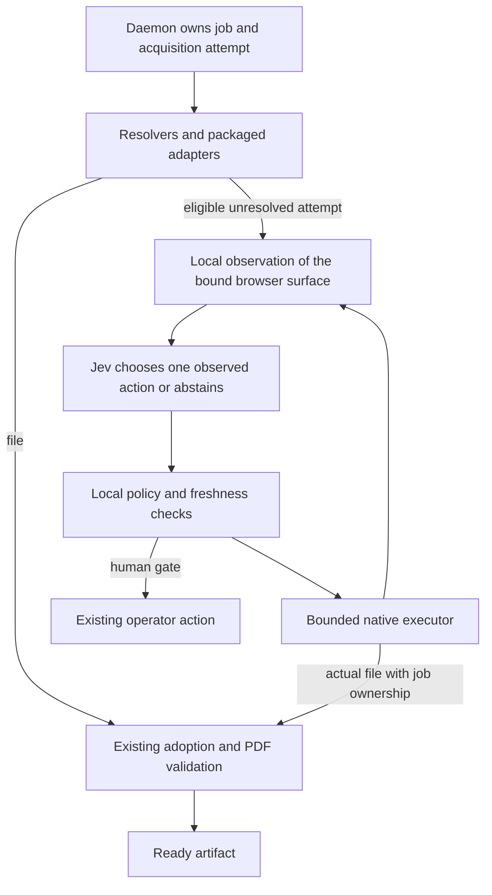

# Bounded agent fallback for acquisition

Status: proposed build plan, 2026-09-20. Development validation is authorized.
Production enablement and new OS permissions have not been granted by this plan.
Existing ADRs remain in force until a reviewed decision amends them.

## Evidence and remaining proof

The first supervised native-browser trial downloaded three correct papers.
Two fresh isolated jobs adopted and validated their files; one CDN-viewer
download remained outside papio. A follow-up explicitly used the extension's
Send this PDF action before the native download. The popup promised adoption,
but the file still landed in Downloads and the fresh job remained parked.
Thus explicit binding through the current UI is not yet sufficient in the field.
Private job histories, first-page checks, and model receipts stay in scratch.

The model selected observed controls successfully in those trials. A coding
agent prepared observations, checked actions, and controlled the desktop.
That is evidence for a supervised workflow, not a shipped observation loop,
cross-provider success rate, or proof that native interaction is undetectable.
The exact Chrome download event and extension binding state are still missing
from the failed follow-up. Do not promote a likely explanation into a root cause.

Current code explains why a native path matters:

- `extension/src/background.ts:requiresNativeViewerDownload` refuses to
  re-fetch known CDN and signed delivery URLs. A viewer can hold correct PDF
  bytes while a fresh request to its URL returns HTML.
- `extension/src/background.ts:startPDFDelivery` arms a document-bound manual
  continuation. `extension/src/background.ts:downloadFilenameSuggestion`
  and `extension/src/background.ts:correlate` must then associate the actual
  download. Their passing fixture test does not establish the live event shape.
- `extension/src/plan.ts:planExecution` and
  `extension/src/background.ts:executePlannedPageEffect` enforce the packaged
  plan. An `assisted` result cannot become executable because Jev likes a button.
- `internal/app/browser_adopt.go:AdoptDownload` is the existing adoption entry
  point. PDF structure, identity, artifact publication and import decisions stay
  in the current pipeline.

## Recommended architecture

Keep deterministic resolution and packaged adapters as the first acquisition
paths. Add an opt-in fallback for a current job when those paths lack a usable
route. A missing observation or technical timeout does not prove no entitlement.

**Daemon coordinator.** Own the fallback attempt, user opt-in, model budget,
deadlines, cancellation, result log and human-gate disposition. Store the API
credential in the OS credential store; call TypeSafe from the daemon. Use the
existing holder generation, materialization claim, binding and effect-permit
rules. Do not add a second durable acquisition queue or authority ledger.

**Browser extension.** Supply authoritative browser facts: tab and document
identity, permitted page metadata, navigation, provider observations, and download
events. Bind the fallback to the correct job before an effect. Keep actual URLs,
cookies and signed credentials local. Add a capability-gated protocol family
only after the local proof works; update Go, TS and schema together. The current
CLI trial tool is not the production transport.

**Local observation.** Produce a compact tree with article identity, access
state, visible controls, and their enclosing section or dialog. Preserve the
distinction between the main article and reference/sidebar PDFs. Never flatten
all buttons into an unordered bag or treat absent accessibility nodes as proof
that no control exists. Exclude credentials, form values, account details and
unrelated tabs. Record coverage and omissions explicitly.

**Jev decision module.** Return one opaque ID from the supplied action set,
WAIT, or BLOCKED. Accept no scripts, selectors, URLs, filesystem paths or
invented actions. Do not use model confidence as authority, a calibrated safety
probability, or proof that the file is correct. No explanation model is needed
in the hot loop; explain results from observed events and refusal reasons.

**Native executor.** Start with macOS and Chrome, using accessibility controls
and fresh observations, without CDP. Codex's native-control tool is a development
dependency, not a distributable papio API. A small signed local helper must
replace it. First prove a fixed Download/Save operation, not a general desktop
agent. The helper receives a job-bound action and must verify the intended Chrome
window, tab/document association, current target and unchanged operator control.
Use one native effect at a time; never replay an old accessibility index or
coordinate after navigation. New permissions require the operator's grant.

Native UI operation depends on desktop availability and competes with the user's
attention. The first version should declare its active window and stop on
takeover, lock, missing permission or ambiguous focus. Background operation,
screen-reader coverage, browser variants and other operating systems need
separate proof. A missing helper leaves an honest human continuation.

**Artifact path.** Establish ownership before saving resident viewer bytes.
First diagnose the existing filename-steering path. If a native Save operation
needs an explicit destination, it may receive only a daemon-issued path inside
that job's approved adoption root. The model never chooses a path. Prove this
through the same adoption/identity pipeline, with cancellation and duplicate
download checks; do not import whatever PDF most recently appeared in Downloads.

## Safety and distribution decisions to resolve

An opaque action ID limits output syntax, not the effect of clicking an arbitrary
web control. A page can lie about a button's label. PDF validation cannot undo a
purchase, consent or account mutation. Eligible actions need a local effect
contract; unresolved action semantics remain a human gate. Page instructions
cannot change the goal, allowed actions, budgets or approval requirements.

ADRs 0015 and 0021 deliberately reject positive runtime selector amendments.
A general agent executor introduces a different authority surface and needs a
new reviewed decision before production enablement. It must not silently widen
an assisted job into delegated automation. ADRs 0022 and 0028 continue to own
claims, effect serialization, takeover and surface cleanup.

Chrome permits packaged script injection with granted host access, but that API
does not establish native PDF-toolbar or Save-dialog control. The downloads API
starts URL requests and observes downloads; it is not documented as an export
of resident viewer bytes. See [scripting](https://developer.chrome.com/docs/extensions/reference/api/scripting)
and [downloads](https://developer.chrome.com/docs/extensions/reference/api/downloads).

Typed remote decisions are not a Chrome Web Store approval guarantee. Its MV3
policy also addresses interpreters of remote commands supplied as data. Keep
the extension's role and the desktop helper's role explicit and review the whole
product honestly; moving code to the daemon is not proof of compliance.
[Chrome MV3 policy](https://developer.chrome.com/docs/webstore/program-policies/mv3-requirements).
Firefox's viewer and native-download limitations need their own later acceptance
pass; do not promise parity from the Chrome result.

Users must opt into sending the current paper's minimized observation to
TypeSafe. Permission for local browsing or local diagnostic capture does not
imply cloud transmission. Model/API failure must leave a useful parked job.
Set measured per-job and daily spend budgets before automatic enablement.

## Build order and acceptance

1. **Close the delivery evidence gap.** Capture the real filename and download
   events, whether a tab ID is present, current page epoch, selected job binding,
   candidate-match reason and destination. Keep signed URLs private or retain
   only the comparisons/digests needed. Replay the observed shape in regression
   tests. A fresh CDN-viewer file must reach ready without manually moving it.
   Also prove two pending jobs cannot claim the same file, and a changed document
   cannot reuse an armed continuation.
2. **Prove the distributable native helper.** On a local benign fixture and then
   one isolated real provider, observe, select and save without Codex supplying
   targets. Exercise a changed page, lost focus, missing permission, cancellation
   and a native Save dialog. No general model loop until that fixed operation
   produces a validated artifact and stops correctly on those interruptions.
3. **Add the bounded loop behind explicit opt-in.** Start with proposed limits of
   eight decisions and 90 seconds per attempt, then tune from measurements.
   Detect repeated state/action pairs; distinguish loading from a fresh action.
   Reserve budget before each call. A timed-out browser action is reconciled
   before retry, because the effect may already have happened. Re-observe after
   every effect. Persist enough to stop safely across worker/daemon restarts;
   restart does not authorize replay of a click. Stop at existing human gates.
4. **Run a held-out comparison.** Predeclare at least 20 works across distinct
   platforms, including ordinary links, JavaScript downloads, popups, signed
   viewers, access walls and human gates. Compare the current path with fallback
   under stated session conditions; interleave order where possible and report
   interventions. Keep a held-out set during prompt/observation tuning. Measure
   validated artifacts per eligible job, wrong-work accepts, forbidden actions,
   human interventions, total wall time, API usage and leftover owned tabs.
   Zero observed safety failures is necessary, not proof of universal safety.
   Promote only if failures improve without regressing working routes.
5. **Package and expand from evidence.** Record the new authority decision and
   complete permissions/privacy/store review before distribution. Keep adapters
   for known access semantics and efficient established routes. Successful agent
   traces may propose reviewed fixtures and repairs; never install a learned
   selector or declare a repair successful automatically. Complete the separate
   capture-to-repair-to-live-artifact acceptance cycle.

This reduces recurring layout work; it does not remove maintenance. Browser
accessibility, generic observation quality, download mechanisms, model behavior,
privacy and session recovery become shared maintenance responsibilities. That
trade is worthwhile only if the held-out artifact results support it.
