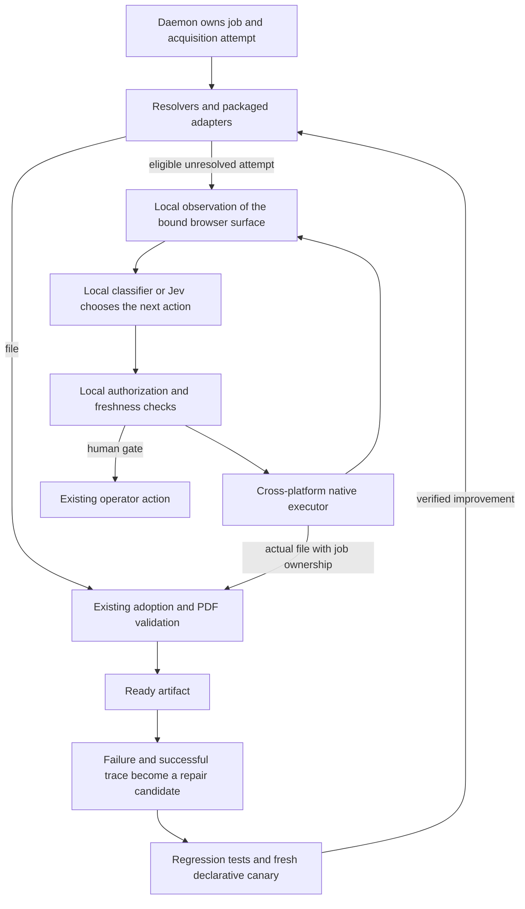

# Native agent acquisition and adapter learning

Status: integrated Chrome and Windows Firefox acquisition proven, 2026-09-21. The product direction is cross-platform
native acquisition, interchangeable cloud/local decision backends, and learning
from successful recoveries. Development validation is authorized. This document
does not grant new OS permissions. ADR-0029 records the acquisition decision
authority. The new integration is optional, capability-gated and disabled without
an explicitly supplied backend credential; native helper distribution is still
unimplemented.

## Current integration

The daemon now owns inference over the existing generic-drive permit and job.
The extension tries the agent after packaged/generic routes fail, including
publishers with no adapter. It observes an already bound DOI-identified article,
selects in-page controls and tracks the resulting browser download. Chrome's
filename-steering API carries Chrome downloads. Firefox now has a negotiated
native-download reservation and daemon adoption path. A naturally unsupported
eLife article reached `ready` through Firefox on Windows after one explicit Open
and one Jev decision; the correct 17-page PDF was retained and visually checked.
This proves assisted startup followed by automatic acquisition, not an unattended
cohort. The backend contract is shared across platforms and accepts local implementations; the first concrete backend
uses TypeSafe with a profile-scoped OS credential or a daemon-only
`PAPIO_TYPESAFE_API_KEY` environment variable.
The key is removed from the process environment before other subprocesses start.

Calls reserve a durable budget before network I/O. Inference runs outside the
bridge lock and stops when its job, holder, permit or session freshness changes.
Replies are checked again at delivery and immediately before browser dispatch.
The browser retains pending-download tracking after a PDF control is dispatched;
a disabled control or a model BLOCKED answer is not artifact failure evidence.
Local receipts omit page projections and raw model responses.

One live call through the new Go backend returned Jev 1.13.0's PDF-control choice
(750 input / 50 output tokens); it performed no browser action. The earlier
verified IOS Press acquisition used the spike controller. A later isolated Chrome
run of the integrated loop acquired the correct five-page IOS Press PDF after one explicit Open and one Jev decision, with the
packaged adapter deliberately omitted. That proves the fallback mechanism;
the eLife Firefox run adds natural no-adapter acceptance. Neither result establishes
cross-provider reliability. Same-tab, same-origin article navigation is now
implemented behind `agent_navigation_v1`; live acceptance is pending. It requires
the exact selected destination and a fresh DOI-bound document, transfers an idle
native reservation without changing its baseline or expiry, and preserves the
loop's deadline and inference budget. Unexpected redirects stop. New tabs,
cross-origin navigation, native viewer saving and automatic source-repair
promotion remain subsequent slices.

## Delivery backlog after the first live proof

The operator requested an extension-free route on 2026-09-21. It is a planned
product capability, not merely a developer tool. Keep the extension-backed route
as the background executor where available; let users choose native execution
without installing an extension. Both executors share the decision contract,
job authority, cancellation and artifact validation. No CDP, WebDriver or browser
debugger is introduced by removing the extension.

| Work | Result required |
| --- | --- |
| Persistent key setup | Hidden prompt or secret-manager stdin → OS credential store → explicitly enrolled profile → restarted daemon, on macOS, Windows and Linux. No plaintext key in config, browser storage, logs or argv. |
| Menu and observation progression | Hidden/clipped menu controls do not appear prematurely; an opened PDF menu advances without spending a 45-second download wait. Preserve actual-download grace and exact receipt ownership. |
| Article navigation and new contexts | Same-tab exact same-origin destination implemented; live proof pending. Next: redirects and an owned child tab. Retire old control handles; carry the existing job/permit through a defined handoff, recheck permissions/identity, close only owned tabs, and reconcile any download already started. Test redirects, cancellation, concurrent jobs and operator takeover. |
| CDN and resident-viewer acquisition | Follow the browser's actual navigation and save resident bytes through the native helper when needed. No second fetch of signed URLs and no claiming the newest arbitrary Downloads file. Require an exact job-bound file, adoption and identity validation on Chrome and Firefox. |
| Local repair learning | Connect failed declarative capture, successful fallback and validated artifact to the existing repair workspace. Generate/test in isolation, run a fresh model-free declarative canary, promote or revert from the artifact outcome. Keep local operation independent of analytics. |
| Extension-free native executor | Reuse and assess maintained OSS accessibility/input components on macOS, Windows and named Linux desktops. The helper starts on demand, yields to user input and cleans up its own tabs/dialogs. Prove article observation, navigation, saving, ownership, cancellation and recovery with the extension disabled and Codex absent. Measure focus, pointer and input interference. |

Removing the extension also removes its tab IDs, host grants and download events.
The native implementation therefore needs its own demonstrated surface/file
association; elapsed time or the newest file is insufficient. Use a daemon-issued
per-attempt save destination or another equally discriminating ownership proof.
Keep cloud and future local classifiers interchangeable in both execution modes.

## Evidence and remaining proof

The [native helper spike](../native-helper-spike.md) now runs independently of
Codex: four Jev decisions acquired a three-page synthetic PDF through Chrome's
viewer and native Save dialog. It reuses AXorcist and selected trycua native
delivery code. Native foreground operation succeeded; native background-only
operation did not. A subsequent extension-API run completed three Jev decisions
and downloaded the verified fixture PDF in 2.29 seconds while another app stayed
in front. The passive monitor recorded 94 samples with no app/window/pointer
changes or missing channels during that run. A further isolated run downloaded a
public 15-page paper through the loopback fixture, steered it to its job directory,
and reached `ready` with PDF identity validation passing. Three Jev decisions took
3.20 seconds through download; 130 monitor samples showed no app/window/pointer
changes or missing channels. This proves fixture adoption through the normal
pipeline. A subsequent IOS Press trial acquired a real five-page article in
2.85 seconds through download, with two Jev decisions and no manual PDF click.
Chrome steered the 363,923-byte file into its fresh isolated job directory;
Papio adopted it, validated identity and reached `ready`. The first page and
page count were checked. Its 113 monitor samples recorded no app/window/pointer
changes or missing channels. This is one provider mechanism, not a cohort result.
A controlled selector fault then completed the full development repair cycle:
daemon-correlated drift capture → Jev recovery → validated PDF → generated source
repair → tests/build/reload → a fresh declarative canary. That canary downloaded
the same correct PDF and reached `ready` 5.19 seconds after explicit Open, with no
model calls and no artifact cache. The first generated candidate failed five
adverse-case tests and was reverted; the corrected generator preserves the
working ancestor, form and disabled-control guards. This proves the controlled
workflow, not autonomous production learning or recovery from natural site drift.
Private receipts include the failed filename check. Owned tabs/servers and
generated bundles were cleaned up; temporary activeTab grants ended on closure.

That adoption test found and fixed a real recovery defect: extension reloads clear
session storage, leaving open manual-download actions without PDF choices. The
extension now recovers inert choices from the daemon's current actions. It can do
so when Send PDF is requested, without requiring an inbox visit. The live test
opened the inbox during setup; regression tests cover the direct cold Send PDF
path. Recovered choices carry no provider-driving authority and require a fresh
PDF document binding. Late completion notifications now recover an already-ready
job only when confined landing bytes, the verified stored artifact and accepted
browser candidate agree. Supplied producer claims require prior durable evidence.
The live IOS Press run completed without the earlier misleading
`adoption_deferred` event.

The first supervised native-browser trial downloaded three correct papers.
Two fresh isolated jobs adopted and validated their files; one CDN-viewer
download remained outside papio. A follow-up explicitly used the extension's
Send this PDF action before the native download. The popup promised adoption,
but the file still landed in Downloads and the fresh job remained parked.
Thus explicit binding through the current UI is not yet sufficient in the field.
Private job histories, first-page checks, and model receipts stay in scratch.

The model selected observed controls successfully in those trials. A coding
agent prepared observations, checked actions, and controlled the desktop.
That is evidence for a supervised workflow, not a shipped observation loop,
cross-provider success rate, or proof that native interaction is undetectable.
The exact Chrome download event and extension binding state are still missing
from the failed follow-up. Do not promote a likely explanation into a root cause.

Current code explains why a native path matters:

- `extension/src/background.ts:requiresNativeViewerDownload` refuses to
  re-fetch known CDN and signed delivery URLs. A viewer can hold correct PDF
  bytes while a fresh request to its URL returns HTML.
- `extension/src/background.ts:startPDFDelivery` arms a document-bound manual
  continuation. `extension/src/background.ts:downloadFilenameSuggestion`
  and `extension/src/background.ts:correlate` must then associate the actual
  download. Their passing fixture test does not establish the live event shape.
- `extension/src/plan.ts:planExecution` and
  `extension/src/background.ts:executePlannedPageEffect` enforce the packaged
  plan. An `assisted` result cannot become executable because Jev likes a button.
- `internal/app/browser_adopt.go:AdoptDownload` is the existing adoption entry
  point. PDF structure, identity, artifact publication and import decisions stay
  in the current pipeline.

## Recommended architecture

Keep deterministic resolution and packaged adapters as the efficient first
paths. Make native agent acquisition a first-class backend when they lack a
usable route. It should navigate unfamiliar layouts and complete multi-step
acquisition without requiring a provider-specific selector for every action.
A missing observation or technical timeout does not prove no entitlement.

**Daemon coordinator.** Own the attempt, selected decision backend, resource
budget, progress, cancellation, result log and operator actions. Store cloud
credentials through the platform's credential store. Use the
existing holder generation, materialization claim, binding and effect-permit
rules. Do not add a second durable acquisition queue or authority ledger.

**Browser extension.** Supply authoritative browser facts: tab and document
identity, permitted page metadata, navigation, provider observations, and download
events. Bind the fallback to the correct job before an effect. Keep actual URLs,
cookies and signed credentials local. Add a capability-gated protocol family
only after the local proof works; update Go, TS and schema together. The current
CLI trial tool is not the production transport.

**Local observation.** Produce a compact tree with article identity, access
state, visible controls, and their enclosing section or dialog. Preserve the
distinction between the main article and reference/sidebar PDFs. Never flatten
all buttons into an unordered bag or treat absent accessibility nodes as proof
that no control exists. Exclude credentials, form values, account details and
unrelated tabs. Record coverage and omissions explicitly.

**Decision backend.** Papio owns a versioned observation/decision contract.
TypeSafe/Jev is its first implementation. A local classifier must be able to
implement the same contract without an API key, cloud account, or cloud consent.
Supply work context, current state, action candidates and useful attempt history;
return a candidate ID, WAIT, or a reason acquisition cannot continue. Typed
arguments for operations such as article search can be added as needed. Actual
URLs, execution handles, save paths and authority stay local. Validate output in
Papio regardless of whether a backend uses typed classification or constrained
generation. Do not make TypeSafe primitives, token accounting, or confidence
scores part of the executor contract.

Keep backend capabilities explicit: text/tree input, optional images, context
limits, cancellation and usage. Preserve hierarchical observations so a small
local model can use focused questions without requiring a whole-page prompt.
No explanation model is required on every step. A stronger configured backend
can handle hard cases; switching from local to cloud must respect the user's
selected mode. API failure must never force an unapproved cloud substitution.

Support future bundled or optional local model packs: versioned weights,
checksums, license/provenance, resource requirements and a reversible update.
The runtime boundary can initially use a local process; choose a concrete
inference engine after measurement. Prove backend substitution and offline
operation with a deterministic test backend now. Defer local-model benchmarking,
and make no claim about when suitable models will arrive. Training or distilling
from retained, permitted traces is a later option, not a prerequisite for adapter
learning. A local-only configuration must not send inference or diagnostics to
an external service.

**Native executor.** Use one normalized observation/action interface with
platform implementations. A small local helper observes accessible controls,
roles, labels, bounds and active dialogs; it activates targets, enters approved
non-secret text, scrolls, changes owned surfaces and operates native Save dialogs.
Freshness, document association and operator takeover are checked before effects.
Use semantic accessibility actions first and fresh visual/input fallbacks when
needed. Missing accessibility coverage calls for another observation method,
not an automatic verdict that the page is unusable. No CDP or debugger attachment.

| Platform | Native backend to prove | Acceptance scope |
| --- | --- | --- |
| macOS | Accessibility API; small Swift/C bridge if needed | Chrome and Firefox, native viewer and Save dialog |
| Windows | UI Automation and required native input | Same observation/action and artifact cases |
| Linux | AT-SPI; desktop portals for input/capture where needed | Chrome/Chromium and Firefox; named X11 and Wayland desktops |

These are implementation candidates, not verified coverage. Apple exposes
[accessibility trust](https://developer.apple.com/documentation/applicationservices/1460720-axisprocesstrusted),
Windows exposes [UI Automation](https://learn.microsoft.com/en-us/windows/win32/winauto/uiauto-uiautomationoverview),
and Linux offers [AT-SPI actions](https://gnome.pages.gitlab.gnome.org/at-spi2-core/libatspi/iface.Action.html)
and the [RemoteDesktop portal](https://flatpak.github.io/xdg-desktop-portal/docs/doc-org.freedesktop.portal.RemoteDesktop.html).
Portal/compositor differences require named coverage, not a blanket Linux claim.

Start the runnable spike on this Mac because it is available. Begin Windows and
Linux contract spikes before broadening the provider cohort. Their shared
conformance cases are a delivery milestone, not unspecified future work. Codex's
native tool is development assistance and must be absent from the acceptance run.
Signing, installation and permission onboarding follow the executable proof.
Keep the policy/model loop in shared code rather than three OS implementations.

Report which surface Papio controls and yield on operator takeover. Reconcile
before resuming; never replay an old target after navigation. Model calls and
resolution can run concurrently, but foreground input needs a single owner.
Desktop lock, missing permission or unsupported browser combinations need clear
operator actions. Probe background accessibility support rather than assuming
every action must steal focus. Close only surfaces owned by the attempt.

Unobtrusiveness includes setup, native dialogs and cleanup. Measure foreground
app/window and keyboard-focus changes, pointer movement and interference during
settling, not merely whether a window was raised. Prefer extension operations
for background page interactions they can perform without CDP; native control
covers the remaining viewer/dialog surfaces. A library's quiet-looking focus
mutation must not silently become the default. The current spike uses endpoint
measurements only and cannot yet establish uninterrupted user input.

**Artifact path.** Establish ownership before saving resident viewer bytes.
Diagnose the existing filename-steering path alongside the native spike. If Save
needs an explicit destination, it may receive only a daemon-issued path inside
that job's approved adoption root. The model never chooses a path. Prove this
through the same adoption/identity pipeline, with cancellation and duplicate
download checks; do not import whatever PDF most recently appeared in Downloads.

## Autonomy and stopping conditions

The loop is observe → decide → act → verify progress → repeat. It can navigate,
search for the article, follow access routes, open viewers, handle ordinary
download dialogs and recover from failed paths. An unfamiliar layout or absence
of a packaged selector is not itself a reason to stop. Use reusable acquisition
action classes, target/context checks and observed consequences. Concrete signs
of a purchase, terms acceptance, credential entry, provider challenge, permission
grant or delivery submission retain the applicable user-approval boundary.
Material ambiguity between acquisition and one of those effects needs resolution;
routine navigation does not require a new provider-specific proof. Page text
cannot change the user's task or grant authority. PDF validation establishes the
artifact result; it cannot undo an unrelated account mutation.

Replace the unsupported eight-decision/90-second proposal with configurable
resource ceilings and progress-based control. Measure active decisions, waiting,
wall time, repeated state/action pairs, API cost and local compute separately.
Continue while making useful progress within the configured ceiling; permit
replanning and alternate routes. Use generous explicit development budgets and
derive product defaults from completion distributions. Event-driven waiting
should not spend repeated inference calls just to observe a loading page.
Stop on cancellation, a real approval boundary, exhausted configured resources,
or persistent lack of progress. Reconcile an uncertain effect before retrying;
navigation or a daemon restart must not duplicate a download or other effect.

## Learning from successful recovery

This is part of the feature, including local development without hosted analytics:

1. Preserve the failed declarative observation and the successful native trace.
2. Require download, job-bound adoption, correct-PDF validation and first-page/
   page-count evidence for live acceptance. Record interventions separately.
3. Turn the failure into a regression fixture and derive a corrective adapter
   candidate. Reuse `papio adapter repair` and the existing capture/incident
   machinery. Jev supplies action/outcome evidence; a deterministic generator or
   separate coding model can produce source changes. Jev need not generate code.
4. Replay the old and candidate revisions against historical and adverse cases.
   Successful outcomes supply labels; the candidate does not label its own tests.
5. In developer mode, automatically apply eligible source repairs in an isolated
   checkout/build, run a fresh declarative canary, and promote or revert from its
   artifact result. Keep the previous revision and provenance. No requirement
   for a person to approve every ordinary local repair.
6. Count repair success only when the corrected declarative route independently
   acquires the correct PDF. Track whether later jobs avoid the model call.

Eligibility concerns the resulting effect, not which selector field changed.
A new selector can preserve an acquisition effect; a changed guard can enlarge
authority. Enforce host/work/action boundaries, target revalidation and negative
cases. Expanded authority or unresolved consequential effects need review;
passing fixtures and a successful download alone do not establish equivalence.
Local canaries use fresh isolated jobs and preserve original jobs and storage.
Distributed extension repairs use packaged releases and a tested rollout path;
this plan does not silently add a remote executable selector catalog.

## Consent, contribution and distribution

Entering a TypeSafe key specifically to enable Jev is the cloud-inference opt-in.
Explain the minimized observation and destination at setup, then run without a
second checkbox or per-job prompt. A pre-existing unrelated credential is not
enrollment. Selecting a local backend needs no cloud key or cloud consent.
Local model installation and any OS-required permissions have their own setup.

Contribution to the Papio developer is separately optional. Extend the existing
[repair/contribution plan](adapter-release-latency-plan.md), which already defines
local-only, ask and automatic modes, with separate structural and rich-capture
tiers. Structural reports can reveal recurring failure patterns; actual selector
repair generally needs a local fixture or an authorized richer capture. Preserve
local learning when reporting is disabled. Do not upload reading history,
credentials, account data or private traces by implication from a TypeSafe key.

ADRs 0015 and 0021 explain why selector changes can change authority. Write the
native-executor and automated local-repair decision alongside the spike, including
its effect checks and the distinction between source builds and runtime catalogs.
This is a concrete architecture task, not an indefinite veto. Enabling agent
acquisition must be explicit in job policy; do not silently reinterpret existing
assisted jobs. ADRs 0022 and 0028 still own claims, serialization and cleanup.

Chrome permits packaged script injection with granted host access, but that API
does not establish native PDF-toolbar or Save-dialog control. The downloads API
starts URL requests and observes downloads; it is not documented as an export
of resident viewer bytes. See [scripting](https://developer.chrome.com/docs/extensions/reference/api/scripting)
and [downloads](https://developer.chrome.com/docs/extensions/reference/api/downloads).

Data contribution and distribution of executable behavior are separate issues.
Chrome's MV3 policy addresses interpreters of remote commands supplied as data;
it does not establish that opt-in diagnostic uploads are forbidden. Document what
executes in the extension, daemon and helper, and test the intended distribution
route before broad release. Moving execution to the daemon is not proof of approval.
[Chrome MV3 policy](https://developer.chrome.com/docs/webstore/program-policies/mv3-requirements).
Mozilla also requires declaration of data sent to native applications, including
local ones. Meet that browser requirement through onboarding; do not misdescribe
it as cloud consent. [Mozilla guidance](https://extensionworkshop.com/documentation/develop/best-practices-for-collecting-user-data-consents/).

## Build order and acceptance

1. **Prove native acquisition without Codex or CDP.** Build the shared driver and
   decision interfaces, a Mac executable and the TypeSafe backend. On benign
   fixtures and then fresh isolated provider jobs, let the program observe,
   select controls, navigate, save and reach a validated artifact without a coding
   agent supplying targets. Test varied links, dialogs and viewers, stale targets,
   takeover, cancellation and cleanup. This is a multi-step acquisition spike,
   not a fixed Save demonstration. Prove offline backend substitution with a test
   implementation, without claiming a local model's acquisition quality.
2. **Close delivery association in the same milestone.** Capture real download
   events, whether a tab ID is present, current page epoch, selected job binding,
   candidate-match reason and destination. Keep signed URLs private or retain
   only the comparisons/digests needed. Replay the observed shape in regression
   tests. Existing filename steering is not a prerequisite to building the driver;
   a daemon-issued Save destination is another path to test. A fresh CDN-viewer
   file must reach ready without manually moving it.
   Also prove two pending jobs cannot claim the same file, and a changed document
   cannot reuse an armed continuation.
3. **Validate portability and complete one learning cycle.** Run Windows and
   Linux driver contract spikes before widening provider coverage, recording
   missing capabilities per OS/browser/desktop. On this development machine,
   prove failed adapter → native recovery → generated repair → test/build → fresh
   declarative canary → validated artifact, with rollback exercised. Integrate
   the capability-gated production protocol after these seams are demonstrated.
4. **Run a held-out comparison.** Predeclare at least 20 works across distinct
   platforms, including ordinary links, JavaScript downloads, popups, signed
   viewers, access walls and human gates. Compare the current path with fallback
   under stated session conditions; interleave order where possible and report
   interventions. Keep a held-out set during prompt/observation tuning. Measure
   validated artifacts per eligible job, wrong-work accepts, forbidden actions,
   human interventions, total wall time, API usage and leftover owned tabs.
   Zero observed safety failures is necessary, not proof of universal safety.
   Promote only if failures improve without regressing working routes.
5. **Deliver across the platform matrix.** Complete Chrome and Firefox acceptance
   on macOS, Windows and named Linux environments; publish explicit coverage and
   limitations. Package helpers, permissions and credential backends. Complete
   the distribution experiment and staged repair release path. Evaluate local
   models when candidates are worth measuring; ship a suitable licensed model
   pack through the same backend interface. Add hosted contribution only with
   its separate opt-in and retention/deletion implementation.

This reduces recurring layout work; it does not remove maintenance. Browser
accessibility, generic observation quality, download mechanisms, model behavior,
privacy and session recovery become shared maintenance responsibilities. That
trade is worthwhile only if the held-out artifact results support it.
