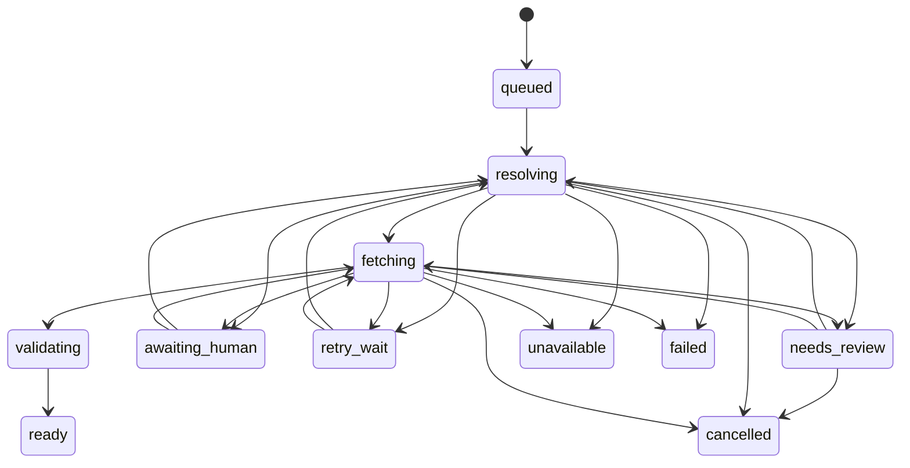

# Acquisition pipeline

An acquisition is a durable, bounded job: it turns a work request into a
validated artifact, or records why that did not happen. The broker keeps the
request separate from the eventual Zotio export, so a ready acquisition is not
rewritten by a later preview or apply operation.

## Durable work

SQLite stores the canonical request and identifiers, the job's policy snapshot,
state, lease, selected candidate, artifact, and terminal reason. Related tables
record resolver and fetch attempts, candidate observations, artifacts, human
actions, append-only events, exports, and per-source budgets. Sensitive browser
and credential material is not persisted: cookies, raw DOM, screenshots, and
secret-bearing URL query values remain outside the database.

Every state transition is one database transaction with an idempotency key. A
running job holds a lease. When a daemon crashes, expired leases allow work to
resume at the last durable boundary without duplicating a download.

## Resolution and selection

Resolvers return observations, not authority. Free and known-identifier
resolvers can run concurrently within their source-specific limits, but their
results are selected by one deterministic ranking tuple:

1. Identity confidence; an explicit mismatch rejects the candidate.
2. Legitimate access basis and user policy.
3. Requested or default version preference.
4. Directness and historical source reliability.
5. Reuse-license clarity.
6. Monetary cost and quota impact.
7. Stable source tie-breaker.

The broker does not accept the first URL it sees. It resolves candidates, fetches
them in rank order, validates each result, and continues after retryable or
invalid results.

The resolver order is:

1. Existing broker artifact cache by canonical identity and validated SHA.
2. Identifier-native open sources: arXiv, PubMed Central/Europe PMC where applicable.
3. Unpaywall OA locations.
4. OpenAlex work locations and, when explicitly enabled, OpenAlex Content API.
5. CORE and other identifier-native repositories with configured API keys/terms.
6. Crossref full-text/TDM links only when the specific publisher/API credential and use are configured; a link is metadata, not entitlement.
7. Institution OpenURL.
8. Document-delivery/controlled-loan/manual action when no entitled candidate exists.

Institutional routing begins with the configured institution OpenURL resolver,
not a guessed publisher login. See [browser handoff](browser-handoff.md) for the
user-controlled institutional path and [configuration reference](../reference/config-reference.md)
for access policy and resolver settings.

## Fetch, quarantine, and validation

A fetch is bounded by source-specific host policy, redirect cap, deadlines,
response-size cap, and retry budget. Redirects are resolved and validated;
authorization headers do not cross hosts. The response streams to a
same-filesystem quarantine file, with both early `Content-Length` enforcement
and independent byte counting. HTML, audio, JSON, and login pages fail before
artifact adoption; PDF, octet-stream, or absent content type is only
provisionally accepted.

Validation decides whether the quarantined result can become an immutable
artifact. Its PDF structure, size and SHA-256, page count, content, and work
identity are checked. Conflicting identity is rejected; ambiguous identity moves
to review rather than being silently accepted. Read [validation and
provenance](validation-and-provenance.md) for the complete acceptance and
provenance record.

## Job lifecycle

`ready` is the acquisition terminal state. A retryable outcome enters
`retry_wait` before resolution or fetching resumes. `awaiting_human` represents
a required user action; `needs_review` preserves ambiguity for an explicit
decision. `unavailable`, `failed`, and `cancelled` end the current acquisition
path.
