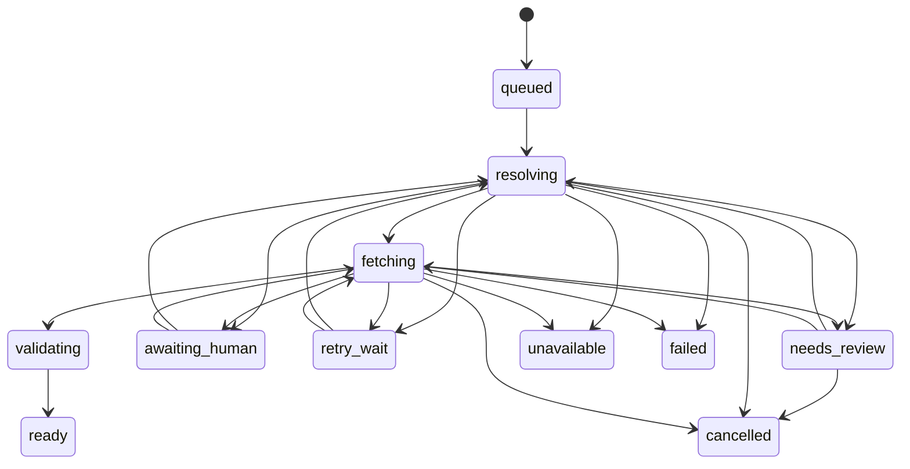

# Acquisition pipeline

An acquisition is a saved job: it turns a request into a validated PDF, or
records why that did not happen. *papio* keeps the request separate from the
eventual zotio export, so a finished acquisition is not rewritten by a later
preview or apply.

## How work is saved

A local database stores each request and its identifiers, the policy in force
when it ran, its current state, the chosen candidate, the resulting file, and (if
it ended) why. Companion records track each source lookup and download attempt,
candidate observations, human decisions, a full event history, exports, and
per-source budgets. Sensitive browser and credential material is never stored:
cookies, page contents, screenshots, and secret-bearing URL values stay out of the database.

Each step is recorded so it happens once, even if repeated. If *papio* is
interrupted, an unfinished job resumes from its last saved point instead of
downloading again.

## Resolution and selection

Sources return candidates, not decisions. Free and identifier-based lookups can
run at the same time within their limits, but their results are ranked by one
fixed set of rules:

1. Identity confidence; an explicit mismatch rejects the candidate.
2. Legitimate access basis and user policy.
3. Requested or default version preference.
4. Directness and historical source reliability.
5. Reuse-license clarity.
6. Monetary cost and quota impact.
7. Stable source tie-breaker.

*papio* does not accept the first URL it sees. It gathers candidates, downloads
them in ranked order, validates each result, and moves on after a failed or
invalid one.

*papio* tries sources in this order:

1. Files *papio* has already validated for the same work.
2. Identifier-native open sources: arXiv, PubMed Central/Europe PMC where applicable.
3. Unpaywall OA locations.
4. OpenAlex work locations and, when explicitly enabled, OpenAlex Content API.
5. CORE and other identifier-native repositories with configured API keys/terms.
6. Crossref full-text/TDM links only when the specific publisher/API credential and use are configured; a link is metadata, not entitlement.
7. Institution OpenURL.
8. Document-delivery/controlled-loan/manual action when no entitled candidate exists.

Institutional access starts with your library's OpenURL resolver, not a guessed
publisher login. See [browser handoff](browser-handoff.md) for the
user-controlled institutional path and [configuration reference](../reference/config-reference.md)
for access policy and source settings.

## Fetch, quarantine, and validation

A fetch is constrained by source-specific host policy, a redirect cap, deadlines, a
response-size cap, and retry budget. Redirects are resolved and validated;
authorization headers do not cross hosts. The response streams to a
same-filesystem quarantine file, with both early `Content-Length` enforcement
and independent byte counting. HTML, audio, JSON, and login pages are rejected
before adoption; a PDF, a generic file download, or an unlabeled response is only
provisionally accepted.

Validation decides whether the quarantined file can become a permanent, trusted
PDF. *papio* checks its structure, size and content hash, page count, text, and
whether it matches the requested work. Conflicting identity is rejected; ambiguous identity moves
to review rather than being silently accepted. Read [validation and
provenance](validation-and-provenance.md) for the complete acceptance and
provenance record.

## Job lifecycle

`ready` is the acquisition terminal state. A retryable outcome enters
`retry_wait` before resolution or fetching resumes. `awaiting_human` represents
a required user action; `needs_review` preserves ambiguity for an explicit
decision. `unavailable`, `failed`, and `cancelled` end the current acquisition
path.
