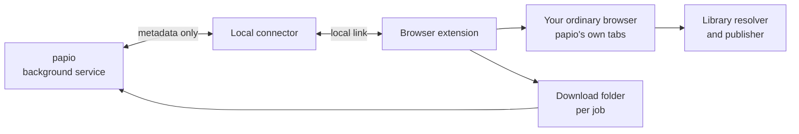

# Browser handoff

Browser handoff is *papio*'s institutional-access plane. When an eligible job has
exhausted direct acquisition, [assisted and maximal access modes](access-modes.md)
can route it to the user's existing browser session. Conservative mode records
institutional OpenURL availability without opening a handoff.

## One ordinary browser, not browser automation

*papio* uses the browser you already use for institutional access. A browser
extension opens its own tabs and connects to *papio* through a small local
connector. *papio* stays in charge of jobs and state; the connector only passes
short messages and never owns the queue or stores browser data.

*papio* never uses an automated or hidden browser. It does not launch a separate
browser, run one in the background, copy your cookies, or fill in sign-in forms.
Because everything happens in your ordinary browser, publisher sites see a normal
person, not a robot — automated browsers trip anti-bot checks and get blocked.
*papio* relies on your real, signed-in session instead.

The extension tracks only its own tabs. It runs provider-specific code only on
sites you grant, notices when you return from your institution's login page
without recording that page's address or title, matches up the job's download,
and closes only its own tabs when a job finishes or is cancelled. The extension
can restart at any time; it keeps only a minimal tab-to-job mapping and asks
*papio* for the authoritative state.

## The minimized work window

*papio* keeps its tabs in one dedicated browser window, opened minimized and
unfocused — a normal window kept out of your way, not a hidden or automated
browser. It is reused for later handoffs and reopened if you close it, so your
ordinary tabs are not flooded with login and publisher pages.

The extension surfaces the exact work tab only when a human decision is needed:

- institutional authentication;
- publisher terms requiring a decision; or
- identity review.

After that step, the window can be minimized again and *papio* continues
its work. This preserves the one-login-per-research-session model without
asking *papio* to handle passwords, MFA, CAPTCHA tokens, or publisher
credentials.

## Chrome and Firefox

The extension works the same way in Chrome and Firefox. *papio* installs a
connector for each browser, and the connector checks each caller: Chrome
supplies the configured extension ID; Firefox supplies the configured add-on ID.
Leaving a browser's extension ID empty turns off that browser's connection.

Firefox is a day-one target. Its built add-on ID is fixed as
`papio@orgmentem.com`; the Firefox connector is set to allow that ID. Firefox
treats host access as opt-in at runtime,
so the extension options page includes a resolver-access grant alongside the
per-provider grants.

## Browser configuration

`[browser]` binds each installed browser and defines the default institution:

| Key | Purpose |
| --- | --- |
| `extension_id` | Chrome extension ID allowed to use the connector; empty disables the Chrome bridge. |
| `firefox_extension_id` | Firefox add-on ID allowed to use the connector; empty disables the Firefox bridge. |
| `openurl_base_url` | Default institution's HTTPS OpenURL resolver base. |
| `shibboleth_entity_id` | Optional default IdP entity ID for skipping a provider's WAYF selector. |
| `proquest_account_id` | Optional default ProQuest account ID for the `accountid` append. |
| `download_adoption_root` | Root containing the per-job adopted downloads; when empty, *papio* uses `<data_dir>/adoptions`. |
| `action_expiry_seconds` | Maximum open time for one browser handoff. |

`[browser.resolvers.<name>]` profiles replace the default institution for a
selected job. They carry only `openurl_base_url` and optional
`shibboleth_entity_id` and `proquest_account_id`; they never inherit a default
identity.

## Permissions and data boundary

The extension requests only these regular permissions:

`nativeMessaging`, `activeTab`, `tabs`, `downloads`, `scripting`, and `storage`.

Provider domains are declared in `optional_host_permissions` and are granted
per source through the extension UI. *papio* does not request `<all_urls>`,
`cookies`, or `debugger`; it does not request access to identity-provider hosts.
Selecting maximal mode does not grant a browser permission.

The link to the browser carries metadata only, within *papio*'s fixed message-size limit.
PDF bytes, cookies, credentials, page contents, screenshots, and secret- or
signed-URL values never cross that link. For a selected download, the
extension reports metadata such as the download item and final filename; the
file itself lands under `<download_adoption_root>/<job_id>/` for adoption and
validation. See [Configuration reference](../reference/config-reference.md)
for `download_adoption_root` and the effective default.

## Institution-specific routing

The default `[browser]` institution can provide an `openurl_base_url` plus
optional `shibboleth_entity_id` and `proquest_account_id`. The entity ID lets a
provider's login jump straight to your institution's sign-in page instead of
stopping at a “Where are you from?” chooser. A ProQuest account ID causes *papio* to append `?accountid=` to
the resolver link, which can unlock the institution's ProQuest route.

For multiple libraries, define `[browser.resolvers.<name>]` profiles. Every
named profile carries its own `openurl_base_url` and optional
`shibboleth_entity_id` and `proquest_account_id`. A named profile never inherits
the default profile's login identity, so a job stays with the institution that
was selected for it. The complete key constraints and profile syntax are in the
[Configuration reference](../reference/config-reference.md#browserresolvers).
