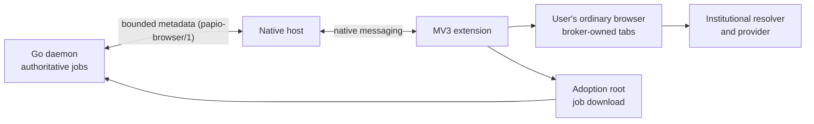

# Browser handoff

Browser handoff is *papio*'s institutional-access plane. When an eligible job has
exhausted direct acquisition, [assisted and maximal access modes](access-modes.md)
can route it to the user's existing browser session. Conservative mode records
institutional OpenURL availability without opening a handoff.

## One ordinary browser, not browser automation

*papio* uses the browser the user already uses for institutional access. A
Manifest V3 extension opens broker-owned tabs and connects through a local
native-messaging host to the Go daemon using `papio-browser/1`. The daemon
remains authoritative for jobs and state; the native host forwards bounded
messages and does not own the queue or persist browser state.

This is a no-CDP design. *papio* does not launch a separate profile, hidden
backend browser, headless browser, or a CDP-controlled browser, and it does not
copy cookies or automate sign-in. The ordinary-browser posture keeps
`navigator.webdriver` false. CDP-driven publisher trials triggered Cloudflare
loops; the extension instead relies on the user's real, human-authenticated
session.

The extension tags and tracks only broker-owned tabs. It runs provider adapters
only on hosts the user grants, detects a return from an identity provider
without recording the IdP URL or title, correlates a job download, and closes
only broker-owned tabs when a job completes or is cancelled. Its service worker
can restart; it retains only minimal tab/job correlation and re-requests the
daemon's authoritative state.

## Headless-most work window

“Headless” here means *out of the way*, not a headless browser. *papio* keeps
broker tabs in one dedicated browser work window, created minimized and
unfocused. The window is reused for later offers and recreated if the user
closes it, so ordinary tabs do not receive a succession of resolver and
provider pages.

The extension surfaces the exact work tab only when a human decision is needed:

- institutional authentication;
- publisher terms requiring a decision; or
- identity review.

After that step, the work window can recede and the broker continues its
bounded work. This preserves the one-login-per-research-session model without
asking *papio* to handle passwords, MFA, CAPTCHA tokens, or publisher
credentials.

## Chrome and Firefox

The browser protocol is shared across Chrome and Firefox. *papio* installs a
native-host manifest for each browser, and the native host validates each
caller exactly: Chrome supplies the configured extension origin; Firefox
supplies the configured Gecko add-on ID. An empty browser extension ID disables
that browser's bridge independently.

Firefox is a day-one target. Its built add-on ID is fixed as
`papio@orgmentem.com`; the Firefox native-host manifest uses
`allowed_extensions` for that ID. Firefox treats host access as runtime opt-in,
so the extension options page includes a resolver-access grant alongside the
per-provider grants.

## Browser configuration

`[browser]` binds each installed browser and defines the default institution:

| Key | Purpose |
| --- | --- |
| `extension_id` | Chrome extension ID allowed to use the native host; empty disables the Chrome bridge. |
| `firefox_extension_id` | Firefox add-on ID allowed to use the native host; empty disables the Firefox bridge. |
| `openurl_base_url` | Default institution's HTTPS OpenURL resolver base. |
| `shibboleth_entity_id` | Optional default IdP entity ID for skipping a provider's WAYF selector. |
| `proquest_account_id` | Optional default ProQuest account ID for the `accountid` append. |
| `download_adoption_root` | Root containing the per-job adopted downloads; when empty, *papio* uses `<data_dir>/adoptions`. |
| `action_expiry_seconds` | Maximum open time for one browser handoff. |

`[browser.resolvers.<name>]` profiles replace the default institution for a
selected job. They carry only `openurl_base_url` and optional
`shibboleth_entity_id` and `proquest_account_id`; they never inherit a default
identity.

## Permissions and data boundary

The extension requests only these regular permissions:

`nativeMessaging`, `activeTab`, `tabs`, `downloads`, `scripting`, and `storage`.

Provider domains are declared in `optional_host_permissions` and are granted
per source through the extension UI. *papio* does not request `<all_urls>`,
`cookies`, or `debugger`; it does not request access to identity-provider hosts.
Selecting maximal mode does not grant a browser permission.

Native messaging carries metadata only, within *papio*'s bounded message size.
PDF bytes, cookies, credentials, raw browser DOM, screenshots, and secret- or
signed-URL values never cross that boundary. For a selected download, the
extension reports metadata such as the download item and final filename; the
file itself lands under `<download_adoption_root>/<job_id>/` for adoption and
validation. See [Configuration reference](../reference/config-reference.md)
for `download_adoption_root` and the effective default.

## Institution-specific routing

The default `[browser]` institution can provide an `openurl_base_url` plus
optional `shibboleth_entity_id` and `proquest_account_id`. The entity ID lets a
provider login route directly to the institution's IdP rather than stopping at
a WAYF selector. A ProQuest account ID causes *papio* to append `?accountid=` to
the resolver link, which can unlock the institution's ProQuest route.

For multiple libraries, define `[browser.resolvers.<name>]` profiles. Every
named profile carries its own `openurl_base_url` and optional
`shibboleth_entity_id` and `proquest_account_id`. A named profile never inherits
the default profile's login identity, so a job stays with the institution that
was selected for it. The complete key constraints and profile syntax are in the
[Configuration reference](../reference/config-reference.md#browserresolvers).
