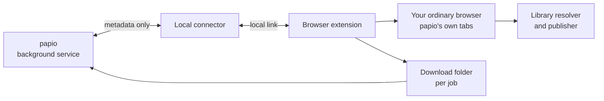

# Browser handoff

Browser handoff is *papio*'s institutional-access plane. When an eligible job has
exhausted direct acquisition, [assisted and delegated access modes](access-modes.md)
can route it to the user's existing browser session. Conservative mode records
institutional OpenURL availability without opening a handoff.

Not every handoff requires a login. Some open-access pages refuse non-browser
downloads. `papio actions list` labels each parked job as either “open access —
no login needed” or “sign in to your institution first.”

## One ordinary browser, not browser automation

*papio* uses the browser you already use for institutional access. A browser
extension opens its own tabs and connects to *papio* through a small local
connector. *papio* stays in charge of jobs and state; the connector only passes
short messages and never owns the queue or stores browser data.

*papio* never uses an automated or hidden browser. It does not launch a separate
browser, run one in the background, copy your cookies, or fill in sign-in forms.
Requests go through the browser session you use for institutional access.

```mermaid
flowchart LR
    D["papio<br/>background service"] <-->|"metadata only"| H[Local connector]
    H <-->|local link| E[Browser extension]
    E --> B["Your ordinary browser<br/>papio's own tabs"]
    B --> I["Library resolver<br/>and publisher"]
    E --> A["Download folder<br/>per job"]
    A --> D
```

The extension tracks only its own tabs. It runs provider-specific code only on
sites you grant, notices when you return from your institution's login page
without recording that page's address or title, matches up the job's download,
and closes only its own tabs when a job finishes or is cancelled. The extension
can restart at any time; it keeps only a minimal tab-to-job mapping and asks
*papio* for the authoritative state.

## Handoff surfaces

*papio* opens its own tabs on one of three surfaces, chosen automatically
from your setting and what the browser supports:

- **work window** (default) — one dedicated browser window, opened minimized
  and unfocused;
- **tab group** — a collapsed "papio" tab group inside your current window;
- **in-window** (legacy) — ordinary visible tabs in your current window.

The work window and the tab group both keep your ordinary tabs free of
login and publisher pages; a dedicated work window is reused for later
handoffs and reopened if you close it.

Tab-group handoff depends on a browser tab-groups API
(`chrome.tabGroups`/`chrome.tabs.group`), which the extension detects at
runtime rather than gating by browser — it runs on Chrome and on Firefox
139+. The extension's minimum supported Firefox version stays at 128.0, the
ESR release many institutions run, so it keeps installing there even though
tab groups aren't available yet: on Firefox 128 through 138, a tab-group
choice automatically falls back to the work window. A work-window choice
falls back further, to in-window tabs, on a browser with no windows API at
all.

The extension surfaces the exact work tab only when a human decision is needed:

- institutional authentication;
- publisher terms requiring a decision; or
- identity review.

After that step, a minimized work window or a collapsed tab group returns
to the background and *papio* continues its work. This preserves the
one-login-per-research-session model without asking *papio* to handle
passwords, MFA, CAPTCHA tokens, or publisher credentials.

### If your institution's sign-in reports a stale session

Institutional sign-ins are time-boxed: if login plus MFA takes long enough,
the identity provider can reject the original handoff with a "stale" or
"expired request" page. That page is a dead end, not a failure of your
session — sign in first, then re-run `papio actions open`; every open mints a
fresh resolver link.

The extension recognizes the common OpenAthens and Shibboleth failure pages
itself. When it does, it **restores and focuses the work window** so the dead
page is in front of you rather than hidden, records the outcome on the job's
audit trail (`papio jobs get <id>` shows it), and retries the handoff tab
through the resolver on your behalf. Retries share the handoff's
authentication budget: after a few, the tab is deliberately left on the
failure page and the job stays parked for you, rather than looping the
resolver silently. Only the outcome and the identity provider's hostname are
reported — never the page's contents.

## Chrome and Firefox

The extension works the same way in Chrome and Firefox. *papio* installs a
connector for each browser, and the connector checks each caller: Chrome
supplies the configured extension ID; Firefox supplies the configured add-on ID.
Leaving a browser's extension ID empty turns off that browser's connection.

The Firefox add-on is published on
[Firefox Add-ons](https://addons.mozilla.org/firefox/addon/papio/). Its add-on
ID is fixed as `papio@orgmentem.com`; the Firefox connector is set to allow
that ID. Firefox treats host access as opt-in at runtime, so the extension
options page includes a resolver-access grant alongside the per-provider
grants.

## One browser holds the session

With *papio* installed in more than one browser — say the store extension in
your daily browser and a development build in a second profile — exactly one
browser holds the offer/handoff flow at a time. The first to connect wins;
others wait, visibly, instead of silently taking over:

- `papio browser sessions` lists the holder and every waiting session with
  extension versions and last-contact times.
- `papio browser use <id>` (or `--latest`) hands the session to another
  browser on demand.
- Quitting the holder releases the session immediately; a holder that stops
  responding (crashed browser) yields to a live waiting session within about
  ten seconds.
- `papio doctor` and `papio status` report when other browsers are waiting.

A browser that is not the holder says so in its popup and points at
`papio browser use`; the daemon negotiates **Acquire this page** and the inbox
with the browser whose session it acknowledged, so both return in whichever
browser you hand the session to.

## The inbox stays current

The inbox refreshes the moment you return to its tab, so a job that finished
while you were away is never stale by the time you look. While the tab stays
open, it also checks in on its own every so often, so you don't need to leave
and come back just to notice a new job land.

The toolbar badge keeps up on the extension's own wake cycle — its existing
one-minute keepalive alarm — whether or not a *papio* tab is open. With
nothing open, the browser decides how often a sleeping extension is woken; no
design on this transport can beat that.

An auto-refresh never reorders the list while a confirmation dialog is open,
an action is still in flight, or a dismissal is still inside its undo
window — it waits until you're finished before applying what it learned.

## Dismissing an inbox item

Dismissing an inbox item removes it immediately and delays the daemon call for a
few seconds behind an **Undo** bar (keyboard `u`). Dismissing several rows uses
one undo window. The daemon receives the dismissal when that window closes. It
cannot undo the dismissal: dismissing an action that parks a job cancels the job,
and a cancelled job cannot be retried. The bar identifies whether the dismissal
cancelled an acquisition or closed a leftover row. Refreshing or leaving the page
commits any pending dismissals.

## Browser configuration

`[browser]` binds each installed browser and defines the default institution:

| Key | Purpose |
| --- | --- |
| `extension_id` | Chrome extension ID allowed to use the connector; empty disables the Chrome bridge. |
| `firefox_extension_id` | Firefox add-on ID allowed to use the connector; empty disables the Firefox bridge. |
| `openurl_base_url` | Default institution's HTTPS OpenURL resolver base. |
| `shibboleth_entity_id` | Optional default IdP entity ID for skipping a provider's WAYF selector. |
| `proquest_account_id` | Optional default ProQuest account ID for the `accountid` append. |
| `download_adoption_root` | Root containing the per-job adopted downloads; when empty, *papio* uses `<your download folder>/papio`. It must be a `papio` directory inside the browser's own download directory — steering cannot reach anywhere else. |
| `action_expiry_seconds` | Maximum open time for one browser handoff. |

`[browser.resolvers.<name>]` profiles replace the default institution for a
selected job. They carry only `openurl_base_url` and optional
`shibboleth_entity_id` and `proquest_account_id`; they never inherit a default
identity.

## Permissions and data boundary

The extension requests these regular permissions: `nativeMessaging`, `activeTab`,
`tabs`, `downloads`, `scripting`, and `storage` for the connector link, tab
tracking, and download adoption described above; `alarms` for the one-minute
keepalive wake cycle that refreshes the pending-job count and connection state
without a *papio* tab open; and `tabGroups` for the "papio" tab group the
extension uses to gather handoff tabs when tab-group mode is active.

Host access splits into two tiers. Three host permissions are required and
granted at install on Chrome: `https://*.alma.exlibrisgroup.com/*` and
`https://*.primo.exlibrisgroup.com/*`, used to classify Ex Libris
library-resolver pages, and `https://login.openathens.net/*`, used only to
recognize OpenAthens's own stale-session error page and restore the work
window (see above). Every provider domain is declared in
`optional_host_permissions` instead, and is granted per source through the
extension UI on a user gesture, revocable at any time. That optional tier also
includes one broad entry, `https://*/*`, offered in the options page as a single
**All sites** toggle for people who would rather not approve each provider
individually; like every optional grant it is never requested at install and can
be revoked at any time. *papio* does not request `<all_urls>`, `cookies`, or
`debugger`, and it requests no host permission for Example University's or any
other institution's own login domain.
Selecting delegated mode does not grant a browser permission.

The link to the browser carries metadata only, within *papio*'s fixed message-size limit.
PDF bytes, cookies, credentials, page contents, screenshots, and secret- or
signed-URL values never cross that link. For a selected download, the extension reports metadata such as
the download item and final filename; the file itself lands under
`<download_adoption_root>/<job_id>/` for adoption and validation. Because
Chrome's `onDeterminingFilename` can only rewrite a download to a path
relative to the browser's download directory, that root is by construction
`<your download folder>/papio` — which is also the effective default. See
[Configuration reference](../reference/config-reference.md) for
`download_adoption_root`.

## Institution-specific routing

The default `[browser]` institution can provide an `openurl_base_url` plus
optional `shibboleth_entity_id` and `proquest_account_id`. The entity ID lets a
provider's login jump straight to your institution's sign-in page instead of
stopping at a “Where are you from?” chooser. A ProQuest account ID causes *papio* to append `?accountid=` to
the resolver link, which can unlock the institution's ProQuest route.

For multiple libraries, define `[browser.resolvers.<name>]` profiles. Every
named profile carries its own `openurl_base_url` and optional
`shibboleth_entity_id` and `proquest_account_id`. A named profile never inherits
the default profile's login identity, so a job stays with the institution that
was selected for it. The complete key constraints and profile syntax are in the
[Configuration reference](../reference/config-reference.md#browserresolvers).
